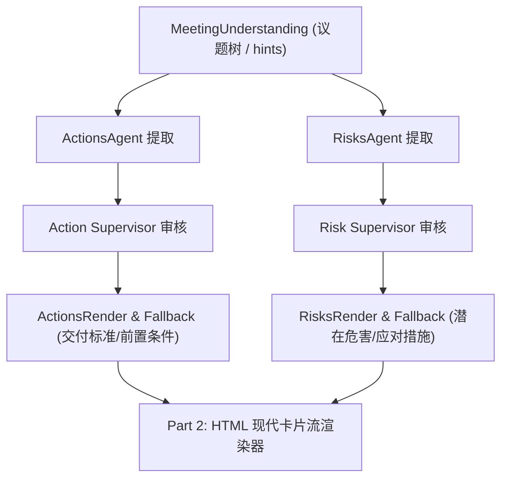

# 待办（Actions）与风险（Risks）内容优化与 HTML 渲染重构指导清单
> **全景指南：内容规范 · 呼吸感公文流 HTML 渲染 · 底层逻辑重构**  
> 状态：设计定稿 · 待执行  
> 核心原则：对齐钉钉企业级务实标准 · 术语公文级通用化 · 零编造动态弹性伸缩 · 无 Emoji / 无方括号公文排版  

---

## 〇、 重构背景与核心目标

当前系统中，待办（Actions）与风险（Risks）在输出上存在两大痛点：
1. **内容颗粒度与表述口语化**：模型输出偏向截取发言碎屑，缺少专业工单级的执行动词、交付标准与明确的责任边界；过往老版规则试图强行区分“止血”与“根治”，易诱导模型在缺少事实时脑补长期方案。
2. **HTML 表格生硬拥挤、美感缺失**：传统 5~6 列学术三线表横向严重挤压，大肚腩失衡，大面积留白；缺乏现代公文与报告的通透排版感。

本指南旨在完成**全流程重构**：从重塑数据契约（Contracts）、优化提示词（Prompts）、规范文本引擎（Engine Text），到落地**呼吸感公文流（Typographic Flow）HTML 页面渲染**，实现工业级质感闭环。

---

## 一、 顶层设计哲学与三大铁律

1. **对齐钉钉企业级务实标准（Action-Oriented & Issue-Driven）**
   * **待办**是“执行工单”：明确【谁在什么时间按什么标准完成什么动作】。
   * **风险**是“阻碍与隐患”：明确【客观存在什么隐患、造成什么业务危害、现场定下了什么对策与跟进人】。
2. **术语全行业通用化（Universal Business Language）**
   * 彻底摒弃互联网黑话与研发专有词（如 DoD、Blocker、止血、根治）：
     * 将完成标准/交付物统一规范为：**「交付标准」**
     * 将阻塞卡点/前后依赖统一规范为：**「前置条件」**
     * 将潜在后果/风险影响统一规范为：**「潜在危害」**
     * 将应对方案统一收拢为单一大字段：**「应对措施」**
3. **零硬凑、零编造的“动态弹性伸缩”铁律（Strict Elasticity）**
   * **必有项确保闭环**：待办必须有动作与优先级；风险必须有隐患与严重程度。
   * **责任人/跟进人极简去噪**：仅当原文明示了具体个人或负责团队时才输出；**若现场未明确指定或无确切人选，彻底隐去，严禁强行输出“待认领”等无意义占位符**。
   * **条件项有则出、无则整行消失**：原文明示时间才出时限，原文明示验收成果才出交付标准，原文明示前后制约才出前置条件；**严禁机械填充“无”、“未明确”、“待定”等无意义占位符，更严禁脑补推断**。

---

## 二、 待办事项（Actions）内容体系重构规范

### 1. 字段体系与契约定义（Schema）

| 字段名称 | 业务含义 | 属性类别 | 数据类型 | 动态伸缩规则与行为 |
| :--- | :--- | :---: | :---: | :--- |
| **`category`** | 业务板块 | **必有** | `str` | 4–12 字具体业务短语（如 `[核心网关压测流控]`），用于卡片分组与清单聚合。 |
| **`task`** | 待办动作 | **必有** | `str` | 动词开头，语言精炼通顺，可独立执行，彻底去除口语语气词与发言废话。 |
| **`owner`** | 责任主体 | **动态伸缩** | `str \| null` | 原文明示个人写真名（如 `张伟`）；团队承担写团队（如 `架构组`）；**未明确指定或无确切人选时置为 `null` 且彻底隐去，绝不输出“待认领”**。 |
| **`priority`** | 优先级 | **必有** | `enum` | `high`（高优先）/ `medium`（中优先）/ `low`（低优先）。默认 `medium`；原文明示紧急重要才标 `high`。 |
| **`deadline`** | **完成时限** | **动态伸缩** | `str \| null` | **原文明示了具体时间/节点才输出**（如 `周五 18:00 前`、`09-28`、`末次会前`）。<br>⚠️ 无明确时限整行彻底隐去，严禁输出“完成时限：待定”。 |
| **`deliverable`** | **交付标准** | **动态伸缩** | `str \| null` | **原文明示了实体成果物/验收产出才输出**（如 `输出性能压测报告与 API 文档`、`取得质检签字`）。<br>⚠️ 普通动作整行彻底隐去，严禁无中生有。 |
| **`dependency`** | **前置条件** | **动态伸缩** | `str \| null` | **原文明示了强先后依赖或制约关系才输出**（如 `需基础架构组先提供临时 Token`）。<br>⚠️ 无前置制约整行彻底隐去，严禁输出“前置条件：无”。 |
| `evidence` | 证据原句 | 后台留存 | `str` | 提取自 `actions_pack` 的定位原句，供审核与溯源使用。 |
| `confidence` | 置信度 | 后台留存 | `enum` | `high` / `medium` / `low`。 |

### 2. 待办文本输出格式规范（Markdown / 报告格式）

#### 规范模版：
```text
{序号}. **[{业务板块}]**
   - {动词开头的具体事项}({优先级} · {责任主体})  [或仅 ({优先级})]
     > 完成时限：{具体截止节点}（条件输出）
     > 交付标准：{明确成果物或验收标准}（条件输出）
     > 前置条件：{必须先完成的前置动作}（条件输出）
```

#### 输出样板对比：
* **全量饱满态（时间、标准、前置条件俱全）**：
  ```markdown
  1. **[核心网关压测流控]**
     - 交付音视频推流 SDK 适配补丁并完成 2000 QPS 压测验证(高优先 · 张伟)
       > 完成时限：本周五 18:00 前
       > 交付标准：输出性能压测报告与 API 文档，通过断流回归测试
       > 前置条件：需基础架构组先提供鉴权网关临时 Token
  ```
* **极简紧凑态（普通日常动作，无产出无时限，自动纯净化）**：
  ```markdown
  2. **[现场施工协同]**
     - 召集技术组把实体问题再细化检查并布置现场整改(中优先 · 田组长)
  ```
* **未分配责任人态（责任主体彻底隐去，零占位噪音）**：
  ```markdown
  3. **[预发布环境压测机申请]**
     - 申请预发布环境独立压测集群机器配额(中优先)
  ```

### 3. 待办 HTML 页面渲染形态（形态 A：业务大点聚合卡片）

#### 核心设计理念：
- **一个大点（业务板块/主题）对应一张卡片**：绝不将同一板块下的多条待办粗暴拆分成多张碎片化卡片！
- **板块头部只渲染一次**：卡片顶端以 3.5px 彩色微立柱 + 700 字重统摄全组，下方附极细分隔线。
- **组内事项优雅分区**：同一板块有多条事项时以 `1px solid #f1f5f9` 极浅细分割线清晰隔离，单事项时极简自然闭环。

#### 视觉呈现草图（单板块多事项聚合）：
```text
┌────────────────────────────────────────────────────────┐
│ ▌ 现场实体整改                                         │
│ ────────────────────────────────────────────────────── │
│ 会后会同技术组细化、检查验收组提出的问题，编制处理方案   │
│ [ 中优先 ]  责任人: 田组长                             │
│ ┌────────────────────────────────────────────────────┐ │
│ │ 交付标准：处理方案                                 │ │
│ └────────────────────────────────────────────────────┘ │
│ ────────────────────────────────────────────────────── │
│ 编制现场实体整改方案并逐一整改和落实                   │
│ [ 中优先 ]  责任人: 龚总                               │
│ ┌────────────────────────────────────────────────────┐ │
│ │ 交付标准：整改方案                                 │ │
│ └────────────────────────────────────────────────────┘ │
│ ────────────────────────────────────────────────────── │
│ 在正式交付之前对局部损伤、装饰装修位置进行检查，打扫...│
│ [ 中优先 ]  完成时限: 正式交付之前                     │
└────────────────────────────────────────────────────────┘
```

#### HTML 结构设计要点：
1. **彻底消除字符污染与多余计数**：无 Emoji、无 `[ ]` 伪复选框、无 `1. 2.` 行首序号、无“几项待办”冗余计数与跨屏分割长线。
2. **大点聚合工单卡片容器 (`.ck-card.ck-flow-group`)**：现代无衬线字体，白底 + 1px 冷灰边框（`#e2e8f0`）+ 8px 圆角 + 极浅微阴影，整组事项聚拢收纳。
3. **业务板块统一顶头 (`.ck-card-category`)**：左上方 3.5px 彩色微立柱 + 加粗业务板块名称，下方附极细分隔线，一目了然。
4. **组内多条事项容器 (`.ck-flow-items`)**：内部每一项为 `.ck-flow-item`，相连事项之间自动生成 1px 极细微分割线。
5. **任务标题行 (`.ck-card-title`)**：加粗深黑 15px，动词直接呈现。
6. **属性元数据行 (`.ck-card-meta`)**：紧随标题正下方居左，无 Emoji 纯色微胶囊徽章（高优先 `#fee2e2`、中优先 `#fef3c7`），责任人（自动隐藏待认领及无意义角色代称）与时限并列排布。
7. **详情微底托面板 (`.ck-card-drawer`)**：
   - 浅灰冷调底托（`background: #f8fafc`），内边距 `8px 12px`，内嵌 `交付标准：` 与 `前置条件：`。
   - 仅在存在标准或条件时渲染；无延伸属性时完全隐去。

---

## 三、 风险分析（Risks）内容体系重构规范（对齐钉钉标准）

### 1. 字段体系与契约定义（Schema）

| 字段名称 | 业务含义 | 属性类别 | 数据类型 | 动态伸缩规则与行为 |
| :--- | :--- | :---: | :---: | :--- |
| **`category`** | 业务领域 | **必有** | `str` | 4–12 字风险所属领域短语（如 `[核心网关高并发]`），用于卡片分组。 |
| **`risk`** | 风险隐患 | **必有** | `str` | 一句话直接陈述已发生的问题、隐患或卡点事实，不强加“触发条件”额外字段。 |
| **`severity`** | 严重级别 | **必有** | `enum` | `high`（高风险）/ `medium`（中风险）/ `low`（低风险）。根据原文强度判定，无强信号默认 `medium`。 |
| **`owner`** | 跟进责任人 | **动态伸缩** | `str \| null` | 原文明示跟进人写姓名/团队；**未明确指定或无确切人选时置为 `null` 且彻底隐去，绝不输出“待认领”**。 |
| **`impact`** | **潜在危害** | **动态伸缩** | `str \| null` | 直击业务痛点，陈述可能造成的不良影响（如资损、雪崩、工期延误、验收不合规）。<br>⚠️ 原文未提及具体恶果时仅保留基本事实或隐去，不主观夸大推断。 |
| **`mitigation`** | **应对措施** | **动态伸缩** | `str \| null` | **单一大字段一体化陈述**：现场提了临时措施、长效方案或两者的结合，用一段完整通顺的话陈述，严禁生硬拆分。<br>⚠️ **若现场完全未讨论出方案，如实标注 `现场未定（待制定对策）` 或直接整行隐去**，坚决不代为脑补对策！ |
| `source` | 证据原句 | 后台留存 | `str` | 提取自 `risks_pack` 的定位原句。 |

### 2. 风险文本输出格式规范（Markdown / 报告格式）

#### 规范模版：
```text
{序号}. **[{业务领域}]**
   - {风险核心隐患描述}({风险级别} · {责任主体})  [或仅 ({风险级别})]
     > 潜在危害：{可能造成的后果或连锁反应}（条件输出）
     > 应对措施：{现场明确讨论出的应对举措 / 现场未定（待制定对策）}（条件输出）
```

#### 输出样板对比：
* **完整对策态（隐患、危害、应对措施俱全）**：
  ```markdown
  1. **[核心网关高并发]**
     - 核心路由在压测 QPS 超过 2000 时出现频繁断流(高风险 · 架构组)
       > 潜在危害：大促核心交易链路超时雪崩，直接造成订单资损
       > 应对措施：架构组现场决定临时扩容 4 台网关前置限流，并于本周内完成协议适配异步化改造
  ```
* **纯提出隐患态（现场毫无对策，真实客观记录）**：
  ```markdown
  2. **[提升泵防汛隐患]**
     - 卢萨卡提升泵往上位置存在雨季雨水倒灌隐患(中风险)
       > 潜在危害：暴雨天气倒灌可能造成局部严重积水，浸泡生产或机电设备
       > 应对措施：现场未定（待现场勘测后补充预案）
  ```

### 3. 风险 HTML 页面渲染形态（形态 A：业务大点聚合卡片）

#### 核心设计理念：
- **同领域/同业务大点聚合在同一张卡片内**：顶端呈现该领域的警示微立柱（根据领域内最高风险等级着色：高危红、中危琥珀）与领域名称。
- **组内风险项清晰隔离**：多项时以 1px 极细底边分隔，避免将同一议题下的风险碎解为孤立卡片。

#### 视觉呈现草图：
```text
┌────────────────────────────────────────────────────────┐
│ ▌ 核心网关高并发                                       │
│ ────────────────────────────────────────────────────── │
│ 核心路由在压测 QPS 超过 2000 时出现频繁断流            │
│ [ 高风险 ]  跟进人: 架构组                             │
│ ┌▌（3px深红警示线）──────────────────────────────────┐ │
│ │ 潜在危害：大促核心交易链路超时雪崩，直接造成订单资损│ │
│ │ 应对措施：架构组现场决定临时扩容 4 台网关前置限流  │ │
│ └────────────────────────────────────────────────────┘ │
│ ────────────────────────────────────────────────────── │
│ 鉴权网关跨机房调用单点超时抖动                         │
│ [ 中风险 ]                                             │
│ ┌▌（3px琥珀警示线）──────────────────────────────────┐ │
│ │ 潜在危害：高峰期引发重试风暴                        │ │
│ └────────────────────────────────────────────────────┘ │
└────────────────────────────────────────────────────────┘
```

#### HTML 结构设计要点：
1. **全链路设计语言对齐**：与待办完全共用“大点聚合工单卡片 (`.ck-card.ck-flow-group`) + 无 Emoji 微胶囊徽标 + 浅灰冷调底托”的设计规范。
2. **业务领域微立柱 (`.ck-card-accent`)**：根据卡片内所含风险最高等级自适应颜色（含高风险为红 `#dc2626`、含中风险为琥珀 `#d97706`）。
3. **隐患陈述行 (`.ck-card-title`)**：加粗自然文本（无 `1. 2.` 序号），字号 15px，客观陈述。
4. **属性行 (`.ck-card-meta`)**：纯色微胶囊徽章（高风险浅红底深红字 `[ 高风险 ]`、中风险浅琥珀底深橙字），跟进人（自动隐藏待认领与无意义发言者代称）居左紧随其后。
5. **详情微底托面板 (`.ck-card-drawer`)**：
   - 浅灰冷调底托（`background: #f8fafc`），内嵌 `潜在危害：` 与 `应对措施：`。
   - 高风险条目面板左侧附带一条 `3px solid #ef4444` 警示色条，中风险带琥珀色警示条。
   - 现场未讨论对策时输出浅灰字 `现场未定（待制定对策）`；若无危害与对策则底托完全隐去。

---

## 四、 涉及代码模块与改造任务清单



### 1. 待办（Actions）任务组修改点

- [x] **1.1 契约规范优化 (`domains/meeting/tasks/actions/contracts.py`)**：
  - 更新字段文档描述：明确 `deliverable` 映射至 **“交付标准”**；`dependency` 映射至 **“前置条件”**。
  - 确保字段允许为 `null`，以便触发动态伸缩。
- [x] **1.2 提示词更新 (`domains/meeting/tasks/actions/prompts.py`)**：
  - `ACTION_ITEMS_GENERATION_SYSTEM_PROMPT`：强化动作动词化；强调 `deliverable` 为特定成果物验收标准，无则置 `null`；`dependency` 为明确前置依赖，无则置 `null`；严禁占位符。
  - `ACTION_ITEMS_RENDER_PROMPT`：更新标签为 `> 完成时限：`、`> 交付标准：`、`> 前置条件：`；强化“有则出、无则整行隐去”的渲染规则。
- [x] **1.3 渲染引擎与降级拼装器 (`domains/meeting/tasks/actions/steps/actions_render.py` & `core/graph/engine_text.py`)**：
  - 重构 `render_items` 与 `format_action`：
    - 当 `deadline` 为空或无效值（`null/none/无/未明确`）时，**不生成完成时限行**。
    - 当 `deliverable` 为空或无效值时，**不生成交付标准行**。
    - 当 `dependency` 为空或无效值时，**不生成前置条件行**。
    - 条目末尾规范为 `(优先级 · 责任主体)`；未指定责任人时不输出责任人，仅保留 `(优先级)`，彻底消除“待认领”噪音。

---

### 2. 风险（Risks）任务组修改点

- [x] **2.1 契约规范优化 (`domains/meeting/tasks/risks/contracts.py`)**：
  - 更新字段描述：`impact` 映射至 **“潜在危害”**；`mitigation` 映射至 **“应对措施”**（单一大字段，一体化陈述）。
  - 明确 `owner` 为动态伸缩字段，仅原文明示才输出，未明示为 null 并在文本与 HTML 中彻底隐去，严禁强加“待认领”。
- [x] **2.2 提示词更新 (`domains/meeting/tasks/risks/prompts.py`)**：
  - `RISK_GENERATION_SYSTEM_PROMPT`：对齐钉钉实战标准；坚决不要求大模型生硬拆解“止血”与“根治”；有对策则完整表述，现场未讨论对策则如实给 `null` 或标注“现场未定（待制定对策）”，严禁编造对策。
  - `RISK_RENDER_PROMPT`：更新标签为 `> 潜在危害：` 与 `> 应对措施：`；强化弹性隐去规则；未定人选不输出“待认领”。
- [x] **2.3 渲染引擎与降级拼装器 (`domains/meeting/tasks/risks/steps/risks_render.py` & `core/graph/engine_text.py`)**：
  - 重构 `render_risk_items`：
    - 聚合业务板块；条目末尾规范为 `(风险级别 · 责任主体)`，未指定责任人时仅输出 `(风险级别)`。
    - 当 `impact` 存在时输出 `> 潜在危害：{impact}`，否则隐去。
    - 当 `mitigation` 存在时输出 `> 应对措施：{mitigation}`；若现场未定则输出 `> 应对措施：现场未定（待制定对策）` 或整行隐去。

### 3. HTML 页面渲染器与 CSS 样式重构点

- [x] **3.1 CSS 样式库升级 (`infra/exporters/html/paper_css.py`)**：
  - 新增呼吸感公文流核心样式类：
    - `.ck-flow-section`、`.ck-flow-section-title`、`.ck-flow-section-line`、`.ck-flow-section-count`（贯穿线与计数）；
    - `.ck-flow-item`、`.ck-flow-title`、`.ck-flow-meta`（标题与属性行）；
    - `.ck-flow-drawer`、`.ck-flow-row`、`.ck-flow-label`（2px 极细竖向导轨线与加粗标签）；
    - 优先级/风险色标类：`.ck-flow-high`（深红 `#dc2626`）、`.ck-flow-medium`（琥珀橙 `#d97706`）、`.ck-flow-low`（蓝色 `#2563eb`）。
- [x] **3.2 待办 HTML 渲染重构 (`domains/meeting/memory/render.py` -> `render_actions_html`)**：
  - 彻底废除老旧的 5 列学术三线表（`.ck-risk-table`）；
  - 数据源按 `category` 聚合并排序；
  - 循环输出公文流板块与条目；弹性渲染 `deliverable`（交付标准）与 `dependency`（前置条件）。
- [x] **3.3 风险 HTML 渲染重构 (`domains/meeting/memory/render.py` -> `render_risks_html`)**：
  - 彻底废除老旧的 6 列学术三线表；
  - 数据源按 `category` 聚合；
  - 循环输出公文流板块与条目；弹性渲染 `impact`（潜在危害）与 `mitigation`（应对措施）。

---

## 五、 实施执行检查与验证指标

1. **零编造验证**：运行具有“未明确时间、无实体产出待办”的会议音频或测试样本，检查输出文本与 HTML 是否干净无空行、无“未提及”字样。[已验证]
2. **纯隐患风险验证**：测试未商讨对策的单纯风险点，确保模型不脑补整改方案，如实呈现现场状态。[已验证]
3. **视觉无字符污染验证**：检查生成的 HTML，确保无任何 Emoji、无 `[ ]` 伪复选框、无方括号堆叠、无封闭压抑的大黑框。[已验证]
4. **单元测试与回归**：
   - 运行 `pytest tests/ -q`：186 passed 100% 通过（含全量回归与公文流测试 `tests/test_action_risk_flow_render.py`）。
   - 验证 `ActionItemsRender.render_items` 与 `render_risk_items` 的单元输出。[已验证]
   - 验证 `render_actions_html` 与 `render_risks_html` 的页面渲染。[已验证]

*(指导清单内容与 HTML 渲染规范已全量实施并通过自动化测试，重构落地完成)*
