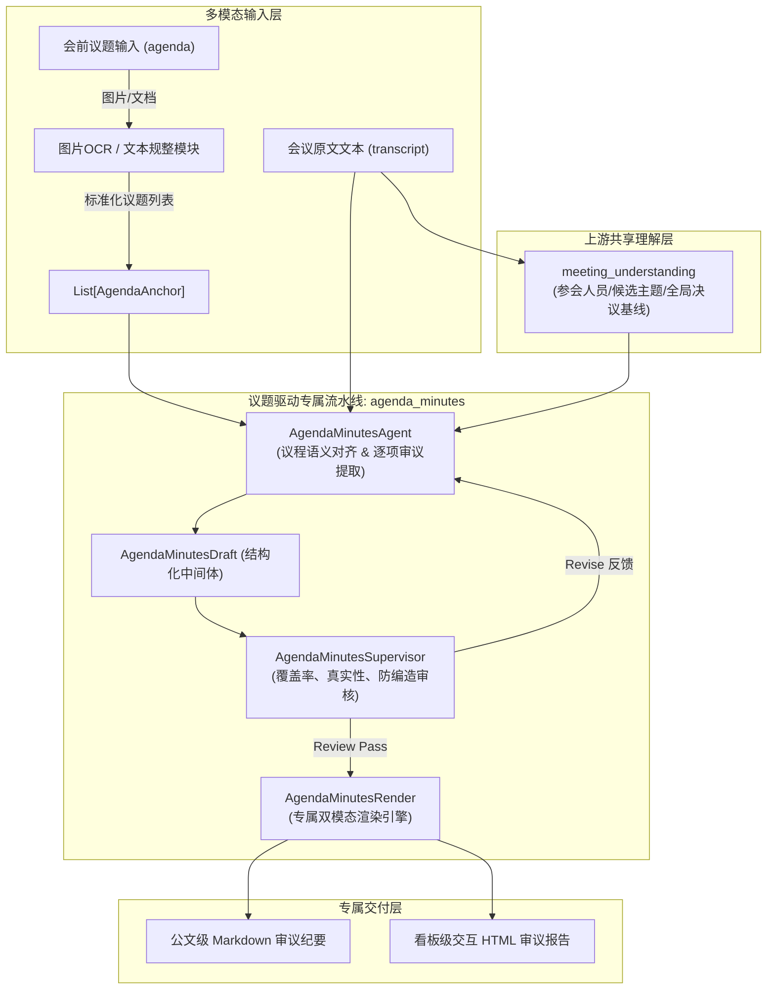
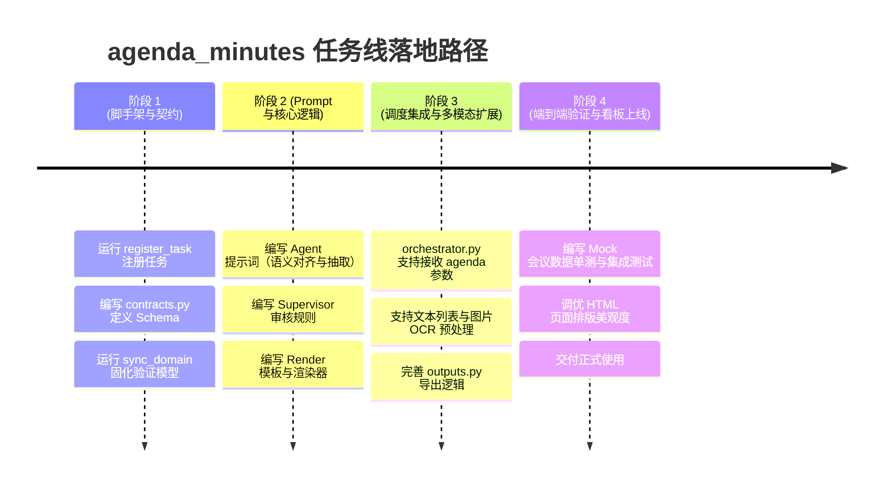

# 议题驱动型会议纪要（Agenda-Driven Minutes）输出策略与架构设计方案

> **文档版本**：v1.0.0  
> **所属领域**：`domain/meeting`  
> **任务线规划**：`agenda_minutes`（议题审议纪要）  
> **设计定位**：针对政企高管会、立项评审会、党委会、董事会等“带有既定议程/议题单”的高端严肃会议场景，建立独立的端到端智能化纪要提炼与输出流水线。

---

## 目录

1. [业务场景剖析与痛点分析](#一业务场景剖析与痛点分析)
2. [核心设计原则](#二核心设计原则)
3. [整体系统架构与数据流链路](#三整体系统架构与数据流链路)
4. [Agent 核心处理逻辑与子模块设计](#四agent-核心处理逻辑与子模块设计)
5. [数据契约规范 (Contracts Schema)](#五数据契约规范-contracts-schema)
6. [专属输出模板规范 (Markdown & HTML)](#六专属输出模板规范-markdown--html)
7. [Supervisor 领域审核规则设计](#七supervisor-领域审核规则设计)
8. [工程落地步骤与排期建议](#八工程落地步骤与排期建议)

---

## 一、业务场景剖析与痛点分析

### 1.1 真实会议的两极分化

在企业级会议协作中，会议天然划分为两大形态，心智模型与输出预期截然不同：

| 维度 | 自由发散型会议（通用 `minutes` 适用） | 预设议程型会议（`agenda_minutes` 专属） |
| :--- | :--- | :--- |
| **典型会议** | 周例会、头脑风暴、业务对齐、日常碰头会 | 集团办公会、党委会、董事会、立项评审会、验收协调会 |
| **会前先验** | 无固定议程，或仅有笼统主题（自由发言） | **会前必发《会议议题单》、《议程安排表》**（文字或截图） |
| **组织形式** | 随聊随记，话题自由切换与交织 | **以议题为单位**：逐项汇报、逐项质询、逐项表态、逐项拍板 |
| **纪要核心** | 归纳讨论了哪些事情、产生了哪些想法 | **逐项议题的过会审议结论、责任人、落地底线** |
| **公文规范** | 灵活、强调全面性和可读性 | **严肃公文规范，议题名称与序号必须 100% 对齐会前议程** |

### 1.2 传统通用纪要处理议程会议的 4 大致命缺陷

1. **议题名称漂移（命名偏差）**：
   - 议程单上是《关于蒙泽工业园区二期工程决算的汇报》，通用 AI 自由提取可能命名为《园区工程账目讨论与资金拨款》。在正式公文场景下会被直接判定为“不合规、不专业”。
2. **结构失控与议题拆并**：
   - AI 自作主张把一个议题拆成两段，或者把两个关联议题揉在一起，打破了与会领导习惯的“对号入座”结构。
3. **真实场景的“议题跳过/延期”引发幻觉编造**：
   - 会议往往由于时间超支，主持人现场临时宣布：“议题 3 今天暂缓审议”。如果硬套通用模型，AI 会因为“被要求输出”而凭空捏造一段讨论。
4. **忽视临场最高决策（临时追加事项）**：
   - 会议临近结束，主要领导经常借机作指示：“议程上的事聊完了，我额外强调一下节前安全生产检查……”。若机械死套预设议程，领导最重要的临时指示就会被直接截断丢弃。

---

## 二、核心设计原则

为了彻底解决上述痛点，`agenda_minutes` 任务线确立以下 **4 大核心设计原则**：

```
                ┌──────────────────────────────────────────────┐
                │        Agenda-Driven Core Principles         │
                └──────────────────────┬───────────────────────┘
                                       │
         ┌───────────────────┬─────────┴─────────┬───────────────────┐
         ▼                   ▼                   ▼                   ▼
┌─────────────────┐ ┌─────────────────┐ ┌─────────────────┐ ┌─────────────────┐
│ 1. 骨架绝对锁定 │ │ 2. 事实动态校准 │ │ 3. 结果明确可考 │ │ 4. 大众通俗表达 │
│ Agenda-as-Anchor│ │ Dynamic Ground  │ │ Resolution First│ │  Plain & Clear  │
└─────────────────┘ └─────────────────┘ └─────────────────┘ └─────────────────┘
```

1. **骨架绝对锁定（Agenda-as-Anchor）**：
   - 预设议题的序号、名称作为输出的绝对骨架（一级/二级标题）。严禁大模型擅自改名、合并或重新排序。
2. **事实动态校准（Dynamic Grounding，拒绝死板硬套）**：
   - 允许议题状态处于“审议通过”、“附带前提同意”、“补充材料再议/暂缓”、“本次未讨论”。
   - 具备**“增量探测机制”**，主动捕捉议程外的【临时追加议题/重要定调】。
3. **结果明确可考（Resolution-First）**：
   - 每一个议题必须形成明确的“闭环决议”，明确交代：同意了什么、付出了什么代价、谁负责跟进、完成时限是什么。
4. **通俗易懂无黑话（Plain & Clear Language）**：
   - 延续项目去伪咨询黑话的规范，全面采用日常业务语言（如：用“提出顾虑方”替代“质询/审议方”，用“顾虑”替代“关切”，用“底线”替代“翻盘红线”）。

---

## 三、整体系统架构与数据流链路

本任务线作为 `domain/meeting` 下的独立平级任务，与 `meeting_understanding` 形成清晰的上下游消费关系：



---

## 四、Agent 核心处理逻辑与子模块设计

`AgendaMinutesAgent` 内部采用分阶段微链处理，避免单一 Prompt 负载过大导致漏题或张冠李戴：

```
AgendaMinutesAgent 核心处理流程：
1. 议程规范化 (Normalize) ──> 2. 语义对齐与发言归聚 (Mapping) ──> 3. 逐项审议状态提炼 (Synthesis) ──> 4. 临场追加议题探测 (Ad-hoc Discovery)
```

### 4.1 阶段一：议题与原文语义对齐（Semantic Mapping）
- **痛点**：口语化讨论经常不说书面议题全称（例如：议题叫《关于蒙泽工业园区二期工程决算的汇报》，现场领导直接说“老张，你把修路那个决算说一下”）。
- **策略**：
  - Agent 先结合议题名称与 `meeting_understanding` 的 `topics` 进行模糊语义关联；
  - 扫描原文中的主持人转场信号（如“进行下一项议程”、“听取关于...的汇报”、“第X个议题”），切分出发言起止段落；
  - 允许多个非连续段落回溯（若在议题3讨论中又回头补充了议题1的细节，自动归拢并入议题1）。

### 4.2 阶段二：逐项审议状态判定（Status Classification）
对每一个既定议题判定最终审议状态，严格限制在四种标准化状态中：
1. **`approved`（审议通过）**：各方一致赞成，方案通过，直接进入执行落实阶段。
2. **`conditional_approval`（附带前提同意）**：大方向同意，但附带了明确前提条件、时限要求或前置整改项。
3. **`deferred`（暂缓审议 / 补正再议）**：分歧过大、材料不齐或数据存疑，主持人或主管领导明确要求补齐后下次再议。
4. **`skipped`（本次未予审议）**：因时间紧张或汇报人缺席，主持人当场宣布跳过或延期。**触发此状态时严禁提炼正文，必须如实记录跳过原因**。

### 4.3 阶段三：议题要点结构化抽取（Agenda Synthesis）
对已讨论议题按四段式精准提炼：
- **汇报要点**：主张方案、核心数据、诉求。
- **与会讨论与顾虑**：谁提出了什么疑虑、潜在风险或限制条件（保留真实发言人与现场原话）。
- **最终拍板决议**：领导层达成的统一结论与明确口径。
- **督办落实清单**：责任单位/责任人、交付物要求、完成节点。

### 4.4 阶段四：临场追加事项探测（Ad-hoc Discovery）
- 检索原文末尾或议程间歇，捕捉未经列入原议题单、但具有实质性决策约束力的大脑/领导临场定调发言，归入“临时追加议题”区，确保重大决策零遗漏。

---

## 五、数据契约规范 (Contracts Schema)

遵循系统的 `GenerationContract` 规范，在 `contracts.py` 中定义专用输出契约：

```python
from tools.schema.contracts import (
    GenerationContract,
    SupervisorContract,
    ObjField,
    ObjListField,
    StrField,
    StrListField,
    EnumField,
    Check,
    Decision,
    Feedback,
)

AGENDA_STATUS_ENUM = [
    "approved",              # 审议通过
    "conditional_approval", # 附带前提同意
    "deferred",             # 暂缓审议 / 补充材料再议
    "skipped",              # 本次未讨论
]

class AgendaMinutesGenerationContract(GenerationContract):
    """议题审议型纪要生成契约。"""
    fields = [
        ObjField("summary", [
            StrField("meeting_theme", "会议核心主题"),
            StrField("executive_overview", "整场会议议程审议结果总体评价"),
            StrField("agenda_stats", "审议统计（如：共审议4项，通过2项，附条件1项，暂缓1项）"),
        ], desc="全会审议总览"),
        
        ObjListField("agenda_items", [
            StrField("agenda_seq", "原议题序号，如 01, 02"),
            StrField("agenda_title", "既定议程议题名称（严格与会前议程完全一致）"),
            EnumField("status", AGENDA_STATUS_ENUM, desc="审议结论状态"),
            StrField("presenter", "主要汇报部门或汇报人"),
            StrListField("key_proposals", "汇报核心内容、主张及依据（1~3条）"),
            
            ObjField("deliberation", [
                StrListField("supporters", "赞同方及支持理由概要"),
                StrListField("concerns", "提出顾虑方代表及具体顾虑隐患（保留人名与具体顾虑）"),
            ], desc="多方审议与顾虑讨论"),
            
            StrField("resolution", "最终决议结论与统一口径（明确领导拍板要求）"),
            StrField("caveat_condition", "附带前提/前置约束（若无则填 null）"),
            
            ObjListField("action_commitments", [
                StrField("owner", "落实责任人/单位"),
                StrField("task", "具体执行事项"),
                StrField("deadline", "完成时限节点（若会上未提明确时间填 推进实施中）"),
            ], desc="落实责任清单"),
            
            StrField("key_quote", "该议题最核心的现场定调原话"),
        ], desc="既定议题审议详情列表"),
        
        ObjListField("adhoc_items", [
            StrField("title", "临时追加事项标题"),
            StrField("initiator", "发起人/指示领导"),
            StrField("context", "临时动因或背景"),
            StrField("resolution", "指示决议与落实要求"),
            StrField("owner", "牵头责任人"),
            StrField("key_quote", "现场定调原话"),
        ], desc="临场追加议题与重要部署（若无则为空列表）"),
    ]
```

---

## 六、专属输出模板规范 (Markdown & HTML)

### 6.1 专属 Markdown 模板架构

```markdown
# [会议全称] · 议程审议与决策纪要

> **会议时间**：2026-XX-XX | **主持人**：XXX | **核心参会人**：XXX  
> **审议进度总览**：既定议题共 4 项（通过 2 项 · 附带前提 1 项 · 暂缓 1 项） · 临时追加 1 项  
> **整体评估**：本次会议议程推进扎实，核心基建决算顺利过会，营销预算调整需补充测算后实施。

---

## 第一部分：议程审议结果一览表

| 议程序号 | 议题名称 | 汇报人/单位 | 审议结论 | 责任人 / 完成时限 |
| :---: | :--- | :---: | :---: | :---: |
| **议题 01** | 关于蒙泽工业园区二期工程决算的汇报 | 施工管理组 (张工) | `[审议通过]` | 张工 / 9月30日前归档 |
| **议题 02** | 2026年度第三季度营销预算追加方案 | 市场部 (王总) | `[附带前提同意]` | 王总 / 补齐明细后推进 |
| **议题 03** | 某海外仓配租赁项目立项议案 | 海外业务部 (赵总) | `[暂缓审议]` | 赵总 / 重新做竞品调研 |
| **议题 04** | 办公协同系统升级改造方案 | 信息中心 (钱工) | `[本次未审议]` | 顺延至下次专题会 |

---

## 第二部分：既定议题逐项审议详情

### 议题 01 · 关于蒙泽工业园区二期工程决算的汇报

- **汇报单位/人**：施工管理组（张工）
- **审议结果**：`[审议通过]`

#### 1. 汇报核心要点
- 工程按既定节点顺利完工，决算金额较预算整体节约 3.2%；
- 施工过程中发现非主要通道有少量微裂纹，已形成闭环修补计划。
- **汇报原话**：“整体工程质量可控，决算账目清晰。”

#### 2. 各方观点与讨论
- **[主张推进] 张工**：主张在验收报告出具前完成修补，确保档案闭环。
- **[提出顾虑方] 合作局领导**：
  - **顾虑**：移交外方后若再大面积开裂会影响对外形象，必须查清裂纹成因，不能简单刷漆掩盖。
  - **现场原话**：“不能因为赶时间就糊弄，对外移交是政治任务。”

#### 3. 最终审议决议
> 会议原则同意该工程决算报告，同意按修补闭环方案推进最终移交手续。

#### 4. 落实督办清单
- **落实事项**：完成开裂成因专题分析，并组织三方联合复检。
- **责任人**：管理组 张工
- **交付时限**：9月30日前完成复核归档。

---

## 第三部分：临时追加与重要指示事项

### 【临时追加 01】关于国庆节前全员安全生产排查的紧急指示
- **定调领导**：李董事长
- **指示背景**：会议各议程审议完毕后，董事长针对近期行业安全事故特别强调防范。
- **决议要求**：
  > “各项目负责人必须亲自带队跑工地，严禁带患过节，隐患排查不彻底一律不得放行。”
- **牵头督办**：集团安委办（10月1日前报送自查底表）。
```

### 6.2 专属 HTML 交互看板视觉规划

HTML 页面将采用学术/高管公文看板风格（沿用项目内成熟的 `paper_css` 与极简高级排版）：
1. **顶部固定导航导轨（Agenda Floating Rail）**：
   - 将所有议题排布为顶部药丸徽章，用户可一键锚定跳转；
   - 徽章颜色直接对应状态（绿色=通过、黄色=附前提、红色=暂缓、灰色=未讨论）。
2. **三段式双拼卡片（Visual Dossier）**：
   - 左侧：汇报要点与支持论据（清晰条列）；
   - 右侧：提出顾虑方的担忧隐患与现场原声引用；
   - 底部全通栏：领导裁决公文印章底色框（Decision Block），决议内容一目了然。
3. **督办落实任务带（Action Ribbon）**：
   - 醒目标出谁负责、几号前交卷，具备企业级督查督办质感。

---

## 七、Supervisor 领域审核规则设计

在 `agenda_minutes/steps/agenda_minutes_supervisor.py` 中配置严格的把关规则，防止 AI 翻车：

```python
AGENDA_MINUTES_SUPERVISOR_DOMAIN_PROMPT = """## 领域审核规则：议题审议型纪要
你负责审查「议题审议型纪要」的议程对齐度、事实真实性与审议结论清晰度。

### 核心拦截标准（触发 revise）：
1. 议程覆盖一致性审查（coverage_check）：
   - 核验输入的既定议程列表，所有议题必须在 agenda_items 中有明确条目，严禁无故漏题；
   - 严禁篡改原议题名称与序号，必须与输入保持字面一致。
2. 假审议与编造审查（grounding_check）：
   - 会议明确说明跳过、未讨论或延期的议题，status 必须标记为 skipped，正文严禁虚构讨论细节；
   - 若发言人在会上明确表达了前置约束，但状态被误标为无保留条件的 approved，必须打回修正。
3. 决议与责任人清晰度审查（resolution_check）：
   - 每个通过或附前提议题必须有清晰的 resolution，严禁模糊带过；
   - action_commitments 中责任人必须为会议中真实指定人员，严禁代称“相关人员”。
4. 临时议题真实性审查（adhoc_check）：
   - adhoc_items 必须来源于原文末尾或插播的真实领导重要指示，严禁将既定议题重复塞入临时区。

### 不拦截项（应当 approve）：
- 会议确实全员高度赞同，deliberation.concerns 为空；
- 原文确实未讨论某议题，status 如实标记为 skipped；
- 会议全流程严格按议程推进，adhoc_items 为空数组。
"""
```

---

## 八、工程落地步骤与排期建议

得益于本项目完善的代码生成器（Code Generation）和任务注册脚手架，新增一条任务线完全模块化解耦，建议分为 4 个步骤推进：



### 关键指令指引（供实施时一键执行）：
1. **一键生成任务骨架**：
   ```powershell
   python tools/codegen/register_task.py --domain meeting --task agenda_minutes
   ```
2. **同步领域模型生成区**：
   ```powershell
   python tools/codegen/sync_domain.py --domain meeting --write
   ```
3. **验证代码一致性与自动化测试**：
   ```powershell
   python tools/codegen/sync_domain.py --domain meeting --check
   python -m pytest
   ```

---

## 结语

本策略通过将**预设议程场景**独立为专有任务线 `agenda_minutes`，不仅彻底解耦了代码逻辑，更从底层确立了**“以议程为骨架、以审议为核心、动态容错保真”**的专业公文纪要心智，使本系统具备了直接服务党政机关、大型企事业单位严肃过会决策的硬核产品竞争力。
