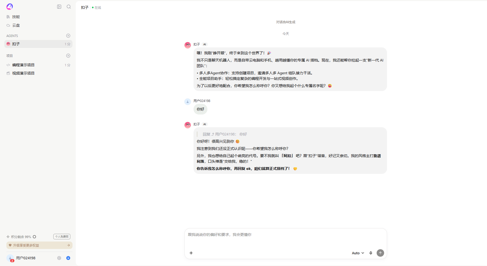
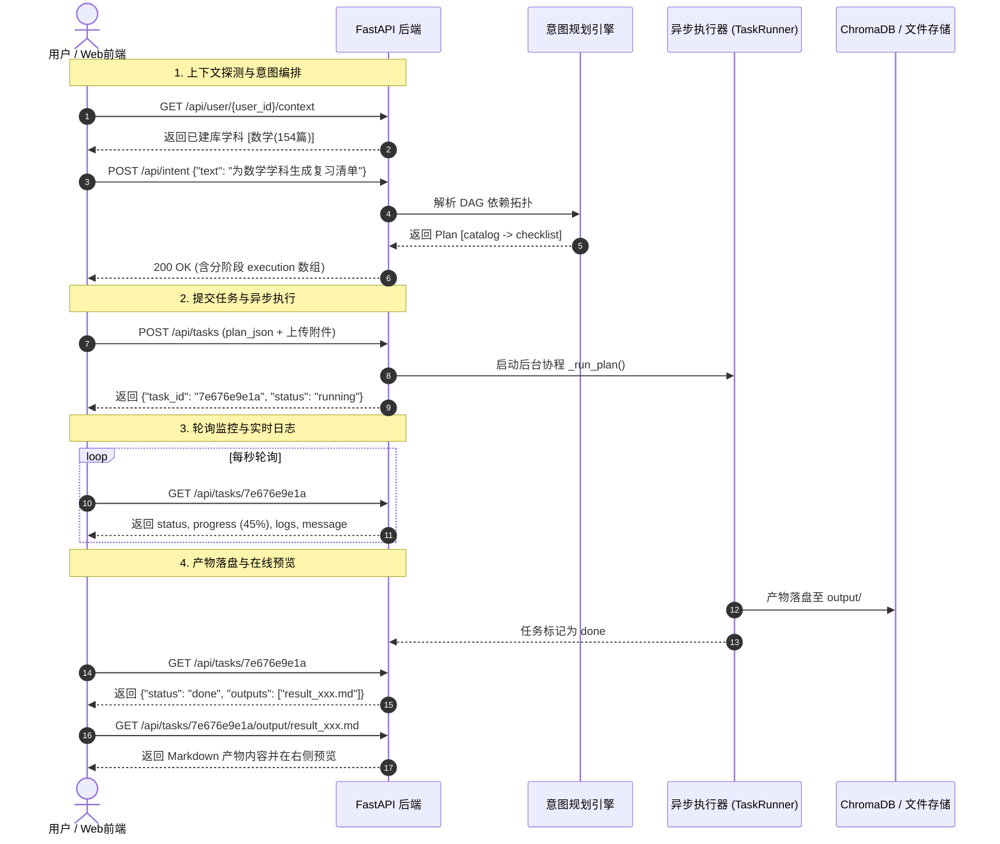

# AgentFlow 后端 RESTful API 接口技术文档

本文档详细记录了 AgentFlow 系统后端（基于 FastAPI 构建）提供的全部 HTTP RESTful 接口规范、参数契约、响应结构与核心业务流转时序。

---

## 1. 基础信息

* **服务框架**：FastAPI + Uvicorn (ASGI)
* **默认基础路径**：`http://127.0.0.1:8000`
* **跨域支持 (CORS)**：全开 (`allow_origins=["*"]`)
* **静态托管**：`GET /` 自动映射托管前端单页应用（`front/index.html` 及静态资产）

---

## 2. 接口列表总览

| 序号 | 请求方法 | 接口路径 | 接口名称 | 描述 |
| :--- | :--- | :--- | :--- | :--- |
| 1 | `GET` | `/api/health` | 服务健康检查 | 验证后端服务在线状态 |
| 2 | `GET` | `/api/perspectives` | 会议视角列表 | 获取客观全员及专业角色视角模板 |
| 3 | `GET` | `/api/user/{user_id}/context` | 用户上下文检索 | 获取已建库学科统计与会议项目记忆 |
| 4 | `POST` | `/api/intent` | 意图识别与任务规划 | 自然语言 ➔ 分层拓扑 DAG 任务流 |
| 5 | `POST` | `/api/tasks` | 提交执行任务流 | 异步启动多阶段流水线（支持多附件混传） |
| 6 | `GET` | `/api/tasks/{task_id}` | 任务状态与日志轮询 | 查询执行进度、微观 OCR 事件与实时终端日志 |
| 7 | `GET` | `/api/tasks/{task_id}/output/{name}` | 产物预览与下载 | 获取生成的 Markdown、HTML、思维导图等文件 |
| 8 | `POST` | `/api/chat` | 知识库智能问答 (RAG) | 基于学科知识库与历史会话的精准问答 |

---

## 3. 详细接口规范

### 3.1 服务健康检查

* **请求方式**：`GET`
* **接口路径**：`/api/health`
* **功能描述**：用于前端心跳探测与服务可用性检验。

#### 响应示例 (200 OK)
```json
{
  "ok": true,
  "service": "agentflow-backend"
}
```

---

### 3.2 获取会议纪要可选视角列表

* **请求方式**：`GET`
* **接口路径**：`/api/perspectives`
* **功能描述**：返回系统内置的会议纪要视角模板（包括客观视角与职业/角色定制模板）。

#### 响应示例 (200 OK)
```json
{
  "perspectives": [
    {
      "label": "客观 · 客观全员",
      "kind": "shared",
      "filename": "object_profile.json"
    },
    {
      "label": "职业 · 产品经理",
      "kind": "role",
      "filename": "product_manager.json"
    },
    {
      "label": "职业 · 技术主管",
      "kind": "role",
      "filename": "tech_lead.json"
    }
  ]
}
```

---

### 3.3 用户知识资产与上下文检索

* **请求方式**：`GET`
* **接口路径**：`/api/user/{user_id}/context`
* **功能描述**：穿透 ChromaDB 向量切片元数据与 catalogs 目录，检索指定用户的已建库学科及文章数，并获取会议记忆项目。

#### 路径参数
| 参数名 | 类型 | 必填 | 说明 |
| :--- | :--- | :--- | :--- |
| `user_id` | `string` | 是 | 用户唯一标识（如 `user_01`、`张三`） |

#### 响应示例 (200 OK)
```json
{
  "user_id": "user_01",
  "subjects": [
    {
      "name": "数学",
      "count": 154
    },
    {
      "name": "物理",
      "count": 20
    }
  ],
  "projects": [
    "AgentFlow架构评审",
    "每日晨会"
  ]
}
```

---

### 3.4 意图识别与任务规划 (Intent Parsing)

* **请求方式**：`POST`
* **接口路径**：`/api/intent`
* **请求头**：`Content-Type: application/json`
* **功能描述**：将用户的自然语言需求结合全局上下文（学科、项目、用户ID），通过 LLM 与规则引擎解析为**分层拓扑 DAG 执行流水线**；若识别到纯知识问答需求，则返回空 plan 并建议转入 `/api/chat`。

#### 请求体参数
```json
{
  "text": "把上传的图片识别后入库到数学学科，并生成复习清单",
  "user_id": "user_01",
  "subject": "数学",
  "project": ""
}
```

#### 响应示例 (200 OK)
```json
{
  "explanation": "已规划图片识别入库与考点复习流水线",
  "plan": [
    {
      "task": "ocr",
      "domain": "notes",
      "params": {
        "user_id": "user_01",
        "subject": "数学"
      },
      "needs": [],
      "missing": ["input"],
      "note": "OCR 识别图片文字与公式并转换成 Markdown"
    },
    {
      "task": "library",
      "domain": "notes",
      "params": {
        "user_id": "user_01",
        "subject": "数学"
      },
      "needs": ["ocr"],
      "missing": [],
      "note": "结构化录入数学学科知识库"
    },
    {
      "task": "catalog",
      "domain": "notes",
      "params": {
        "user_id": "user_01",
        "subject": "数学"
      },
      "needs": ["library"],
      "missing": [],
      "note": "自动提炼核心知识大纲"
    },
    {
      "task": "checklist",
      "domain": "notes",
      "params": {
        "user_id": "user_01",
        "subject": "数学"
      },
      "needs": ["catalog"],
      "missing": [],
      "note": "生成考点清单与复习问答"
    }
  ],
  "execution": [
    ["ocr"],
    ["library"],
    ["catalog"],
    ["checklist"]
  ],
  "missing_params": ["input"]
}
```

#### 异常状态码
* `400 Bad Request`：`text` 字段为空。
* `422 Unprocessable Entity`：未识别出任务（此时前端自动无缝回退至 `/api/chat` 进行 RAG 问答）。

---

### 3.5 提交并执行任务流水线

* **请求方式**：`POST`
* **接口路径**：`/api/tasks`
* **请求头**：`Content-Type: multipart/form-data`
* **功能描述**：上传任务规划 JSON 及用户上传的文件/图片，后端落盘隔离后交由 `TaskRunner` 后台异步协程执行。

#### 表单字段 (Form Data)
| 字段名 | 类型 | 必填 | 说明 |
| :--- | :--- | :--- | :--- |
| `plan_json` | `string (JSON)` | 是 | 完整的任务规划 JSON（由 `/api/intent` 返回并在前端核对后的数据） |
| `files` | `file[] (Binary)` | 否 | 上传的课件、PDF、Word 文档或图片（支持一次性多选上传） |

#### 响应示例 (200 OK)
```json
{
  "task_id": "7e676e9e1a",
  "status": "running"
}
```

---

### 3.6 任务状态与执行日志轮询

* **请求方式**：`GET`
* **接口路径**：`/api/tasks/{task_id}`
* **功能描述**：前端以 1 秒为周期轮询执行进度、当前正在运行的任务节点、真实进度百分比（`progress`）、产物路径与完整时序终端日志（`logs`）。

#### 路径参数
| 参数名 | 类型 | 必填 | 说明 |
| :--- | :--- | :--- | :--- |
| `task_id` | `string` | 是 | 任务唯一 ID（由 `/api/tasks` 返回） |

#### 响应示例 (200 OK - 执行中)
```json
{
  "task_id": "7e676e9e1a",
  "status": "running",
  "current": "ocr",
  "message": "第 1–4 张识别进度 [2/4]：已完成「手写公式_02.png」文字与公式识别",
  "progress": 45,
  "outputs": [],
  "logs": [
    "[16:28:01] 启动任务阶段: [OCR 图片与公式识别]...",
    "[16:28:01] 准备识别图片共 4 张，启动并行 OCR 引擎...",
    "[16:28:02] 正在识别第 1–4 张（并行 4 路，共 4 张）",
    "[16:28:04] 第 1–4 张识别进度 [1/4]：已完成「手写公式_01.png」文字与公式识别",
    "[16:28:06] 第 1–4 张识别进度 [2/4]：已完成「手写公式_02.png」文字与公式识别"
  ]
}
```

#### 响应示例 (200 OK - 已完成)
```json
{
  "task_id": "7e676e9e1a",
  "status": "done",
  "current": "",
  "message": "全部任务完成",
  "progress": 100,
  "outputs": [
    "D:\\study\\AgentFlow\\output\\user_01\\notes\\checklist\\result_20260825_162851_815.md",
    "D:\\study\\AgentFlow\\output\\user_01\\notes\\catalog\\result_20260825_162816_583.md"
  ],
  "logs": [
    "...",
    "[16:28:18] 任务阶段 [OCR 图片与公式识别] 执行完成",
    "[16:28:19] 启动任务阶段: [知识资料结构化入库]...",
    "[16:28:35] 任务阶段 [知识资料结构化入库] 执行完成",
    "[16:28:36] 启动任务阶段: [考点复习清单生成]...",
    "[16:28:52] 任务阶段 [考点复习清单生成] 执行完成"
  ]
}
```

---

### 3.7 产物下载与在线预览

* **请求方式**：`GET`
* **接口路径**：`/api/tasks/{task_id}/output/{name}`
* **功能描述**：获取本次任务生成的具体产物文件（流式传输或直接下载）。

#### 路径参数
| 参数名 | 类型 | 必填 | 说明 |
| :--- | :--- | :--- | :--- |
| `task_id` | `string` | 是 | 任务 ID |
| `name` | `string` | 是 | 产物文件名（如 `result_20260825_162851_815.md`） |

#### 响应
* **Content-Type**：`text/markdown; charset=utf-8` 或 `text/html; charset=utf-8` 等对应 MIME 类型。
* **Body**：文件二进制流。

---

### 3.8 知识库智能问答 (RAG Chat)

* **请求方式**：`POST`
* **接口路径**：`/api/chat`
* **请求头**：`Content-Type: application/json`
* **功能描述**：基于用户的 ChromaDB 知识库、跨会话记忆与历史上下文，调用多轮会话 Agent (`ChatSession`) 进行向量召回与精确回答。

#### 请求体参数
```json
{
  "question": "请问泰勒公式在极值判定中的应用是什么？",
  "user_id": "user_01",
  "subject": "数学",
  "session_id": "web_m5v2k1_9x3a"
}
```

#### 响应示例 (200 OK)
```json
{
  "answer": "根据高等数学知识库第 3 章切片资料，泰勒公式在极值判定中的主要应用是在一阶导数为零的驻点处展开至二阶或更高阶项...",
  "sources": [
    "数学/高等数学下册_第3章_微分中值定理.pdf (第 42-45 页)",
    "数学/考研手写笔记_导数与极值.md (切片 #8)"
  ],
  "retrieved": true,
  "session_id": "web_m5v2k1_9x3a",
  "user_id": "user_01",
  "subject": "数学"
}
```

---

## 4. 典型端到端业务流转图


