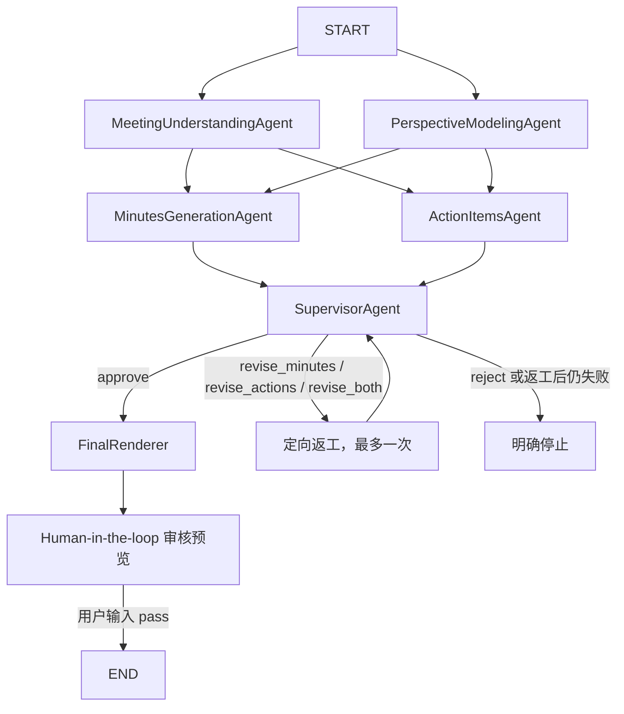

# 个性化会议纪要多 Agent 项目理解手册

## 1. 项目要解决的问题

传统会议总结通常只把整段会议文字交给一个大模型，让模型一次性输出摘要和待办。
这种方式容易出现：

- 不同角色得到完全相同的纪要；
- 把其他人的任务分配给当前用户；
- 把讨论、建议错误地写成正式决策；
- 编造负责人或截止时间；
- 同一个模型在不同运行中返回不同 JSON 结构。

本项目将任务拆给多个 Agent：

1. 先独立理解会议事实；
2. 再建立当前用户在本次会议中的视角；
3. 并行生成用户纪要草稿和待办候选；
4. 最后统一校准，只输出该用户相关的纪要和本人待办。

同一份会议可以输入多份用户画像，因此物业负责人和居民志愿者会得到不同结果。

## 2. 最终输出

程序最终只展示两部分：

```text
【用户视角会议纪要】
一段完整、连续的会议纪要。

【待办事项】
1. 第一项待办（负责人：某人；截止时间：某时间）
2. 第二项待办（负责人：某人；截止时间：某时间）
```

以下内容不会展示：

- Agent 中间推理；
- JSON；
- 他人的独立待办；
- 置信度；
- 原文证据；
- LangGraph State。

这些字段会在内部用于校验和最终整合。

## 3. 项目结构

```text
meeting_summary/
├── app.py                              # 唯一启动入口
├── README.md                           # 快速使用说明
├── ARCHITECTURE.md                     # 本文档
├── requirements.txt                    # Python 运行依赖
├── pyproject.toml                      # 项目与构建配置
├── .env                                # 本地 DeepSeek Key，不上传 Git
├── .env.example                        # 可上传的配置示例
├── .gitignore                          # Git 忽略规则
├── examples/
│   ├── community_meeting.txt           # 示例会议原文
│   ├── property_manager_profile.json   # 王芳画像
│   └── volunteer_profile.json          # 李明画像
└── src/meeting_agent/
    ├── __init__.py
    ├── agents/
    │   ├── meeting_understanding_agent.py
    │   ├── perspective_modeling_agent.py
    │   ├── minutes_generation_agent.py
    │   ├── action_items_agent.py
    │   ├── supervisor_agent.py
    │   ├── final_renderer.py
    │   └── schema_repair_agent.py
    ├── orchestrator.py                 # LangGraph 工作流
    ├── state.py                        # 共享内存 State
    ├── client.py                       # DeepSeek API 与重试
    ├── models.py                       # Python 数据模型
    ├── validation.py                   # 严格结构校验
    ├── config.py                       # .env 读取
    └── presenter.py                    # 最终终端展示
```

## 4. 如何运行

### 4.1 创建虚拟环境

已有 Conda 环境时可以直接使用：

```powershell
conda activate agent
python -m pip install -r requirements.txt
```

也可以创建项目独立环境：

```powershell
cd D:\meeting_summary
python -m venv .venv
.\.venv\Scripts\Activate.ps1
```

### 4.2 安装依赖

```powershell
python -m pip install -r requirements.txt
```

如果 PyPI 官方源访问异常：

```powershell
python -m pip install -i https://pypi.tuna.tsinghua.edu.cn/simple -r requirements.txt
```

### 4.3 配置 API Key

复制示例文件：

```powershell
Copy-Item .env.example .env
```

在 `.env` 中填写：

```text
DEEPSEEK_API_KEY=你的真实Key
DEEPSEEK_BASE_URL=https://api.deepseek.com
DEEPSEEK_MODEL=deepseek-chat
```

`.env` 已被 `.gitignore` 忽略，不能上传 GitHub。

### 4.4 启动

```powershell
python app.py
```

`app.py` 不负责自动切换 Python 环境。运行前应激活已经安装依赖的环境。

## 5. 从 app.py 开始理解

`app.py` 是唯一入口，主要完成四件事：

1. 定位项目目录和输入文件；
2. 加载 `.env`；
3. 读取会议文字与用户画像；
4. 调用 `MeetingAgentSystem` 并展示结果。

输入文件在顶部配置：

```python
MEETING_FILE = PROJECT_ROOT / "examples" / "community_meeting.txt"

PROFILE_FILES = [
    PROJECT_ROOT / "examples" / "property_manager_profile.json",
    PROJECT_ROOT / "examples" / "volunteer_profile.json",
]
```

会议原文只读取一次：

```python
transcript = MEETING_FILE.read_text(encoding="utf-8")
```

随后依次处理每份用户画像：

```python
for profile_file in PROFILE_FILES:
    profile_data = json.loads(profile_file.read_text(encoding="utf-8"))
    user = UserIdentity(**profile_data)
    result = await system.run(transcript, user)
```

因此：

- 王芳和李明使用相同会议原文；
- 每个人拥有独立用户画像；
- 每个人单独执行一次完整 LangGraph；
- 用户之间目前顺序执行；
- 单个用户内部的 Agent 会并行执行。

## 6. 用户画像

用户画像格式：

```json
{
  "name": "李明",
  "role": "居民志愿者",
  "department": "春风小区志愿者小组",
  "responsibilities": [
    "报名信息整理",
    "现场签到",
    "居民引导",
    "临时通知"
  ],
  "interests": [
    "报名名单准确性",
    "现场秩序",
    "通知是否及时"
  ],
  "context": "希望明确活动前和活动当天需要完成的事情"
}
```

字段含义：

| 字段 | 含义 |
|---|---|
| name | 用户姓名，用于匹配待办负责人 |
| role | 用户角色，用于确定纪要视角 |
| department | 所属部门或组织 |
| responsibilities | 用户的长期职责 |
| interests | 用户希望重点关注的内容 |
| context | 本次生成的额外要求 |

`name` 对待办准确性最重要。最终 Agent 要求待办 `owner` 与当前用户名一致。

## 7. LangGraph 工作流

### 7.1 拓扑



`SchemaRepairAgent` 不是固定图节点。只有输出格式连续不合规时，由客户端调用。

### 7.2 第一层并行

```python
builder.add_edge(START, "meeting_understanding")
builder.add_edge(START, "perspective_modeling")
```

两个节点都从 `START` 出发，所以 LangGraph 会并行执行：

- 会议事实理解；
- 用户视角建模。

### 7.3 第一层汇合

```python
first_layer = [
    "meeting_understanding",
    "perspective_modeling",
]

builder.add_edge(first_layer, "minutes_generation")
builder.add_edge(first_layer, "action_items")
```

列表形式的起点表示：必须等待列表中的两个节点全部完成。

### 7.4 第二层并行

第一层完成后，并行执行：

- `MinutesGenerationAgent`；
- `ActionItemsAgent`。

### 7.5 第二层汇合与审核

```python
builder.add_edge(
    ["minutes_generation", "action_items"],
    "supervisor_review",
)
```

Supervisor 必须等待纪要草稿和待办候选全部生成。它直接读取会议原文，
分别审核事实一致性、用户视角、待办证据和跨 Agent 一致性，然后决定：

- `approve`：进入最终渲染；
- `revise_minutes`：只返工纪要；
- `revise_actions`：只返工待办；
- `revise_both`：两者并行返工；
- `reject`：原文不足或结果无法可靠修复，明确停止。

返工节点完成后会再次进入 Supervisor，但 `revision_count` 的最大值为 1。
第二次审核仍不通过时不会继续循环或带病输出。

## 8. LangGraph State

共享状态定义在 `state.py`：

```python
class MeetingState(TypedDict, total=False):
    transcript: str
    user: dict
    meeting_understanding: dict
    perspective_profile: dict
    minutes_draft: dict
    extracted_action_items: dict
    supervisor_review: dict
    minutes_revision_feedback: list[str]
    actions_revision_feedback: list[str]
    revision_count: int
    final_report: dict
    human_decision: str
```

### 8.1 初始状态

```python
{
    "transcript": "会议原文",
    "user": {
        "name": "李明",
        "role": "居民志愿者"
    }
}
```

### 8.2 第一层完成后

```python
{
    "transcript": ...,
    "user": ...,
    "meeting_understanding": ...,
    "perspective_profile": ...
}
```

### 8.3 第二层完成后

```python
{
    ...,
    "minutes_draft": ...,
    "extracted_action_items": ...
}
```

### 8.4 最终状态

```python
{
    ...,
    "final_report": ...
}
```

每个节点只返回自己负责更新的字段，LangGraph 将局部更新合并到 State。

当前版本使用内存 Checkpointer 支持 Human-in-the-loop：

```python
checkpointer = InMemorySaver()
graph = builder.compile(
    checkpointer=checkpointer,
    interrupt_before=["human_review"],
)
```

`FinalRenderer` 完成后，图在 `human_review` 节点之前暂停。应用显示
`final_report` 预览；用户输入 `pass` 后，使用同一个 `thread_id` 恢复：

```python
state = await graph.ainvoke(None, config=config)
```

该 Checkpointer 的边界是：

- 检查点只存在于当前 Python 进程内存；
- 支持暂停后使用同一个 `thread_id` 恢复；
- 不创建 SQLite；
- 不保存会议历史；
- 程序退出后检查点释放。

## 9. 业务 Agent 与辅助组件

## 9.1 MeetingUnderstandingAgent

文件：`agents/meeting_understanding_agent.py`

职责：

- 理解会议目的；
- 识别讨论议题；
- 区分讨论与正式决策；
- 提取风险；
- 提取未决问题。

输入：

```text
会议原文
```

输出：

```json
{
  "meeting_purpose": "字符串",
  "topics": [
    {
      "title": "字符串",
      "discussion": "字符串",
      "conclusion": "字符串或null",
      "participants": ["字符串"]
    }
  ],
  "decisions": ["字符串"],
  "open_questions": ["字符串"],
  "risks": ["字符串"]
}
```

该 Agent 不负责个性化。

## 9.2 PerspectiveModelingAgent

文件：`agents/perspective_modeling_agent.py`

职责：

- 把静态用户画像映射到本次会议；
- 找出与当前用户相关的议题；
- 确定职责、目标和关注点；
- 给出判断依据。

输入：

```text
会议原文 + 用户画像
```

输出：

```json
{
  "confidence": "high|medium|low",
  "name": "字符串或null",
  "inferred_role": "字符串或null",
  "responsibilities": ["字符串"],
  "goals": ["字符串"],
  "concerns": ["字符串"],
  "relevant_topics": ["字符串"],
  "evidence": ["字符串"]
}
```

用户显式提供的姓名、角色、部门和职责优先于模型推断。

## 9.3 MinutesGenerationAgent

文件：`agents/minutes_generation_agent.py`

职责：

- 生成个性化纪要草稿；
- 提高与用户职责相关内容的权重；
- 保留全局关键决策；
- 避免把建议写成决策。

输入：

```text
会议原文
+ 用户画像
+ 会议理解
+ 用户视角模型
```

输出仍然是分区结构，方便后续整合：

```json
{
  "headline": "字符串",
  "executive_summary": ["字符串"],
  "key_decisions": ["字符串"],
  "personally_relevant_points": ["字符串"],
  "risks_and_blockers": ["字符串"],
  "unresolved_questions": ["字符串"]
}
```

注意：这里是内部草稿，可以是数组；最终 Agent 会整理成一段话。

## 9.4 ActionItemsAgent

文件：`agents/action_items_agent.py`

职责：

- 提取明确可执行的任务；
- 区分本人、他人和未分配待办；
- 保存负责人、截止时间和原文依据。

核心规则：

- 本人待办必须由原文明示；
- 不能只凭角色推断负责人；
- 无明确负责人时 `owner=null`；
- 不同动作必须拆分；
- 不同截止时间必须拆分；
- 一般讨论不能被写成待办。

输出：

```json
{
  "my_actions": [],
  "delegated_actions": [],
  "unassigned_actions": []
}
```

每项待办：

```json
{
  "task": "任务内容",
  "owner": "负责人或null",
  "deadline": "截止时间或null",
  "priority": "high|medium|low",
  "status": "explicit|inferred",
  "evidence": "会议原文依据",
  "confidence": "high|medium|low"
}
```

## 9.5 SupervisorAgent

文件：`agents/supervisor_agent.py`

职责：

- 以会议原文为最高事实来源，审核决策、风险、日期和未决事项；
- 检查纪要是否真正体现用户职责，同时保留关键全局信息；
- 逐条核对待办任务、负责人、截止时间和原文证据；
- 检查会议理解、用户视角、纪要草稿和待办结果之间的冲突；
- 决定放行、定向返工或拒绝，并生成具体返工意见。

审核输出：

```json
{
  "decision": "approve|revise_minutes|revise_actions|revise_both|reject",
  "facts_check": {"status": "pass|fail", "findings": []},
  "perspective_check": {"status": "pass|fail", "findings": []},
  "action_items_check": {"status": "pass|fail", "findings": []},
  "consistency_check": {"status": "pass|fail", "findings": []},
  "minutes_feedback": [],
  "actions_feedback": []
}
```

## 9.6 FinalRenderer

文件：`agents/final_renderer.py`

它只在 Supervisor 放行后运行，将已审核内容渲染成一个连贯纪要段落和当前用户本人待办。
它不负责再次规划或补充事实，最终输出仍使用 `FinalReport` 固定结构。

## 9.7 SchemaRepairAgent

文件：`agents/schema_repair_agent.py`

它不是业务 Agent，只负责修复 JSON 结构：

- 不得新增会议事实；
- 不得删除会议事实；
- 不得推断负责人；
- 不得改写任务；
- 只允许修复字段、数组和 JSON 格式。

修复结果仍需通过严格校验。

## 10. Prompt 和输出模板

每个业务 Agent 文件都包含：

```python
class SomeAgent:
    SYSTEM_PROMPT = """业务职责和规则"""

    OUTPUT_CONTRACT = """固定JSON模板"""

    async def run(...):
        return await self.client.structured(
            self.SYSTEM_PROMPT,
            user_prompt,
            ResponseModel,
            self.OUTPUT_CONTRACT,
        )
```

这样查看或修改一个 Agent 时，不需要跨多个文件寻找它的 Prompt 和模板。

公共的结构校验仍放在 `validation.py`，避免在每个 Agent 中重复实现。

## 11. DeepSeek 客户端

`client.py` 负责：

1. 从环境变量读取 DeepSeek 配置；
2. 构造 `/chat/completions` 请求；
3. 设置 `temperature=0`；
4. 要求模型返回 JSON 对象；
5. 注入 Agent 的输出契约；
6. 解析并严格校验；
7. 失败时重试；
8. 多次失败后调用 SchemaRepairAgent。

同步网络请求通过：

```python
await asyncio.to_thread(self._post, messages)
```

放入工作线程，使 LangGraph 的并行节点不会被单个阻塞请求完全卡住。

正常情况下，每个用户需要六次 DeepSeek 调用：

```text
第一层：2次
第二层：2次
Supervisor 审核：1次
FinalRenderer：1次
总计：6次
```

若只返工一个结果，会增加一次生成和一次复审，共 8 次；若纪要和待办同时
返工，会增加两次生成和一次复审，共 9 次。格式重试会继续增加调用次数。

## 12. 输出一致性

系统使用三层保障。

### 12.1 Prompt 契约

每个 Agent 的 `OUTPUT_CONTRACT` 明确规定字段和类型。

### 12.2 严格校验

`validation.py` 检查：

- 顶层是否是对象；
- 字段是否缺失；
- 是否有多余字段；
- 字段类型是否正确；
- 数组元素是否正确；
- 枚举值是否合法；
- `null` 是否只出现在允许位置。

校验器不会：

- 把字符串偷偷转换成数组；
- 删除多余字段；
- 自动补齐字段；
- 修改业务事实。

### 12.3 重试和格式修复

```text
模型输出
   ↓
JSON解析
   ↓
严格校验
   ├─ 通过 → 返回
   └─ 失败 → 把错误反馈给原Agent
                   ↓
                自动重试
                   ↓
            多次失败后格式修复
                   ↓
                再次校验
```

最终仍不合规时直接报错，不把错误数据传给下游。

## 13. 数据模型

`models.py` 使用 dataclass 定义输入和输出：

- `UserIdentity`
- `MeetingUnderstanding`
- `PerspectiveProfile`
- `PersonalizedMinutes`
- `ActionItems`
- `FinalReport`

所有模型继承 `ModelMixin`，通过：

```python
result.model_dump()
```

转换成普通字典，再写入 LangGraph State。

## 14. 最终展示

`presenter.py` 只关心终端格式。`app.py` 会先用它显示一份尚未发布的审核预览：

```text
审核预览（尚未正式输出）
```

用户输入 `pass` 后，LangGraph 恢复并通过 `human_review` 节点，随后再次使用
相同展示函数输出正式结果。未输入 `pass` 时不会正式发布。

纪要直接输出为一段：

```python
print(result.personalized_minutes)
```

待办使用数字编号：

```python
for index, item in enumerate(result.action_items, start=1):
    print(f"{index}. ...")
```

展示层不会参与 Agent 推理，也不会改变业务内容。

## 15. 如何修改会议

直接编辑：

```text
examples/community_meeting.txt
```

建议会议文字包含：

- 发言人姓名；
- 明确任务；
- 明确负责人；
- 明确截止时间；
- 会议结论。

原文越清楚，待办归属越准确。

## 16. 如何增加用户

创建：

```text
examples/new_user_profile.json
```

然后修改根目录 `app.py`：

```python
PROFILE_FILES = [
    PROJECT_ROOT / "examples" / "property_manager_profile.json",
    PROJECT_ROOT / "examples" / "volunteer_profile.json",
    PROJECT_ROOT / "examples" / "new_user_profile.json",
]
```

程序会用同一会议原文依次为三个人生成结果。

## 17. 如何修改 Agent

如果只修改某个 Agent 的行为，修改对应文件：

```text
src/meeting_agent/agents/
```

通常需要修改：

```python
SYSTEM_PROMPT
OUTPUT_CONTRACT
```

如果改变了输出字段，还必须同步修改：

```text
models.py
validation.py
```

否则严格校验会拒绝新结构。

## 18. 准确性边界

项目能够严格保证的是输出结构，不可能仅靠 LLM 绝对保证语义永远正确。

当前提高准确性的手段包括：

- 会议理解和用户建模分开；
- 纪要与待办分开生成；
- 最终 Agent 二次校准；
- 待办保留 evidence；
- owner 必须匹配当前用户；
- 禁止仅凭角色推断任务；
- temperature 设置为 0；
- 所有结果经过固定契约校验。

如果后续对准确率要求更高，可以新增事实核验 Agent，逐条检查最终纪要和待办能否在原文中找到依据。

## 19. GitHub 安全

可以上传：

```text
app.py
src/
examples/
README.md
ARCHITECTURE.md
requirements.txt
pyproject.toml
.env.example
.gitignore
```

不能上传：

```text
.env
.venv/
__pycache__/
```

`.gitignore` 已配置这些规则。真实 API Key 一旦公开，应立即撤销并重新生成。

## 20. 常见问题

### ModuleNotFoundError: No module named 'langgraph'

当前 Python 没安装依赖，或没有激活正确的虚拟环境：

```powershell
.\.venv\Scripts\Activate.ps1
python -m pip install -r requirements.txt
```

### 找不到 meeting_agent

应从项目根目录运行：

```powershell
cd D:\meeting_summary
python app.py
```

### API Key 无效

检查 `.env` 中是否填写了当前有效的 DeepSeek Key。不要把 Key 写入代码或 `.env.example`。

### 运行时暂时没有结果

每个用户正常需要六次模型调用；发生返工时需要 8 或 9 次。程序开始时会显示
“正在生成”，具体时间取决于 DeepSeek 响应速度。

### 输出结构错误

系统会自动重试和修复。若最终仍不符合契约，会明确报错，而不会展示错误结构。

### 不同用户结果相同

重点检查：

- 两份画像的姓名是否不同；
- 角色和职责是否有区分；
- 会议原文是否明确提到用户；
- 任务是否包含负责人姓名。
