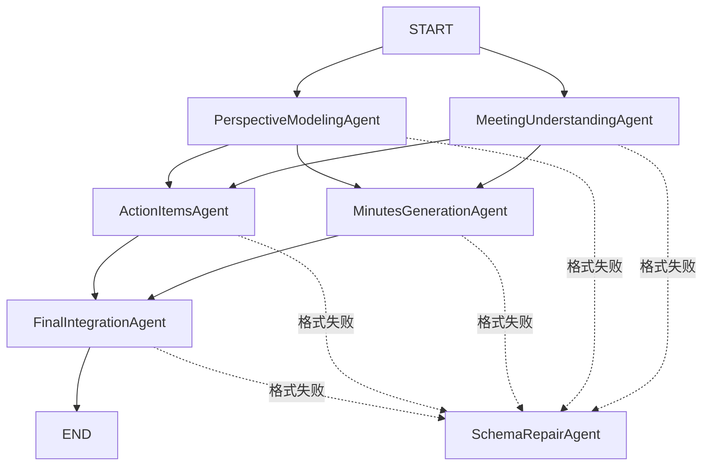

# LangGraph 会议纪要多 Agent 系统设计文档

## 1. 系统目标

系统接收两类输入：

1. 一份会议文字；
2. 一份用户画像，包括姓名、角色、部门、职责和关注点。

系统使用同一份会议内容，为不同用户生成不同侧重点的会议纪要，并且只把该用户本人负责、共同负责或需要主动跟进的事项放入最终待办。

最终界面只展示：

```text
【用户视角会议纪要】
一段完整、连贯的用户视角会议纪要。

【待办事项】
1. ...
2. ...
```

Agent 中间结果不会显示在最终界面，只在本次运行的 LangGraph State 中传递。
程序结束后状态释放，不保存会议内容。

## 2. Agent 拓扑



工作流包含两个并行层：

- 第一层并行执行会议理解和用户视角建模；
- 第二层在第一层全部完成后，并行生成纪要草稿和待办提取结果；
- 最终整合节点等待第二层全部完成。

`SchemaRepairAgent` 不参与正常业务推理。只有某个 Agent 连续输出不符合 JSON 契约时才会调用它。

## 3. LangGraph 共享状态

共享状态定义在 `src/meeting_agent/state.py`：

```python
class MeetingState(TypedDict, total=False):
    transcript: str
    user: dict
    meeting_understanding: dict
    perspective_profile: dict
    minutes_draft: dict
    extracted_action_items: dict
    final_report: dict
```

State 中只传递可序列化的 JSON 字典，不直接传递自定义 Python 类。Agent
返回的强类型模型在写入状态前调用 `model_dump()`；从最终状态读取后再次通过
严格校验器恢复为模型对象。

每个节点只返回自己负责更新的字段：

| 节点 | 读取 | 写入 |
|---|---|---|
| MeetingUnderstandingAgent | transcript | meeting_understanding |
| PerspectiveModelingAgent | transcript、user | perspective_profile |
| MinutesGenerationAgent | 前两项结果、原文、用户 | minutes_draft |
| ActionItemsAgent | 前两项结果、原文、用户 | extracted_action_items |
| FinalIntegrationAgent | 全部中间结果 | final_report |

状态不再通过全局变量共享，也不需要调用方手工保存。LangGraph 会把节点返回的局部更新合并进 `MeetingState`。

## 4. 并行和汇合

第一层通过两条 `START` 边并行启动：

```python
builder.add_edge(START, "meeting_understanding")
builder.add_edge(START, "perspective_modeling")
```

第二层使用节点列表作为汇合条件。只有第一层两个节点都完成，第二层节点才会启动：

```python
first_layer = ["meeting_understanding", "perspective_modeling"]
builder.add_edge(first_layer, "minutes_generation")
builder.add_edge(first_layer, "action_items")
```

最终节点同样等待纪要和待办两个节点：

```python
builder.add_edge(
    ["minutes_generation", "action_items"],
    "final_integration",
)
```

这种写法替代了原来的两处 `asyncio.gather()`，并把执行关系变成清晰、可检查的图。

## 5. Context 生命周期

当前版本不配置 Checkpointer：

```python
graph = builder.compile()
state = await graph.ainvoke(initial_state)
```

每个用户调用一次独立工作流。Context 只存在于该次 `ainvoke()` 的内存 State 中：

```python
initial_state = {
    "transcript": transcript,
    "user": user.model_dump(),
}
```

执行过程中 State 会依次增加：

```text
meeting_understanding
perspective_profile
minutes_draft
extracted_action_items
final_report
```

最终结果返回后，State 没有其他引用时由 Python 自动释放。项目不会创建 SQLite
文件，也不会保留会议原文、用户画像或 Agent 中间结果。

## 6. 输出一致性保障

系统不依赖 Prompt 自觉遵守格式，而是采用三层保障。

### 6.1 固定 JSON 契约

每个 Agent 文件通过 `OUTPUT_CONTRACT` 定义自己的唯一合法结构。这样修改
Agent 时，可以在同一个文件中同时查看职责 Prompt、输出模板和返回模型。

最终结果示例：

```json
{
  "title": "字符串",
  "personalized_minutes": "一段完整、连贯的字符串",
  "action_items": [
    {
      "task": "字符串",
      "owner": "字符串或null",
      "deadline": "字符串或null",
      "priority": "high|medium|low",
      "status": "explicit|inferred",
      "evidence": "字符串",
      "confidence": "high|medium|low"
    }
  ]
}
```

### 6.2 严格校验

`src/meeting_agent/validation.py` 检查：

- 字段是否完整；
- 是否存在多余字段；
- 字段类型是否正确；
- 数组是否真的是数组；
- 待办字段是否齐全；
- 枚举值是否合法；
- `null` 是否只出现在允许的位置。

校验器不会：

- 把字符串转换成数组；
- 丢弃多余字段；
- 自动补齐缺失字段；
- 修改业务内容。

### 6.3 SchemaRepairAgent

原 Agent 连续失败后，`SchemaRepairAgent` 只修复 JSON 结构。修复结果仍需再次通过相同的严格校验，否则整个节点失败，不允许错误结构进入下游。

## 7. 项目结构

```text
meeting_summary/
├── app.py
├── README.md
├── ARCHITECTURE.md
├── pyproject.toml
├── .env
├── .env.example
├── examples/
│   ├── community_meeting.txt
│   ├── property_manager_profile.json
│   └── volunteer_profile.json
└── src/meeting_agent/
    ├── agents/
    │   ├── meeting_understanding_agent.py
    │   ├── perspective_modeling_agent.py
    │   ├── minutes_generation_agent.py
    │   ├── action_items_agent.py
    │   ├── final_integration_agent.py
    │   └── schema_repair_agent.py
    ├── client.py
    ├── config.py
    ├── models.py
    ├── orchestrator.py
    ├── presenter.py
    ├── state.py
    └── validation.py
```

## 8. 安装和运行

要求 Python 3.10 或更高版本。

安装：

```powershell
cd D:\meeting_summary
python -m pip install -e .
```

当前已验证的核心环境版本：

```text
Python 3.10.9
LangGraph 1.2.10
```

如果 PyPI 官方源受本地代理影响，可通过清华大学 TUNA 镜像重建：

```powershell
python -m pip install -i https://pypi.tuna.tsinghua.edu.cn/simple -e .
```

在 `.env` 中设置：

```text
DEEPSEEK_API_KEY=你的真实API-Key
DEEPSEEK_BASE_URL=https://api.deepseek.com
DEEPSEEK_MODEL=deepseek-chat
```

运行：

```powershell
python app.py
```

默认使用同一份社区活动会议，分别生成王芳和李明两种用户视角的结果。

## 9. 修改输入

会议文字：

```text
examples/community_meeting.txt
```

用户画像：

```text
examples/property_manager_profile.json
examples/volunteer_profile.json
```

需要增加用户时，新建画像 JSON，并将路径加入 `app.py` 的 `PROFILE_FILES`：

```python
PROFILE_FILES = [
    PROJECT_ROOT / "examples" / "property_manager_profile.json",
    PROJECT_ROOT / "examples" / "volunteer_profile.json",
    PROJECT_ROOT / "examples" / "new_user_profile.json",
]
```

## 10. 常见问题

### ModuleNotFoundError: No module named 'langgraph'

尚未安装项目依赖：

```powershell
python -m pip install -e .
```

确保安装依赖和运行 `app.py` 使用同一个 Python：

```powershell
python --version
python -m pip --version
```

### pip 出现 SSL 错误

这是本机 Python 证书、代理或网络访问 PyPI 的问题，不是项目代码问题。可先更新当前 Python 环境的证书和 pip，或在能够访问 PyPI 的网络环境中安装。

### 运行期间暂时没有最终输出

程序需要完成两层并行 Agent 和最终整合。开始时会显示正在生成提示，通常十几秒后显示结果。

### 输出格式不正确

不合规输出会自动重试并进入格式修复流程。如果最终仍不满足契约，程序会报错，而不会展示结构不一致的结果。
