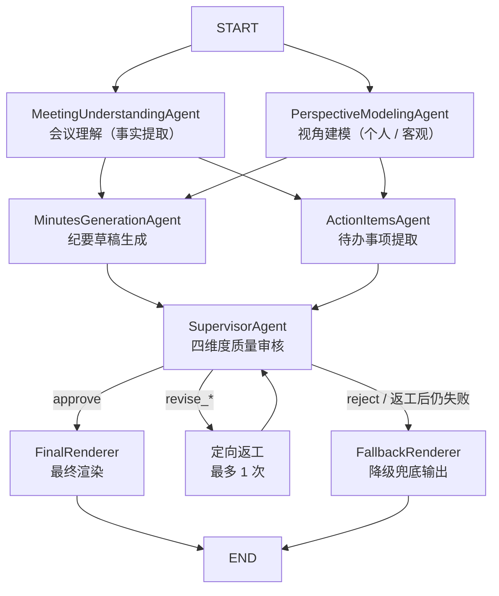

# 个性化会议纪要多 Agent 系统

基于 LangGraph 的多 Agent 会议处理系统。输入会议文本和用户画像，自动生成该用户视角下的个性化会议纪要和本人待办事项。支持**个人视角**和**客观全员视角**两种模式，同一份会议可输入多份画像，不同角色得到不同结果。

## 目录

- [项目背景](#项目背景)
- [核心特性](#核心特性)
- [项目结构](#项目结构)
- [快速开始](#快速开始)
- [配置 LLM 厂商](#配置-llm-厂商)
- [运行方式](#运行方式)
- [输入格式](#输入格式)
- [Agent 工作流](#agent-工作流)
- [双视角模式](#双视角模式)
- [质量保障机制](#质量保障机制)
- [数据模型](#数据模型)
- [输出示例](#输出示例)
- [自定义与扩展](#自定义与扩展)
- [常见问题](#常见问题)
- [GitHub 安全](#github-安全)

## 项目背景

传统会议总结通常把整段会议文字交给一个大模型，一次性输出摘要和待办。这种方式容易出现：

- 不同角色得到完全相同的纪要，缺乏针对性
- 把其他人的任务分配给当前用户
- 把讨论、建议错误地写成正式决策
- 编造负责人或截止时间
- 同一模型在不同运行中返回不同 JSON 结构

本项目将任务拆给多个专用 Agent：

1. **独立理解会议事实** — 不绑定任何用户身份
2. **建立用户视角模型** — 把静态画像映射到本次会议
3. **并行生成纪要草稿和待办候选** — 各司其职
4. **统一审核校准** — 以原文为最高事实来源，核验后输出
5. **最终渲染** — 整理为可读的终稿

## 核心特性

- **多 Agent 协作**：7 个专职 Agent（理解、建模、纪要、待办、审核、渲染、修复）通过 LangGraph 编排
- **并行执行**：会议理解与视角建模并行，纪要生成与待办提取并行
- **双视角模式**：支持"个人用户视角"和"客观全员视角"（`perspective: "objective"`）
- **严格质量保障**：三层校验（Prompt 契约 → 严格结构校验 → 重试+修复），不合规不输出
- **审核与返工**：Supervisor 对中间结果做四维度审核，支持定向返工（最多 1 次），不通过时降级兜底
- **多厂商兼容**：支持 DeepSeek、Kimi (Moonshot)、vLLM 及任何 OpenAI 兼容接口
- **Human-in-the-loop**：最终结果预览确认后才正式输出

## 项目结构

```text
meeting_agent/
├── app.py                                    # 唯一启动入口
├── README.md                                 # 本文档
├── ARCHITECTURE.md                           # 架构深度解析
├── requirements.txt                          # Python 依赖
├── pyproject.toml                            # 项目元数据与构建配置
├── .gitignore                                # Git 忽略规则
├── summary/                                  # 会议文本（.txt）
│   └── meeting.txt
├── profile/                                  # 用户画像（.json）
│   ├── user_profile.json
│   └── object_profile.json                   # 客观视角画像
├── examples/                                 # 示例输入
│   ├── community_meeting.txt                 # 社区筹备会示例
│   ├── volunteer_profile.json                # 志愿者李明画像
│   └── property_manager_profile.json         # 物业王芳画像
├── tests/                                    # 测试文件
└── src/meeting_agent/
    ├── __init__.py                           # 公共 API
    ├── orchestrator.py                       # LangGraph 工作流编排
    ├── state.py                              # 共享 State 定义
    ├── client.py                             # LLM 客户端（OpenAI 兼容）
    ├── models.py                             # 数据模型（dataclass）
    ├── validation.py                         # 严格结构校验
    ├── config.py                             # 环境变量与厂商预设
    ├── presenter.py                          # 终端进度与结果展示
    └── agents/
        ├── __init__.py
        ├── meeting_understanding_agent.py    # Agent 1: 会议理解
        ├── perspective_modeling_agent.py     # Agent 2: 视角建模
        ├── minutes_generation_agent.py       # Agent 3: 纪要生成
        ├── action_items_agent.py             # Agent 4: 待办提取
        ├── supervisor_agent.py               # Agent 5: 质量审核
        ├── final_renderer.py                 # Agent 6: 最终渲染
        └── schema_repair_agent.py            # 辅助: JSON 修复
```

## 快速开始

### 1. 环境准备

```bash
# 创建并激活虚拟环境（Python >= 3.10）
conda activate agent
# 或者
python -m venv .venv && .venv\Scripts\Activate.ps1

# 安装依赖
python -m pip install -r requirements.txt
```

### 2. 配置 API Key

```bash
# 复制环境变量模板
copy .env.example .env
```

编辑 `.env`，填入 LLM 配置（以 DeepSeek 为例）：

```text
LLM_PROVIDER=deepseek
DEEPSEEK_API_KEY=sk-你的真实Key
DEEPSEEK_BASE_URL=https://api.deepseek.com
DEEPSEEK_MODEL=deepseek-chat
```

### 3. 准备输入

在 `summary/` 目录放入会议文本（`.txt`），在 `profile/` 目录放入用户画像（`.json`）。

或直接使用项目自带的示例：

```bash
python app.py --summary examples/community_meeting.txt --profile examples/volunteer_profile.json
```

### 4. 运行

```bash
python app.py
```

## 配置 LLM 厂商

通过 `LLM_PROVIDER` 环境变量切换厂商（均为 OpenAI 兼容接口）。所有厂商都支持 `LLM_API_KEY` / `LLM_BASE_URL` / `LLM_MODEL` 通用覆盖变量。

### DeepSeek（默认）

```text
LLM_PROVIDER=deepseek
DEEPSEEK_API_KEY=sk-xxx
DEEPSEEK_BASE_URL=https://api.deepseek.com
DEEPSEEK_MODEL=deepseek-chat
```

### Kimi / Moonshot

```text
LLM_PROVIDER=kimi
KIMI_API_KEY=sk-xxx
KIMI_BASE_URL=https://api.moonshot.cn/v1
KIMI_MODEL=moonshot-v1-32k
```

支持别名：`moonshot`、`moonshot-ai`。也可用 `MOONSHOT_API_KEY` 环境变量。国际站 base_url 可用 `https://api.moonshot.ai/v1`。

### 本地 vLLM / 其他 OpenAI 兼容服务

```text
LLM_PROVIDER=openai_compatible
LLM_API_KEY=local-key
LLM_BASE_URL=http://127.0.0.1:8000/v1
LLM_MODEL=qwen-local
```

支持别名：`openai`、`vllm`、`local`。

### 环境变量优先级

| 变量 | 说明 |
|---|---|
| `LLM_PROVIDER` | 厂商名称（deepseek / kimi / openai_compatible，默认 deepseek） |
| `LLM_API_KEY` | 通用 API Key（优先级高于厂商专用变量） |
| `LLM_BASE_URL` | 通用 Base URL |
| `LLM_MODEL` | 通用模型名 |
| `LLM_TEMPERATURE` | 温度参数（默认 0，Kimi 默认 1） |

各厂商也有专用变量（如 `DEEPSEEK_API_KEY`），通用变量优先。

## 运行方式

```bash
# 使用默认路径（summary/ 和 profile/ 目录）
python app.py

# 指定具体文件
python app.py \
  --summary summary/meeting.txt \
  --profile profile/user_profile.json

# 指定目录（自动寻找目录中的唯一目标文件）
python app.py --summary summary --profile profile

# 使用绝对路径 + 自定义 .env
python app.py \
  --summary /home/user/input/meeting.txt \
  --profile /home/user/input/user.json \
  --env /home/user/config/.env
```

**路径解析规则**：
- `--summary` 传目录时，目录中需要只有一个 `.txt` 文件
- `--profile` 传目录时，目录中需要只有一个 `.json` 文件
- 如果目录里有多个文件，程序会提示直接指定其中一个

旧命令 `--summary-dir` 和 `--profile-dir` 仍可用作别名。

## 输入格式

### 会议文本（.txt）

纯文本，建议包含：
- 会议主题、时间、地点
- 发言人姓名及其发言内容
- 明确的任务分配、负责人和截止时间
- 会议结论

原文越清晰，Agent 输出的准确性越高。示例见 `examples/community_meeting.txt`。

### 用户画像（.json）

```json
{
  "name": "李明",
  "role": "居民志愿者",
  "department": "春风小区志愿者小组",
  "responsibilities": [
    "报名信息整理",
    "现场签到",
    "居民引导",
    "临时通知"
  ],
  "interests": [
    "报名名单准确性",
    "现场秩序",
    "通知是否及时"
  ],
  "context": "希望明确自己在活动前和活动当天需要完成的事项"
}
```

| 字段 | 类型 | 说明 |
|---|---|---|
| `name` | string | 用户姓名，用于匹配待办负责人（**最重要**） |
| `role` | string | 用户角色，确定纪要视角 |
| `department` | string | 所属部门或组织 |
| `responsibilities` | string[] | 用户的长期职责 |
| `interests` | string[] | 用户重点关注的内容 |
| `context` | string | 本次生成的额外说明 |
| `perspective` | string | 视角模式（见下方），设置为 `"objective"` 启用客观全员视角 |

## Agent 工作流

### 流程图



### 执行时序

```
Layer 1（并行）
  ├── MeetingUnderstandingAgent    ─┐
  └── PerspectiveModelingAgent     ─┘
                                     ↓
Layer 2（并行）                     汇合
  ├── MinutesGenerationAgent       ─┐
  └── ActionItemsAgent             ─┘
                                     ↓
Layer 3                             汇合
  └── SupervisorAgent              四维审核
                                     ↓
Layer 4
  └── FinalRenderer（或 Fallback）  最终输出
```

### Agent 职责一览

| # | Agent | 职责 | 输入 | 输出 |
|---|---|---|---|---|
| 1 | **MeetingUnderstandingAgent** | 客观提取会议事实：议题、决策、风险、未决问题 | 会议原文 | `MeetingUnderstanding` |
| 2 | **PerspectiveModelingAgent** | 将用户画像映射到本次会议，建立关注视角 | 会议原文 + 用户画像 | `PerspectiveProfile` |
| 3 | **MinutesGenerationAgent** | 生成个性化 / 客观纪要草稿 | 会议理解 + 视角模型 + 原文 + 画像 | `PersonalizedMinutes` |
| 4 | **ActionItemsAgent** | 提取待办，区分本人 / 他人 / 未分配 | 会议理解 + 视角模型 + 原文 + 画像 | `ActionItems` |
| 5 | **SupervisorAgent** | 四维度审核，决定放行 / 返工 / 拒绝 | 所有中间结果 + 原文 | `SupervisorReview` |
| 6 | **FinalRenderer** | 将已批准内容整理为最终展示 | 已审核的全部中间结果 | `FinalReport` |
| — | **SchemaRepairAgent** | 修复 JSON 结构（仅格式，不改事实） | 不合规输出 + 契约 + 错误 | 修复后的 JSON |

### 审核四维度

SupervisorAgent 对每次生成进行四个维度的检查：

1. **facts_check** — 事实一致性：决策是否正确归类，日期/结论是否忠实原文
2. **perspective_check** — 视角准确性：是否体现用户职责，是否片面裁剪
3. **action_items_check** — 待办证据：负责人归属是否有原文依据，是否拆分合理
4. **consistency_check** — 跨 Agent 一致性：四个 Agent 的输出是否相互一致

审核决策：`approve`（通过）、`revise_minutes`（返工纪要）、`revise_actions`（返工待办）、`revise_both`（两者返工）、`reject`（拒绝）。

## 双视角模式

系统支持两种生成模式，由用户画像中的 `perspective` 字段控制。

### 个人用户视角（默认）

当 `perspective` 缺省或为其他值时，系统为用户生成**个人视角**的纪要和待办：
- 纪要突出与用户职责相关的讨论
- 待办只包含用户本人明确负责的事项
- `my_actions` = 用户本人的待办，`delegated_actions` = 他人待办

### 客观全员视角

当 `perspective` 设为 `"objective"` 时，系统生成**全员口径**的客观记录：

```json
{
  "name": "会议记录",
  "role": null,
  "perspective": "objective"
}
```

- 纪要公平覆盖全体参会人与议题，不绑定任何个人
- 待办覆盖各方的明确分工（`my_actions` = 全员已分配待办）
- 标题使用"客观会议纪要"等中立表述
- 禁止使用第二人称和个性化措辞

命令行中使用（示例）：

```bash
python app.py --summary examples/community_meeting.txt --profile profile/object_profile.json
```

## 质量保障机制

系统使用**四层防护**确保输出可靠：

### 1. Prompt 契约

每个 Agent 的 `OUTPUT_CONTRACT` 明确规定了输出的 JSON 结构、字段类型和合法值。所有 Agent 的 System Prompt 包含严格的业务规则（如"不得仅凭角色推断负责人"、"严格区分讨论与决策"）。

### 2. 严格结构校验（validation.py）

`validate_payload()` 对每个 Agent 输出执行：

- 顶层对象类型检查
- 字段完整性（不允许缺失、不允许多余）
- 字段类型校验（字符串/数组/null 位置）
- 数组元素逐项校验
- 枚举值合法性
- 逻辑一致性（如 `approve` 时反馈必须为空）

校验器**不会**做任何自动修正（不丢字段、不强转类型、不补默认值）。

### 3. 重试 + 格式修复

```
模型输出 → JSON 解析 → 严格校验
                         ├─ 通过 → 返回
                         └─ 失败 → 回传错误给原 Agent（最多 2 次重试）
                                        ↓
                                 仍失败 → SchemaRepairAgent 修复
                                        ↓
                                 再次校验 → 仍失败则报错
```

SchemaRepairAgent 只修复 JSON 结构问题，**绝不修改业务事实**。

### 4. Supervisor 审核 + 降级兜底

- Supervisor **未通过**时，触发定向返工（最多 1 次）
- 返工后仍未通过或 Supervisor 直接 reject，系统进入**降级兜底**：
  - 优先尝试用 FinalRenderer 基于现有草稿整理
  - 渲染也失败时，用中间草稿确定性拼装（不依赖 LLM）
  - 所有降级输出附加 `⚠ 生成可能有误` 提示
- `temperature=0` 保证输出确定性

### API 调用次数

| 场景 | 调用次数 |
|---|---|
| 正常通过 | 6 次 |
| 单项返工 | 8 次 |
| 两项返工 | 9 次 |
| 含格式重试 | 递增 |

## 数据模型

所有模型使用 `@dataclass` 定义，通过 `model_dump()` 转换为字典写入 LangGraph State。

| 模型 | 说明 |
|---|---|
| `UserIdentity` | 用户画像输入（name, role, responsibilities, perspective 等） |
| `MeetingUnderstanding` | 会议事实提取结果（purpose, topics, decisions, risks 等） |
| `PerspectiveProfile` | 用户视角模型（confidence, goals, concerns, evidence 等） |
| `PersonalizedMinutes` | 纪要草稿（headline, executive_summary, key_decisions 等） |
| `ActionItems` | 待办列表（my_actions, delegated_actions, unassigned_actions） |
| `SupervisorReview` | 审核结果（decision + 四项 check） |
| `FinalReport` | 最终输出（title + personalized_minutes + action_items） |

### LangGraph State

`MeetingState`（TypedDict）在节点间传递，每个节点只返回自己更新的字段：

```python
class MeetingState(TypedDict, total=False):
    transcript: str                    # 会议原文
    user: dict                         # 用户画像
    objective_perspective: bool        # 是否客观视角
    meeting_understanding: dict        # Agent 1 输出
    perspective_profile: dict          # Agent 2 输出
    minutes_draft: dict                # Agent 3 输出
    extracted_action_items: dict       # Agent 4 输出
    supervisor_review: dict            # Agent 5 输出
    minutes_revision_feedback: list    # 纪要返工意见
    actions_revision_feedback: list    # 待办返工意见
    revision_count: int                # 返工计数
    quality_degraded: bool             # 降级标记
    final_report: dict                 # 最终输出
```

## 输出示例

运行时会显示 Agent 执行进度：

```text
· 01 理解会议内容
· 02 建立用户视角
✓ 01 理解会议内容
✓ 02 建立用户视角
· 03 生成用户视角纪要
· 04 提取待办事项
✓ 03 生成用户视角纪要
✓ 04 提取待办事项
· 05 审核结果质量
✓ 05 审核结果质量
· 06 整理最终展示内容
✓ 06 整理最终展示内容

── 用户视角会议纪要 ──
春风小区周末亲子跳蚤市场筹备会纪要
会议决定于本周六上午9点至12点在中心花园举办亲子跳蚤市场...
（完整的个性化会议纪要段落）

── 待办事项 ──
1. 整理报名名单，周三报名截止后于周四中午前将最终摊位编号发到业主群（负责人：李明；截止时间：周四中午）
2. 制作签到表和摊位号码牌，周五晚上交给王芳（负责人：李明；截止时间：周五晚上）
3. ...
```

降级输出时会显示警告：

```text
⚠ 生成可能有误，请结合会议原文核对。
```

## 自定义与扩展

### 修改会议输入

直接编辑 `summary/meeting.txt` 或创建新的 `.txt` 文件。

### 增加用户画像

在 `profile/` 目录创建新的 `.json` 文件，或通过命令行指定：

```bash
python app.py --summary summary/meeting.txt --profile profile/new_user.json
```

### 修改 Agent 行为

编辑 `src/meeting_agent/agents/` 下对应文件，通常修改：
- `SYSTEM_PROMPT` — 业务规则和职责描述
- `OUTPUT_CONTRACT` — 输出 JSON 模板

**注意**：如果修改了输出字段，必须同步更新：
- `models.py` — 对应的 dataclass 定义
- `validation.py` — 对应的校验逻辑

否则严格校验会拒绝新结构。

### 扩展为多用户批量处理

参考 `app.py` 中的循环模式，可以改为遍历多个画像文件：

```python
profile_dir = Path("profile")
for profile_file in profile_dir.glob("*.json"):
    user = UserIdentity(**json.loads(profile_file.read_text()))
    result = await system.run(transcript, user)
    print_result(result)
```

## 常见问题

### ModuleNotFoundError: No module named 'langgraph'

未安装依赖或未激活正确的虚拟环境：

```bash
python -m pip install -r requirements.txt
```

### 找不到 meeting_agent

应从项目根目录运行 `python app.py`，`app.py` 会自动将 `src/` 加入 Python 路径。

### API Key 无效

检查 `.env` 中 API Key 是否正确填写且未过期。不要把 Key 写入代码或 `.env.example`。

### 运行时没有立即输出

每个用户正常需要 6 次 LLM 调用，发生返工需 8-9 次。程序开始时显示"正在生成"，具体耗时取决于 LLM 响应速度。

### 输出结构错误

系统会自动重试和修复 JSON 格式。若最终仍不合规，会明确报错而非展示错误数据。

### 不同用户结果相同

检查画像：姓名是否不同、角色职责是否有区分、会议原文是否明确提到该用户。

## GitHub 安全

**可上传**：`app.py`、`src/`、`examples/`、`README.md`、`ARCHITECTURE.md`、`requirements.txt`、`pyproject.toml`、`.env.example`、`.gitignore`

**不可上传**：`.env`、`.venv/`、`__pycache__/`、`*.pyc`

`.gitignore` 已配置这些规则。真实 API Key 一旦公开，应立即撤销并重新生成。
