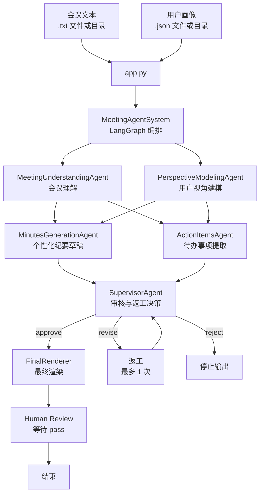

# 个性化会议纪要多 Agent 系统

这是一个基于 LangGraph 的多 Agent 会议处理项目。输入会议文本和用户画像后，系统会生成该用户视角下的会议纪要和本人待办事项。

## 项目结构

```text
meeting_summary/
├── app.py
├── summary/
│   └── meeting.txt
├── profile/
│   └── user_profile.json
├── src/meeting_agent/
│   ├── agents/
│   ├── client.py
│   ├── models.py
│   ├── orchestrator.py
│   ├── presenter.py
│   ├── state.py
│   └── validation.py
├── requirements.txt
├── pyproject.toml
└── .env
```

## 输入格式

会议文本是 `.txt` 文件，用户画像是 `.json` 文件。

用户画像示例：

```json
{
  "name": "李明",
  "role": "居民志愿者",
  "department": "春风小区志愿者小组",
  "responsibilities": [
    "报名信息整理",
    "现场签到",
    "居民引导",
    "临时通知"
  ],
  "interests": [
    "报名名单准确性",
    "现场秩序",
    "通知是否及时"
  ],
  "context": "希望明确自己在活动前和活动当天需要完成的事项"
}
```

## 环境配置

安装依赖：

```bash
conda activate agent
python -m pip install -r requirements.txt
```

复制环境变量模板并填写 Key：

```bash
copy .env.example .env
```

通过 `LLM_PROVIDER` 切换厂商（均为 OpenAI 兼容接口）：

**DeepSeek（默认）**

```text
LLM_PROVIDER=deepseek
DEEPSEEK_API_KEY=你的 API Key
DEEPSEEK_BASE_URL=https://api.deepseek.com
DEEPSEEK_MODEL=deepseek-chat
```

**Kimi（Moonshot）**

```text
LLM_PROVIDER=kimi
KIMI_API_KEY=你的 API Key
KIMI_BASE_URL=https://api.moonshot.cn/v1
KIMI_MODEL=moonshot-v1-32k
```

也可用 `MOONSHOT_API_KEY`；国际站 base_url 可为 `https://api.moonshot.ai/v1`。

**本地 vLLM / 其他 OpenAI 兼容服务**

```text
LLM_PROVIDER=openai_compatible
LLM_API_KEY=local-key
LLM_BASE_URL=http://127.0.0.1:8000/v1
LLM_MODEL=qwen-local
```

通用覆盖项：`LLM_API_KEY` / `LLM_BASE_URL` / `LLM_MODEL`（优先级高于厂商专用变量）。

## 运行方式

使用默认输入：

```bash
python app.py
```

默认读取：

```text
summary/
profile/
```

指定具体文件：

```bash
python app.py \
  --summary summary/meeting.txt \
  --profile profile/user_profile.json
```

指定目录：

```bash
python app.py \
  --summary summary \
  --profile profile
```

服务器上也可以使用绝对路径：

```bash
python app.py \
  --summary /home/ma-user/work/input/summary/meeting.txt \
  --profile /home/ma-user/work/input/profile/user_profile.json \
  --env /home/ma-user/work/meeting_summary_agent/.env
```

`--summary-dir` 和 `--profile-dir` 仍然可用，它们是兼容旧命令的别名：

```bash
python app.py --summary-dir summary --profile-dir profile
```

如果传入的是目录，程序会自动寻找目录中的唯一目标文件：

- `--summary` 传目录时，目录中需要只有一个 `.txt`
- `--profile` 传目录时，目录中需要只有一个 `.json`

如果目录里有多个文件，程序会提示你直接指定其中一个具体文件。

## 输出效果

运行时会显示 Agent 进度：

```text
正在生成会议纪要和待办事项，请稍候...

01  MeetingUnderstandingAgent｜理解会议内容  ...
02  PerspectiveModelingAgent｜建立用户视角  ...
01  MeetingUnderstandingAgent｜理解会议内容  完成
02  PerspectiveModelingAgent｜建立用户视角  完成
03  MinutesGenerationAgent｜生成用户视角纪要  ...
04  ActionItemsAgent｜提取待办事项  ...
```

最终展示：

```text
【用户视角会议纪要】
一段完整的个性化会议纪要

【待办事项】
1. 第一条本人待办
2. 第二条本人待办

确认请输入 pass：
```

## Agent 流程


