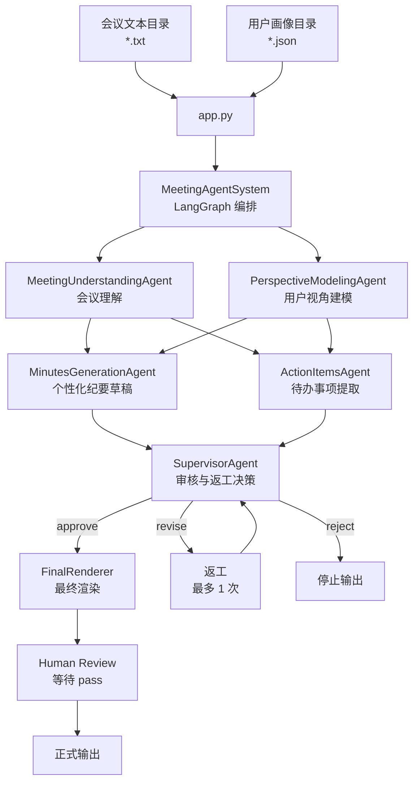

# 个性化会议纪要多 Agent 系统

这是一个基于 LangGraph 的多 Agent 会议处理项目。输入一段会议文本和一份用户画像后，系统会生成该用户视角下的会议纪要和本人待办事项。

## 项目结构

```text
meeting_summary/
├── app.py                         # 运行入口
├── summary/                       # 默认会议文本目录
│   └── meeting.txt
├── profile/                       # 默认用户画像目录
│   └── user_profile.json
├── src/meeting_agent/
│   ├── agents/
│   │   ├── meeting_understanding_agent.py
│   │   ├── perspective_modeling_agent.py
│   │   ├── minutes_generation_agent.py
│   │   ├── action_items_agent.py
│   │   ├── supervisor_agent.py
│   │   ├── final_renderer.py
│   │   └── schema_repair_agent.py
│   ├── client.py
│   ├── models.py
│   ├── orchestrator.py
│   ├── presenter.py
│   ├── state.py
│   └── validation.py
├── requirements.txt
├── pyproject.toml
└── .env
```

## 输入文件

会议文本目录中需要有一个 `.txt` 文件，例如：

```text
summary/meeting.txt
```

用户画像目录中需要有一个 `.json` 文件，例如：

```text
profile/user_profile.json
```

用户画像格式：

```json
{
  "name": "李明",
  "role": "居民志愿者",
  "department": "春风小区志愿者小组",
  "responsibilities": [
    "报名信息整理",
    "现场签到",
    "居民引导",
    "临时通知"
  ],
  "interests": [
    "报名名单准确性",
    "现场秩序",
    "通知是否及时"
  ],
  "context": "希望明确自己在活动前和活动当天需要完成的事项"
}
```

当前入口会从指定目录中自动寻找文件。为了避免歧义，每个目录里请只保留一个目标文件：

- 会议目录：一个 `.txt`
- 画像目录：一个 `.json`

## 环境配置

安装依赖：

```powershell
conda activate agent
python -m pip install -r requirements.txt
```

如果使用 DeepSeek：

```text
DEEPSEEK_API_KEY=你的 API Key
DEEPSEEK_BASE_URL=https://api.deepseek.com
DEEPSEEK_MODEL=deepseek-chat
```

如果在服务器上使用 vLLM 部署的 Qwen，例如模型名是 `qwen-local`，端口是 `8000`，API Key 是 `local-key`：

```text
DEEPSEEK_API_KEY=local-key
DEEPSEEK_BASE_URL=http://127.0.0.1:8000/v1
DEEPSEEK_MODEL=qwen-local
```

## 运行方式

使用默认目录：

```powershell
python app.py
```

等价于读取：

```text
summary/
profile/
```

指定输入目录：

```powershell
python app.py --summary-dir summary --profile-dir profile
```

也可以传入服务器上的绝对路径：

```bash
python app.py \
  --summary-dir /home/ma-user/work/input/summary \
  --profile-dir /home/ma-user/work/input/profile
```

指定 `.env` 文件：

```bash
python app.py \
  --summary-dir /home/ma-user/work/input/summary \
  --profile-dir /home/ma-user/work/input/profile \
  --env /home/ma-user/work/meeting_summary_agent/.env
```

运行后，系统会先展示审核预览。确认无误后，在终端输入：

```text
pass
```

随后正式输出：

```text
【用户视角会议纪要】
一段完整的个性化会议纪要

【待办事项】
1. 第一条本人待办
2. 第二条本人待办
```

## Agent 流程



## 说明

项目不是让一个 LLM 一次性总结会议，而是拆成多个职责清晰的 Agent：

- `MeetingUnderstandingAgent`：理解会议事实、议题、决策、风险和未决问题。
- `PerspectiveModelingAgent`：结合用户画像建立本次会议中的用户关注视角。
- `MinutesGenerationAgent`：生成用户视角纪要草稿。
- `ActionItemsAgent`：提取本人、他人和未分配待办。
- `SupervisorAgent`：审核事实一致性、用户相关性、待办证据和跨 Agent 一致性，并决定是否返工。
- `FinalRenderer`：把审核通过的内容渲染为最终展示结果。
