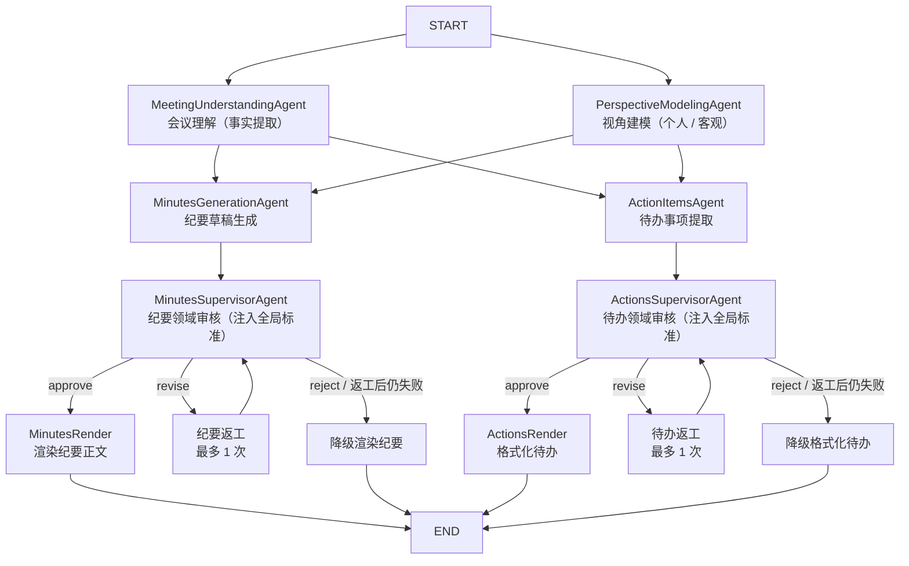

# 个性化会议纪要多 Agent 系统

基于 LangGraph 的多 Agent 会议处理系统。输入会议文本和用户画像，自动生成该用户视角下的个性化会议纪要和待办事项。支持**个人视角**和**客观全员视角**两种模式，同一份会议可输入多份画像，不同角色得到不同结果。

## 目录

- [项目背景](#项目背景)
- [核心特性](#核心特性)
- [项目结构](#项目结构)
- [快速开始](#快速开始)
- [配置 DeepSeek](#配置-deepseek)
- [运行方式](#运行方式)
- [输入格式](#输入格式)
- [Agent 工作流](#agent-工作流)
- [双视角模式](#双视角模式)
- [质量保障机制](#质量保障机制)
- [架构详解](#架构详解)
- [数据模型](#数据模型)
- [输出示例](#输出示例)
- [Gradio Web 界面](#gradio-web-界面)
- [自定义与扩展](#自定义与扩展)
- [准确性边界](#准确性边界)
- [常见问题](#常见问题)
- [GitHub 安全](#github-安全)

## 项目背景

传统会议总结通常把整段会议文字交给一个大模型，一次性输出摘要和待办。这种方式容易出现：

- 不同角色得到完全相同的纪要，缺乏针对性
- 把其他人的任务分配给当前用户
- 把讨论、建议错误地写成正式决策
- 编造负责人或截止时间
- 同一模型在不同运行中返回不同 JSON 结构

本项目将任务拆给多个专用 Agent，每个 Agent 只负责一件事：

1. **独立理解会议事实** — 不绑定任何用户身份，纯粹的事实提取
2. **建立用户视角模型** — 把静态画像映射到本次会议
3. **并行生成纪要草稿和待办候选** — 各司其职
4. **双线监督校准** — 纪要线/待办线各自监督（注入全局整体标准），以原文为最高事实来源
5. **最终渲染** — 整理为可读的终稿

## 核心特性

- **多 Agent 协作**：8 个专职 Agent（理解、建模、纪要生成、待办提取、双线监督、纪要渲染、待办格式化、修复）通过 LangGraph 编排
- **并行执行**：会议理解与视角建模并行；纪要线与待办线（生成→监督→渲染）各自独立并行，互不阻塞
- **双视角模式**：支持"个人用户视角"和"客观全员视角"（`perspective: "objective"`）
- **四层质量保障**：Prompt 契约 → 严格结构校验 → 重试+修复 → Supervisor 审核+降级兜底
- **双线监督与返工**：纪要/待办各有独立监督者（注入全局整体标准），各自返工闭环（最多 1 次），不通过时各自降级兜底
- **模型自带校验**：每个数据模型的 `validate` 类方法携带自身结构校验逻辑，新增模型只需实现该方法即可接入
- **DeepSeek 适配**：开箱即用 DeepSeek 官方 API，`.env` 中一行配置 API Key 即可
- **Gradio Web 界面**：提供浏览器端的可视化操作界面，实时显示 Agent 执行进度
- **模板输出**：支持自定义 Markdown 模板，系统自动填充会议内容

## 项目结构

```text
meeting/
├── bootstrap.py                                    # CLI 启动入口
├── gradio_app.py                             # Gradio Web 启动入口
├── README.md                                 # 本文档
├── ARCHITECTURE.md                           # 架构深度解析
├── requirements.txt                          # Python 依赖
├── pyproject.toml                            # 项目元数据与构建配置
├── .gitignore                                # Git 忽略规则
└── src/
    ├── supervisor/                           # 全局监督器（跨领域整体标准）
    │   ├── __init__.py
    │   ├── supervisor_prompt.py              # 全局监督提示词（所有领域都应遵从的整体标准）
    │   └── supervisor.py                     # 全局监督器实现（prompt 注入机制）
    │
    ├── schema_repair/                        # 通用 JSON 结构修复器（最后恢复输出架构）
    │   ├── __init__.py
    │   ├── schema_repair_prompt.py           # 修复提示词（只改格式，不改事实）
    │   └── schema_repair.py                  # SchemaRepairAgent 实现
    │
    ├── llm_client/                            # 通用 LLM 客户端接口（与领域无关）
    │   ├── __init__.py                       # 导出 LLMClient
    │   ├── client.py                         # LLMClient（OpenAI 兼容，支持流式/重试/修复兜底）
    │   └── config.py                         # 环境变量与厂商预设（LLMSettings / load_env）
    │
    ├── tools/                                # 通用工具（与领域无关）
    │   ├── __init__.py
    │   ├── validation.py                     # 通用数据校验（validate_payload 等）
    │   └── logging_config.py                 # 终端日志格式（仅消息本体）
    │
    └── domain/
        └── meeting/
            ├── __init__.py                       # 公共 API
            ├── orchestrator.py                   # LangGraph 工作流编排（双线并行图 + 运行入口）
            ├── meeting_factory.py                # Agent 工厂（组装依赖）
            ├── models.py                         # 数据模型 + 内置校验 + MeetingState 状态声明
            │
            ├── samples/                          # 领域样例资源（SAMPLES_DIR）
            │   ├── summary/                      # 会议文本（.txt）
            │   │   ├── meeting.txt
            │   │   └── meeting_all.txt
            │   ├── profile/                      # 用户画像（.json）
            │   │   ├── user_profile.json         # 个人视角画像
            │   │   └── object_profile.json       # 客观视角画像
            │   ├── summary_template/             # 纪要输出模板（Markdown）
            │   │   ├── project_progress.md
            │   │   └── simple_minutes.md
            │   └── item_template/                # 待办输出模板（Markdown）
            │       └── action_items.md
            │
            ├── meeting_core/                     # 核心 Agent（会议理解与视角建模）
            │   ├── __init__.py
            │   ├── prompts.py                    # 核心层 prompt（会议理解 + 视角建模）
            │   ├── meeting_understanding_agent.py
            │   └── perspective_modeling_agent.py
            │
            └── tasks/                            # 任务型 Agent（双线并行，互不阻塞）
                ├── __init__.py
                │
                ├── minutes_generation/           # 纪要生成任务组
                │   ├── __init__.py
                │   ├── prompts.py                # 纪要线 prompt（生成/监督/渲染）
                │   ├── minutes_generation_agent.py
                │   ├── minutes_generation_supervisor.py
                │   └── minutes_generation_render.py
                │
                └── action_items/                 # 待办提取任务组
                    ├── __init__.py
                    ├── prompts.py                # 待办线 prompt（提取/监督）
                    ├── action_items_agent.py
                    ├── action_items_supervisor.py
                    └── action_items_render.py
```

## 快速开始

### 1. 环境准备

```bash
# Python >= 3.10
conda activate agent
# 或者
python -m venv .venv && .venv\Scripts\Activate.ps1

# 安装依赖
python -m pip install -r requirements.txt
```

### 2. 配置 API Key

在项目根目录创建 `.env` 文件（可复制 `.env.example` 后填写）：

```text
DEEPSEEK_API_KEY=sk-你的真实Key
```

只需这一行即可运行，base_url、模型名、temperature 均有内置默认值。
### 3. 准备输入

在 `src/domain/meeting/samples/summary/` 目录放入会议文本（`.txt`），在 `src/domain/meeting/samples/profile/` 目录放入用户画像（`.json`）。

### 4. 运行

```bash
# CLI 模式（默认路径）
python bootstrap.py

# 指定文件
python bootstrap.py --summary src/domain/meeting/samples/summary/meeting.txt --profile src/domain/meeting/samples/profile/user_profile.json

# Web 界面
python gradio_app.py
```

## 配置 DeepSeek

本版本只适配 DeepSeek 官方 API。在项目根目录创建 `.env` 文件，配置 API Key 即可运行。

### 最小配置

```text
DEEPSEEK_API_KEY=sk-xxx
```

### 可选配置

| 变量 | 默认值 | 说明 |
|---|---|---|
| `DEEPSEEK_API_KEY` | 无（必填） | DeepSeek API Key，在 [platform.deepseek.com](https://platform.deepseek.com) 申请 |
| `DEEPSEEK_BASE_URL` | `https://api.deepseek.com` | API 地址，一般无需修改 |
| `DEEPSEEK_MODEL` | `deepseek-chat` | 模型名，如 `deepseek-reasoner` |
| `DEEPSEEK_TEMPERATURE` | `0` | 温度参数，0 保证输出确定性 |

配置优先级：代码显式参数 > `.env` 环境变量 > 内置默认值。

## 运行方式

### CLI

```bash
# 使用默认路径（src/domain/meeting/samples/summary/ 和 src/domain/meeting/samples/profile/ 目录）
python bootstrap.py

# 指定具体文件
python bootstrap.py --summary src/domain/meeting/samples/summary/meeting.txt --profile src/domain/meeting/samples/profile/user_profile.json

# 指定目录（自动寻找目录中的唯一目标文件）
python bootstrap.py --summary summary --profile profile

# 使用自定义模板 + 绝对路径 + 自定义 .env
python bootstrap.py \
  --summary /home/user/input/meeting.txt \
  --profile /home/user/input/user.json \
  --summary_template src/domain/meeting/samples/summary_template/project_progress.md \
  --item_template src/domain/meeting/samples/item_template/action_items.md \
  --env /home/user/config/.env
```

> `--summary_template` 指定纪要输出模板，`--item_template` 指定待办输出模板（可选，模板中用 `[描述]` 占位符，不指定则分别使用默认的自由段落/列表格式）。

**路径解析规则**：
- `--summary` 传目录时，目录中需要只有一个 `.txt` 文件
- `--profile` 传目录时，目录中需要只有一个 `.json` 文件
- 如果目录里有多个文件，程序会提示直接指定其中一个

### Gradio Web

```bash
python gradio_app.py
```

浏览器访问 `http://127.0.0.1:7860`，可以在页面上粘贴会议内容和用户画像、上传文件、勾选客观视角、选择输出模板，点击"生成纪要"后实时查看 Agent 执行进度和最终结果。

## 输入格式

### 会议文本（.txt）

纯文本，建议包含：
- 会议主题、时间、地点
- 发言人姓名及其发言内容
- 明确的任务分配、负责人和截止时间
- 会议结论

原文越清晰，Agent 输出的准确性越高。

### 用户画像（.json）

```json
{
  "name": "李明",
  "role": "居民志愿者",
  "department": "春风小区志愿者小组",
  "responsibilities": [
    "报名信息整理",
    "现场签到",
    "居民引导",
    "临时通知"
  ],
  "interests": [
    "报名名单准确性",
    "现场秩序",
    "通知是否及时"
  ],
  "context": "希望明确自己在活动前和活动当天需要完成的事项"
}
```

| 字段 | 类型 | 说明 |
|---|---|---|
| `name` | string | 用户姓名，用于匹配待办负责人（**最重要**） |
| `role` | string | 用户角色，确定纪要视角 |
| `department` | string | 所属部门或组织 |
| `responsibilities` | string[] | 用户的长期职责 |
| `interests` | string[] | 用户重点关注的内容 |
| `context` | string | 本次生成的额外说明 |
| `perspective` | string | 视角模式，设置为 `"objective"` 启用客观全员视角 |

## Agent 工作流

### 流程图



### 执行时序

```
Layer 1（并行）
  ├── MeetingUnderstandingAgent    ─┐
  └── PerspectiveModelingAgent     ─┘
                                     ↓
Layer 2（并行）                     汇合
  ├── MinutesGenerationAgent       ─┐
  └── ActionItemsAgent             ─┘
                                     ↓
Layer 3（双线并行，互不阻塞）        各自监督（注入全局整体标准）
  ├── MinutesSupervisorAgent（纪要审核） ┬ approve → 渲染 / revise → 纪要返工 / reject → 降级
  └── ActionsSupervisorAgent（待办审核） └ approve → 格式化 / revise → 待办返工 / reject → 降级
                                     ↓
Layer 4（并行输出）
  ├── RenderMinutes / FallbackMinutes （纪要）
  └── FormatActions / FallbackActions （待办）
```

### Agent 职责一览

| # | Agent | 职责 | 输入 | 输出 |
|---|---|---|---|---|
| 1 | **MeetingUnderstandingAgent** | 客观提取会议事实：议题、决策、风险、未决问题 | 会议原文 | `MeetingUnderstanding` |
| 2 | **PerspectiveModelingAgent** | 将用户画像映射到本次会议，建立关注视角 | 会议原文 + 用户画像 | `PerspectiveProfile` |
| 3 | **MinutesGenerationAgent** | 生成个性化 / 客观纪要草稿 | 会议理解 + 视角模型 + 原文 + 画像 | `PersonalizedMinutes` |
| 4 | **ActionItemsAgent** | 提取待办，区分本人 / 他人 / 未分配 | 会议理解 + 视角模型 + 原文 + 画像 | `ActionItems` |
| 5 | **MinutesSupervisorAgent** | 纪要领域审核（注入全局整体标准），决定放行 / 返工 / 拒绝 | 纪要草稿 + 原文 | `MinutesSupervisorReview` |
| 6 | **ActionsSupervisorAgent** | 待办领域审核（注入全局整体标准），决定放行 / 返工 / 拒绝 | 待办结果 + 原文 | `ActionsSupervisorReview` |
| 7 | **MinutesGenerationRender** | 将已批准纪要草稿渲染为正文（支持流式 / 模板） | 已审核纪要草稿 | 纪要文本 |
| 8 | **ActionItemsRender** | 待办输出：无模板时确定性格式化列表；指定 `--item_template` 时由 LLM 按模板渲染 | 已审核待办结果 | 待办列表 / 模板文本 |
| — | **SchemaRepairAgent**（`src/schema_repair/`，通用） | 修复 JSON 结构（仅格式，不改事实），用于结构化输出最后兜底 | 不合规输出 + 契约 + 错误 | 修复后的 JSON |

### 监督机制（双线 + 全局整体标准）

每个任务线有独立的领域监督者，执行时经 `src/supervisor` 注入**全局整体标准**（所有领域都应遵从）：

1. **默认信任**：只拦截会导致实质误解的问题，不重做上游工作
2. **以会议原文为最高事实来源**：原文模糊的不判为问题
3. **只记录严重问题**：措辞、顺序、风格问题一律 pass，边界情况 pass
4. **审核一致性**：同类问题始终同一判断标准
5. **不臆测、不补全**：原文没有的信息不得补入
6. **返工意见具体可执行**：写不出具体意见则 approve

**纪要线（MinutesSupervisorAgent）** 三维检查：`facts_check`（事实一致性）、`perspective_check`（视角准确性）、`consistency_check`（纪要草稿与会议理解/视角模型的一致性）。

**待办线（ActionsSupervisorAgent）** 单维检查：`action_items_check`（负责人归属是否有原文依据、字段是否只依信号词）。

审核决策：`approve`（通过）、`revise`（返工，反馈必须具体可执行）、`reject`（拒绝）。两条线各自返工闭环（最多 1 次），互不阻塞。

Supervisor 的默认立场是"信任输出，除非发现明确问题"。边界情况一律 pass，不追求完美。

## 双视角模式

系统支持两种生成模式，由用户画像中的 `perspective` 字段控制。

### 个人用户视角（默认）

当 `perspective` 缺省或为其他值时，系统为用户生成**个人视角**的纪要和待办：
- 纪要突出与用户职责相关的讨论
- 待办只包含用户本人明确负责的事项
- `my_actions` = 用户本人的待办，`delegated_actions` = 他人待办

### 客观全员视角

当 `perspective` 设为 `"objective"` 时，系统生成**全员口径**的客观记录：

```json
{
  "name": null,
  "role": "客观会议记录与纪要整理",
  "perspective": "objective",
  "responsibilities": [
    "客观还原会议目的、议题、讨论与正式决策",
    "完整提取各方明确分工与可执行待办"
  ]
}
```

- 纪要公平覆盖全体参会人与议题，不绑定任何个人
- 待办覆盖各方的明确分工（`my_actions` = 全员已分配待办）
- 标题使用"客观会议纪要"等中立表述
- 禁止使用第二人称和个性化措辞

命令行中使用：

```bash
python bootstrap.py --summary src/domain/meeting/samples/summary/meeting.txt --profile src/domain/meeting/samples/profile/object_profile.json
```

## 质量保障机制

系统使用**四层防护**确保输出可靠：

### 第一层：Prompt 契约

每个 Agent 的 `OUTPUT_CONTRACT` 明确规定了输出的 JSON 结构、字段类型和合法值。所有 Agent 的 System Prompt 包含严格的业务规则（如"不得仅凭角色推断负责人"、"严格区分讨论与决策"）。Prompt 中的每条规则都配有正例和反例，减少模型误解。

### 第二层：严格结构校验

`tools/validation.py`（通用层）提供共享校验工具函数，每个数据模型通过 `validate` 类方法携带自身校验逻辑。校验过程执行：

- 顶层对象类型检查
- 字段完整性（不允许缺失、不允许多余）
- 字段类型校验（字符串/数组/null 位置）
- 数组元素逐项校验
- 枚举值合法性
- 逻辑一致性（如 `approve` 时反馈必须为空、`reject` 时至少一个检查项失败）

校验器**不会**做任何自动修正（不丢字段、不强转类型、不补默认值）——不合规就拒绝，将错误返回给 LLM 重试。

### 第三层：重试 + 格式修复

```
模型输出 → JSON 解析 → 严格校验
                         ├─ 通过 → 返回
                         └─ 失败 → 回传错误给原 Agent（最多 2 次重试）
                                        ↓
                                 仍失败 → SchemaRepairAgent 修复
                                        ↓
                                 再次校验 → 仍失败则报错
```

SchemaRepairAgent 只修复 JSON 结构问题，**绝不修改业务事实**。它被严格限定为：补齐缺失字段（填 null/[]）、删除多余字段、修正类型错误、修正 JSON 语法。禁止新增、删除、改写任何业务内容。

### 第四层：双线监督 + 降级兜底

- 各任务线的 Supervisor 审核通过 → 进入各自渲染/格式化正常输出
- Supervisor 未通过（revise）→ 触发本线返工（最多 1 次），返工后重新审核
- 返工后仍未通过或 Supervisor 直接 reject → 系统进入**降级兜底**：
  - 纪要线优先尝试用 MinutesGenerationRender 基于现有草稿整理
  - 渲染也失败时，用中间草稿确定性拼装（不依赖 LLM）
  - 待办线直接确定性提取
  - 所有降级输出附加 `⚠ 生成可能有误` 提示
- `temperature=0` 保证输出确定性

### API 调用次数

| 场景 | 调用次数 |
|---|---|
| 正常通过（双线均 approve） | 6 次（理解/视角/纪要/待办/双监督/渲染） |
| 单线返工 | 7-8 次 |
| 双线返工 | 8-9 次 |
| 含格式重试 | 递增 |

## 架构详解

### LangGraph 工作流编排（orchestrator.py）

`MeetingAgentSystem` 是系统的核心编排器，负责：

1. **构建双线并行 DAG**：核心层（会议理解 + 视角建模）先行并行，之后纪要线与待办线各自独立运行（生成 → 监督 → 渲染/返工/降级），两条线互不阻塞
2. **管理共享状态**：`MeetingState`（TypedDict）在节点间传递，每个节点只更新自己负责的字段，LangGraph 自动合并
3. **双线条件路由**：每条线各自按监督结果路由——`approve` → 渲染/格式化；`revise` → 本线返工；`reject` / 返工超限 → 本线降级
4. **返工控制**：`minutes_revision_count` / `actions_revision_count` 分别跟踪两条线的返工次数，达到 `MAX_REVISIONS=1` 后强制走兜底路径
5. **降级兜底**：`_assemble_report_from_drafts()` 方法用纯确定性逻辑从中间草稿拼装可读结果，不依赖 LLM，保证系统在任何情况下都有输出

### 共享状态（models.py 中的 MeetingState）

```python
class MeetingState(TypedDict, total=False):
    transcript: str                    # 会议原文
    user: dict                         # 用户画像
    objective_perspective: bool        # 是否客观视角
    meeting_understanding: dict        # 核心 Agent 1 输出
    perspective_profile: dict          # 核心 Agent 2 输出
    minutes_draft: dict                # 纪要线草稿
    extracted_action_items: dict       # 待办线结果
    minutes_supervisor_review: dict    # 纪要线审核结果
    actions_supervisor_review: dict    # 待办线审核结果
    minutes_revision_feedback: list    # 纪要返工意见
    actions_revision_feedback: list    # 待办返工意见
    minutes_revision_count: int        # 纪要返工计数
    actions_revision_count: int        # 待办返工计数
    quality_degraded: bool             # 降级标记
    rendered_minutes: str              # 渲染后的纪要正文
    formatted_actions: list            # 格式化后的待办列表
    streaming: bool                    # 流式模式标记
    template: str                      # 可选输出模板
```

### LLM 客户端（llm_client/，通用层）

`LLMClient` 封装了与 LLM 的通信，是与领域无关的通用组件（独立于 `domain/meeting`，包名 `llm_client/`）：

- 基于标准库 `urllib`，零额外依赖
- 自动注入输出规则（只输出 JSON、字段必须与模板一致等）
- `structured()` 方法完成"请求 → 解析 → 校验 → 重试 → 修复"的完整链路
- `asyncio.to_thread` 将同步 HTTP 请求放入线程池，不阻塞事件循环
- 支持流式（SSE）与 `temperature` 配置（默认 0，保证确定性）

### 校验系统（tools/validation.py + models.py）

校验采用**模型自带校验**的设计：

- `tools/validation.py`（通用层）定义共享校验工具函数（`_exact_fields`、`_string`、`_string_list`、`_choice`、`_review_check`、`_action`）
- 每个数据模型通过 `validate` 类方法包含自己的校验逻辑
- `validate_payload()` 是统一分发入口：检查模型是否实现了 `validate` 方法 → 调用 → 返回实例
- 新增模型只需实现 `validate` 类方法即可自动接入，不需要修改 `tools/validation.py`

这种设计的优势：
- 模型的字段定义和校验逻辑在同一个文件中，修改字段时不容易漏改校验
- 每个模型的校验逻辑独立，互不干扰
- 单一模型的校验可以独立测试
- 类名重构时 IDE 能给出提示（而基于字符串 `if name == "X"` 的旧方案无法被静态分析发现）

### Prompt 与逻辑分离（各任务组 prompts.py）

每个 Agent 的 System Prompt 和 Output Contract 存放在所属目录的 `prompts.py` 中（`meeting_core/prompts.py`、`tasks/minutes_generation/prompts.py`、`tasks/action_items/prompts.py`），全局监督标准独立存放在 `src/supervisor/supervisor_prompt.py`。Agent 类只包含调用逻辑，从 prompts 导入常量。好处：

- 修改 prompt 只需编辑一个文件，`git diff` 清晰展示每次调整
- 非开发人员可以直接审核 prompt 内容
- 后续可替换为远程配置或文件加载，无需改动 Agent 类

## 数据模型

所有模型使用 `@dataclass` 定义，继承 `ModelMixin`（提供 `model_dump()` 转换为字典），每个模型自带 `validate` 类方法。

| 模型 | 说明 | 关键字段 |
|---|---|---|
| `UserIdentity` | 用户画像输入 | name, role, responsibilities, interests, perspective |
| `MeetingUnderstanding` | 会议事实提取结果 | meeting_purpose, topics, decisions, risks, open_questions |
| `PerspectiveProfile` | 用户视角模型 | confidence, goals, concerns, relevant_topics, evidence |
| `PersonalizedMinutes` | 纪要草稿 | headline, executive_summary, key_decisions, personally_relevant_points |
| `ActionItems` | 待办列表 | my_actions, delegated_actions, unassigned_actions |
| `MinutesSupervisorReview` | 纪要线审核结果 | decision, facts_check, perspective_check, consistency_check, feedback |
| `ActionsSupervisorReview` | 待办线审核结果 | decision, action_items_check, feedback |
| `MinutesReport` | 纪要输出 | title, personalized_minutes, quality_warning |
| `ActionsReport` | 待办输出 | action_items, quality_warning |

### 待办项结构

每条待办包含 7 个字段：

```json
{
  "task": "以动词开头的任务描述",
  "owner": "原文明示的负责人姓名，无明确负责人时为 null",
  "deadline": "原文明示的截止时间，无明确时间时为 null",
  "priority": "high | medium | low",
  "status": "explicit | inferred",
  "evidence": "原文中支撑此待办的具体语句",
  "confidence": "high | medium | low"
}
```

### 字段约束

- `owner` 和 `deadline`：原文没有明确说明时必须为 `null`，严禁根据角色推断或猜测
- `status`：`explicit` = 任务和负责人均有原文明示；`inferred` = 仅优先级等软属性需标注（但负责人不能 infer）
- `evidence`：必须是原文中的具体语句，可以直接定位到原文的某句话

## 输出示例

运行时 Agent 执行进度（CLI 模式）：

```text
· 01 理解会议内容
· 02 建立用户视角
✓ 01 理解会议内容
✓ 02 建立用户视角
· 03 生成用户视角纪要
· 04 提取待办事项
✓ 03 生成用户视角纪要
✓ 04 提取待办事项
· 05 审核结果质量
✓ 05 审核结果质量
· 06 整理最终展示内容
✓ 06 整理最终展示内容

── 用户视角会议纪要 ──
春风小区周末亲子跳蚤市场筹备会纪要
会议决定于本周六上午9点至12点在中心花园举办亲子跳蚤市场...
（完整的个性化会议纪要段落）

── 待办事项 ──
1. 整理报名名单，周三报名截止后于周四中午前将最终摊位编号发到业主群（负责人：李明；截止时间：周四中午）
2. 制作签到表和摊位号码牌，周五晚上交给王芳（负责人：李明；截止时间：周五晚上）
3. ...
```

降级输出时会显示警告：

```text
⚠ 生成可能有误，请结合会议原文核对。
```

客观视角模式下的标题：

```text
── 客观会议纪要 ──
── 客观待办事项（全员） ──
```

## Gradio Web 界面

项目提供了 Gradio Web 前端（`gradio_app.py`），零侵入复用 `MeetingAgentSystem`：

- **输入区**：会议内容文本框（支持粘贴或上传 .txt）、用户画像 JSON（支持粘贴或上传 .json）、客观全员视角复选框
- **模板区**（可折叠）：支持上传自定义 Markdown 模板或直接粘贴
- **执行进度**：实时显示每个 Agent 的开始和完成状态
- **结果区**：分别展示会议纪要和待办事项
- **后台线程**：Agent 在后台线程运行，前端通过轮询 + 线程锁实时推送进度

启动方式：

```bash
python gradio_app.py
```

## 自定义与扩展

### 修改会议输入

编辑 `src/domain/meeting/samples/summary/` 目录下的 `.txt` 文件，或通过 `--summary` 指定新文件。

### 增加用户画像

在 `src/domain/meeting/samples/profile/` 目录创建新的 `.json` 文件，或通过 `--profile` 指定：

```bash
python bootstrap.py --summary src/domain/meeting/samples/summary/meeting.txt --profile src/domain/meeting/samples/profile/new_user.json
```

### 修改 Agent 行为

编辑 `src/domain/meeting/` 下对应任务组的 `prompts.py` 文件（`meeting_core/prompts.py`、`tasks/minutes_generation/prompts.py`、`tasks/action_items/prompts.py`），通常修改：
- `SYSTEM_PROMPT` — 业务规则和职责描述
- `OUTPUT_CONTRACT` — 输出 JSON 模板

**注意**：如果修改了输出字段，必须同步更新：
- `models.py` — 对应的 dataclass 定义和 `validate` 方法
- 对应任务组的 `prompts.py` — 对应的 `OUTPUT_CONTRACT`

否则严格校验会拒绝新结构。

### 新增数据模型

1. 在 `models.py` 中定义 dataclass，实现 `validate` 类方法
2. 在对应任务组的 `prompts.py` 中添加输出契约
3. 在对应目录（`meeting_core/` 或 `tasks/*/`）中添加 Agent 类
4. 在 `orchestrator.py` 中注册图节点

校验系统会自动发现新模型的 `validate` 方法，无需修改 `validation.py`。

### 更换 LLM 厂商

当前版本只适配 DeepSeek。如需接入其他 OpenAI 兼容服务，修改 `src/domain/meeting/config.py` 中 `resolve_llm_settings()` 的默认值与环境变量名即可，调用方（`client.py` 等）无需改动。

### 扩展为多用户批量处理

```python
from pathlib import Path
import json
from domain.meeting.models import UserIdentity
from domain.meeting.orchestrator import MeetingAgentSystem

system = MeetingAgentSystem()
profile_dir = Path("profile")
for profile_file in profile_dir.glob("*.json"):
    user = UserIdentity(**json.loads(profile_file.read_text()))
    minutes_report, actions_report = await system.run(transcript, user)
    print(minutes_report.personalized_minutes)
    for item in actions_report.items:
        print(f"- {item.task}（{item.owner or '未指派'}）")
```

## 准确性边界

项目能够严格保证的是**输出结构**，不可能仅靠 LLM 绝对保证语义永远正确。

当前提高准确性的手段包括：

- 会议理解和用户建模分开，避免角色偏见污染事实提取
- 纪要与待办分开生成，各司其职
- 纪要线与待办线独立监督，各自审核交叉验证
- 待办保留 `evidence` 字段，可追溯到原文具体语句
- `owner` 必须匹配当前用户（个人模式）或原文明示的姓名
- 禁止仅凭角色推断任务——"因为你是志愿者所以你应该引导居民"这种推理被明确禁止
- `temperature=0` 保证输出确定性
- 所有结果经过固定契约校验

如果后续对准确率要求更高，可以新增事实核验 Agent，逐条检查最终纪要和待办能否在原文中找到依据。

## 常见问题

### ModuleNotFoundError: No module named 'langgraph'

未安装依赖或未激活正确的虚拟环境：

```bash
python -m pip install -r requirements.txt
```

### 找不到 meeting

应从项目根目录运行 `python bootstrap.py`，`bootstrap.py` 会自动将 `src/` 加入 Python 路径。

### API Key 无效

检查 `.env` 中 API Key 是否正确填写且未过期。不要把 Key 写入代码或提交到 Git。

### 运行时没有立即输出

每个用户正常需要 6 次 LLM 调用，发生返工需 8-9 次。程序开始时显示 Agent 执行进度，具体耗时取决于 LLM 响应速度。

### 输出结构错误

系统会自动重试和修复 JSON 格式。若最终仍不合规，会明确报错而非展示错误数据。

### 不同用户结果相同

检查画像：姓名是否不同、角色职责是否有区分、会议原文是否明确提到该用户。

### Gradio 界面运行出错

确保已安装 `gradio>=5.0`，且 `.env` 配置正确。Gradio 启动时会自动加载 `.env`。

## GitHub 安全

**可上传**：`bootstrap.py`、`gradio_app.py`、`src/`、`src/domain/meeting/samples/summary_template/`、`README.md`、`ARCHITECTURE.md`、`requirements.txt`、`pyproject.toml`、`.gitignore`

**不可上传**：`.env`、`.venv/`、`__pycache__/`、`*.pyc`、`src/domain/meeting/samples/summary/*.txt`、`src/domain/meeting/samples/profile/*.json`

`.gitignore` 已配置这些规则。真实 API Key 一旦公开，应立即撤销并重新生成。
