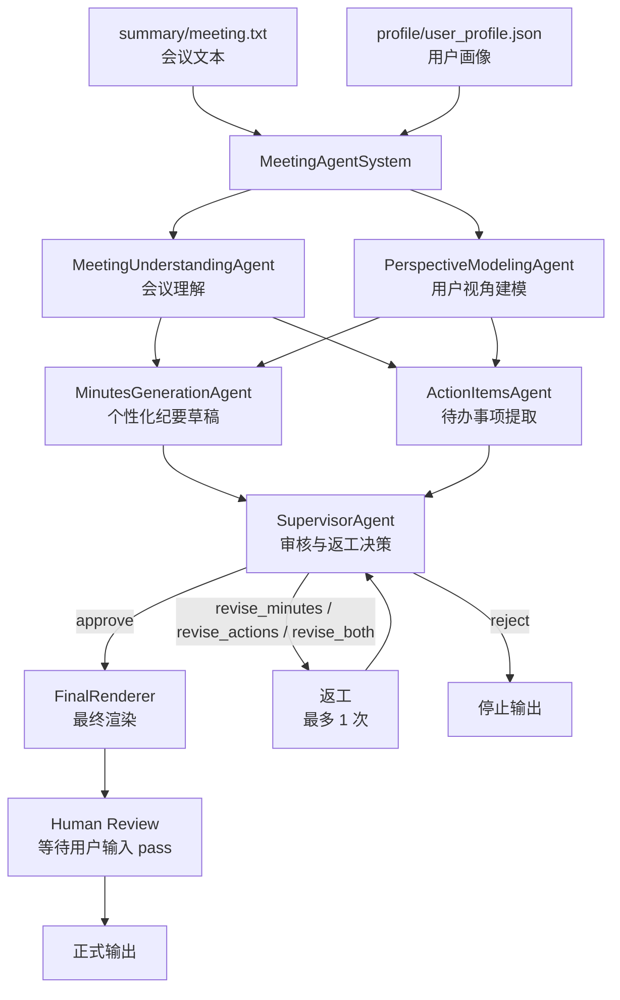

# 个性化会议纪要多 Agent 系统

这是一个基于 DeepSeek API 和 LangGraph 的会议处理项目。用户只需要提供一段会议文本和一份用户画像，系统会生成该用户视角下的会议纪要和本人待办事项。

## 项目结构

```text
meeting_summary/
├── app.py                         # 唯一运行入口
├── summary/
│   └── meeting.txt                # 用户放入会议文本
├── profile/
│   └── user_profile.json          # 用户放入用户画像
├── src/meeting_agent/
│   ├── agents/
│   │   ├── meeting_understanding_agent.py
│   │   ├── perspective_modeling_agent.py
│   │   ├── minutes_generation_agent.py
│   │   ├── action_items_agent.py
│   │   ├── supervisor_agent.py
│   │   ├── final_renderer.py
│   │   └── schema_repair_agent.py
│   ├── client.py                  # DeepSeek API 调用与结构化输出校验
│   ├── models.py                  # 数据模型
│   ├── orchestrator.py            # LangGraph 编排
│   ├── presenter.py               # 最终结果展示
│   ├── state.py                   # LangGraph 共享 State
│   └── validation.py              # 输出格式校验
├── requirements.txt
├── pyproject.toml
└── .env                           # 本地 API Key，不上传 GitHub
```

## 输入格式

会议文本放在 `summary/` 文件夹中，文件类型必须是 `.txt`。当前项目默认只读取一个会议文件，所以请保持该文件夹里只有一个 `.txt`。

用户画像放在 `profile/` 文件夹中，文件类型必须是 `.json`。当前项目默认只读取一个用户画像文件，所以请保持该文件夹里只有一个 `.json`。

用户画像格式如下：

```json
{
  "name": "李明",
  "role": "居民志愿者",
  "department": "春风小区志愿者小组",
  "responsibilities": [
    "报名信息整理",
    "现场签到",
    "居民引导",
    "临时通知"
  ],
  "interests": [
    "报名名单准确性",
    "现场秩序",
    "通知是否及时"
  ],
  "context": "希望明确自己在活动前和活动当天需要完成的事项"
}
```

## 环境配置

推荐使用你已有的 conda 环境：

```powershell
conda activate agent
python -m pip install -r requirements.txt
```

在项目根目录创建 `.env`：

```text
DEEPSEEK_API_KEY=你的 API Key
DEEPSEEK_BASE_URL=https://api.deepseek.com
DEEPSEEK_MODEL=deepseek-chat
```

`.env` 已经被 `.gitignore` 忽略，不会上传到 GitHub。

## 运行

```powershell
python app.py
```

运行后系统会：

1. 读取 `summary/` 中的会议文本。
2. 读取 `profile/` 中的用户画像。
3. 运行多 Agent 工作流。
4. 先展示审核预览。
5. 你在终端输入 `pass` 后，正式输出用户视角会议纪要和待办事项。

最终展示内容只包含：

```text
【用户视角会议纪要】
一段完整的个性化会议纪要

【待办事项】
1. 第一条本人待办
2. 第二条本人待办
```

## Agent 流程



## 设计说明

项目不是让一个 LLM 一次性总结会议，而是拆成多个职责清晰的 Agent：

- `MeetingUnderstandingAgent`：理解会议事实、议题、决策、风险和未决问题。
- `PerspectiveModelingAgent`：结合用户画像建立本次会议中的用户关注视角。
- `MinutesGenerationAgent`：生成用户视角的纪要草稿。
- `ActionItemsAgent`：提取本人、他人和未分配待办。
- `SupervisorAgent`：审核事实一致性、用户相关性、待办证据和跨 Agent 一致性，并决定是否返工。
- `FinalRenderer`：只把已审核通过的内容渲染成最终展示结果。

LangGraph 的 `MeetingState` 负责在这些节点之间传递上下文。每个 Agent 只写入自己负责的 State 字段，后续 Agent 再读取这些字段继续处理。
