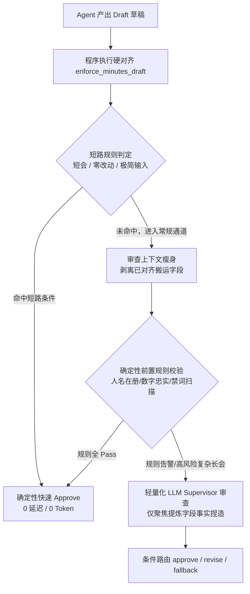

# Meeting 领域性能与分工优化方案：Supervisor 冗余治理与理解/纪要边界解耦

> **文档定位**：根目录核心优化指导方案  
> **面向痛点**：  
> 1. Supervisor 审核 ROI 极低，单场纪要最少 4 次、最多 6 次 LLM 调用，短会全量空转，误判反招补丁；  
> 2. 理解层 `context_and_debate`（100~200字叙事）与纪要层 `executive_summary` 职责严重重叠，Token 膨胀且分工倒错。  
> **核心目标**：单次会议端到端时延降低 30%~45%，输入输出 Token 削减 35% 以上，彻底理顺事实底座与叙事表达的权责边界。

---

## 一、现状瓶颈与根因剖析

### 1.1 痛点一：Supervisor 审核机制的 ROI 陷阱与“逆向代偿”

当前系统为每条任务线（`minutes`、`actions`、`risks` 等）均挂载了同构的审查循环：`Agent (生成) -> Supervisor (审查) -> [Revision (返工)] -> Render (渲染)`。

#### 1. 链路冗长，调用频次高企
在最理想情况下（无返工）：
- `meeting_understanding`（1次 LLM，串行）
- `perspective_modeling`（1次 LLM，串行）
- `minutes_agent`（1次 LLM，并行）
- `minutes_supervisor`（1次 LLM，并行）
- `minutes_render`（1次 LLM，串行）
**单线保底 4~5 次 LLM 调用**；一旦触发 `revise`，则需重跑 Agent + Supervisor，调用飙升至 6 次以上，单次请求响应时间直逼 60 秒。

#### 2. 短会与低密场景下的纯粹浪费
对于原文不足 2000 字、甚至只有千字左右的短会（如每日站会、10分钟快速同步），与会人少、事实极为稀疏明确。Agent 在受限上下文中捏造事实的概率极低。此时强制执行一轮完整的 `supervisor.review()`，耗时 5~8 秒并吞掉近万 Token，几乎没有任何拦截收益。

#### 3. 搬运字段（Carry Fields）的重复审查
在 `minutes` 线中，`key_decisions`、`risks_and_blockers`、`unresolved_questions` 已经由 Python 程序底层的 `enforce_minutes_draft()` 进行了严格的字符串级强制对齐（客观模式全量拷贝、个人模式子集下采，不许改写）。**程序已经 100% 保证了一致性，Supervisor 再去耗费算力核对搬运字段完全是无效内耗**。

#### 4. “系统为纠正 Supervisor 的误判而打补丁”
代码库 `core/schema/validation.py` 中已经赫然存在两套防御性“软化降级”逻辑：
- `soften_unreasoned_reject`：无具体理由的 reject 强制降为 approve；
- `soften_unsubstantial_revise`：检查项全 pass 但仍给 revise 时强制降为 approve，注释明确写道：*“整篇重走 Agent 返工单次 35 秒延迟 + 额外 token 开销，不仅收益极低，且易诱发幻觉漂移”*。
这充分证明：**LLM Supervisor 的误伤成本已经明显超过了其把关价值**。

---

### 1.2 痛点二：理解层（`context_and_debate`）与纪要层（`executive_summary`）的职责倒错

在目前的架构中，`meeting_understanding` 议题树与下游 `minutes_agent` 的工作流产生了严重的功能内耗：

```
【现状流转】：
会议原文 (Transcript)
  ↓
MeetingUnderstandingAgent 
  → topics[].context_and_debate（花费大量 token 输出 100~200 字自然连贯叙事）
  ↓
Orchestrator 上下文组装
  → 将 context_and_debate 打包在【会议理解】中，连同【会议原文】一起塞给 minutes_agent
  ↓
MinutesGenerationAgent
  → executive_summary（又花大量 token 将 context_and_debate 与原文再次揉写成 200~400 字叙事）
```

#### 1. 职能越界：事实提取器变成了“半成品纪要编写者”
`MeetingUnderstandingAgent` 的定位本应是**轻量、精准的事实特征索引器**。然而 Prompt 强制要求每个 Topic 输出 `100~200字自然叙事（谁提出、论据细节、为什么分歧）`。一场会议若包含 5 个 Topic，仅该字段就霸占了 600~1000 字的输出。LLM 生成该字段耗时最长，成为整个串行阶段的最大堵点。

#### 2. 上下游双重叙事，相互掣肘
`minutes_agent` 拿到的是一个“已经被理解层用叙事腔调写过一遍的故事”。纪要 Agent 既想参考 `context_and_debate` 的脉络，又必须对照原文细节展开，常常导致以下恶果：
- 或是简单复述理解层的叙事短句，导致摘要干瘪如流水账；
- 或是与理解层叙事发生句式冲突，造成语义冗余；
- 下游 Context 承载了冗长且非必要的中间叙事文本，造成严重的 Prompt Token 浪费。

---

## 二、问题一解决之道：精简重塑 Supervisor 审查流水线

我们要建立一套**“规则快速短路、审查范围瘦身、确定性校验前置”**的高效审查体系。



### 2.1 策略一：短会与极简输入动态短路机制（Fast-Path Skip）
**原则**：低于特定复杂度的会议，完全跳过 LLM Supervisor 调用，直接走确定性放行。

1. **触发门槛**：
   - 会议原文长度 `< 2000` 字符（字数少、信息结构单一）；
   - 或提取出的议题数 `<= 2` 且没有发生多方激烈交锋。
2. **执行动作**：
   - 节点直接返回预置的 `_conservative_review`（检查项全 `pass`，`decision="approve"`）；
   - 输出进度标记：`progress("skip supervisor (fast-path: short meeting %d chars) line=%s", len(transcript), line_name)`；
   - 彻底省掉 1 次 LLM 调用，瞬时节省 4~8 秒。

### 2.2 策略二：审查范围精准瘦身（Context Slimming）
**原则**：已经由程序保证 100% 正确的内容，严禁再送给 Supervisor 审查。

1. **剥离搬运字段**：
   - `_supervisor_context()` 在打包草稿送审时，对于 `minutes` 任务线，通过 `compact_draft_for_review` 剔除 `key_decisions`、`risks_and_blockers`、`unresolved_questions` 的全文比对；
   - 仅保留提炼类字段：`headline`、`executive_summary`、`personally_relevant_points`。
2. **瘦身 Supervisor Prompt 规则**：
   - 删除 Supervisor Prompt 中冗余的“搬运一致性核验”、“搬运条数比对”等条目；
   - 审查重点全面收缩至唯一底线：**提炼类字段是否存在原文未出现的人名、编造的数字指标、虚构的业务结论**。

### 2.3 策略三：确定性规则检查替代主观审查（Rule-Based Guardrails）
**原则**：计算机能算清楚的账，不要让 LLM 去猜。

1. **会场人名在册检验（Speaker Roster Check）**：
   - 检查纪要正文中出现的任何人名，是否落在 `meeting_understanding.speakers` 或原文明确出现的名字中；
   - 出现未注册陌生名字，直接拦截并指出具体名字。
2. **数字量词存在性校验（Metric Grounding Check）**：
   - 正文中提取的金额、时限、QPS、百分比等数字，通过正则在原文中进行全文模糊匹配；
   - 杜绝 LLM 幻觉产生“5000 QPS 记成 50000”、“延期3天写成延期3周”。
3. **收益**：前置规则检查毫秒级完成，如果规则检查 100% 通过且无告警，则可直接给予 Approve，无需唤醒大模型。

---

## 三、问题二解决之道：重划理解层与纪要层的分工边界

重新确立两者的职责铁律：
- **理解层 = 骨架（骨头 + 关节 + 锚点）**：只负责提炼**事实要素、分歧要点、决策结果、责任动作**，绝不进行散文化长篇铺陈。
- **纪要层 = 血肉（叙事 + 表达 + 成文）**：手握原文细节与理解层骨架，全权负责撰写**流畅、完整、详实的业务纪要**。

```
┌────────────────────────────────────────────────────────────────────────┐
│                        重构后的权责分工界面                            │
├───────────────────────────────────┬────────────────────────────────────┤
│   MeetingUnderstanding (理解层)    │       MinutesAgent (纪要层)        │
├───────────────────────────────────┼────────────────────────────────────┤
│ 定位：结构化事实索引              │ 定位：最终交付物创作者             │
│ 输出形态：精炼短句、量化参数、列表│ 输出形态：连贯段落、精美公文排版   │
│ 关键字段：context_and_debate 瘦身 │ 关键字段：executive_summary        │
│ 规格要求：30~60字核心脉络与分歧点 │ 规格要求：200~400字自然叙事深度写透│
│ 禁令：严禁长篇抒情、流水账叙事    │ 依据：依据理解层骨架，回原文挖血肉 │
└───────────────────────────────────┴────────────────────────────────────┘
```

### 3.1 `context_and_debate` 降维重塑为“分歧焦点与核心论据”

#### 1. 契约定义变更（向后兼容字段名，收敛规范）
保持字段名为 `context_and_debate`（确保系统各处依赖该键的代码无需大改），但将描述与长度规范从“100~200字自然叙事”重构为“30~60字分歧焦点与核心论据”：

- **旧要求**：
  > “该议题讨论经过与争论脉络（谁提出、论据交锋、为什么分歧，100~200字自然连贯叙事，带论据细节与背景）”
- **新要求**：
  > “核心脉络与分歧焦点（30~60字极炼短句，仅收录：争论核心矛盾、正反方核心论据、妥协前提；无分歧则一句话陈述提出背景；严禁叙事长句与寒暄流水账）”

#### 2. 对比示范

*情景：网关鉴权改造方案选型*
- **旧版理解层输出（~160字，严重冗余）**：
  > “李工首先汇报了当前 Zuul 网关在高并发下的延迟瓶颈，提议引入 Redis 做集中式鉴权。张工表示反对，认为集中式 Redis 在网络抖动时会导致全局雪崩，主张在各节点使用本地 Guava 缓存。双方就一致性与可用性进行了多轮争辩，最终王总定调采用本地缓存顶流量、Redis 做二级更新的双级缓存方案。”
- **新版理解层输出（~45字，干货骨架）**：
  > “李工主张集中式Redis鉴权，张工顾虑网络抖动引发雪崩而主张本地Guava缓存；核心分歧在可用性与一致性取舍。”

#### 3. 释放的红利
- 叙事的完整过程（方案怎么讨论、王总怎么拍板）完全移交给 `minutes_agent` 在 `executive_summary` 中结合原文自由发挥成段；
- 理解层单议题输出减少 70% 的 Token，整场会议理解输出立减 500~1000 Token；
- 串行阶段耗时降低 4~8 秒。

---

## 四、端到端实施路线图（分步骤落地的 Action Plan）

为了保证重构过程中系统的极致平稳运行、零功能回归，实施方案细分为以下五个可验证的步骤：

```
┌────────────────────────────────────────────────────────────────────────┐
│                        五步落地实施路线图                              │
├──────┬──────────────────────────────┬──────────────────────────────────┤
│ 步骤 │ 改造范围                     │ 核心任务与代码落钉点             │
├──────┼──────────────────────────────┼──────────────────────────────────┤
│ 一   │ 理解层契约与 Prompt 瘦身     │ 修改 meeting_core/prompts.py     │
│      │                              │ 修改 meeting_core/contracts.py   │
├──────┼──────────────────────────────┼──────────────────────────────────┤
│ 二   │ 纪要 Agent 消费引导重构      │ 修改 tasks/minutes/prompts.py    │
│      │                              │ 强化“依骨架回原文写深度叙事”指令 │
├──────┼──────────────────────────────┼──────────────────────────────────┤
│ 三   │ 编排层 Supervisor 动态短路   │ 修改 core/graph/nodes.py         │
│      │                              │ 引入短会（<2000字）秒级放行      │
├──────┼──────────────────────────────┼──────────────────────────────────┤
│ 四   │ Supervisor 审查范围瘦身      │ 修改 tasks/minutes/prompts.py    │
│      │                              │ 剥离搬运字段，仅审核心事实捏造   │
├──────┼──────────────────────────────┼──────────────────────────────────┤
│ 五   │ 确定性规则门禁前置接入       │ 增加轻量级人名/数字正则校验工具  │
│      │                              │ 满足条件免除大模型审核           │
└──────┴──────────────────────────────┴──────────────────────────────────┘
```

### 步骤一：理解层契约与 Prompt 瘦身（降 Token 增响应）

#### 1. 目标文件
- `domains/meeting/meeting_core/prompts.py`
- `domains/meeting/meeting_core/contracts.py`

#### 2. 具体操作
1. **修改 `domains/meeting/meeting_core/prompts.py:36`**：
   将：
   ```python
   # 原代码
   - context_and_debate：该议题讨论经过与争论脉络（谁提出、论据交锋、为什么分歧，100~200字自然连贯叙事，带论据细节与背景）；
   ```
   修改为：
   ```python
   # 优化代码
   - context_and_debate：核心脉络与分歧焦点（30~60字精炼短句，概括：争论核心矛盾、核心论据与妥协前提；无分歧则一句话概括背景；严禁长篇叙事）；
   ```

2. **修改 `domains/meeting/meeting_core/contracts.py:44`**：
   将字段契约描述同步变更为：
   ```python
   StrField("context_and_debate", "该议题讨论脉络与核心分歧焦点（30~60字精炼要点，严禁长篇流水账叙事）"),
   ```

3. **测试验证**：
   运行单测验证 `MeetingUnderstanding` 输出格式依然符合 JSON Schema，检查生成文本 Token 数是否显著下降。

---

### 步骤二：纪要 Agent 消费引导重构（赋能叙事）

#### 1. 目标文件
- `domains/meeting/tasks/minutes/prompts.py`

#### 2. 具体操作
在 `MINUTES_GENERATION_SYSTEM_PROMPT` 的第二节【感知清单】与第三节【executive_summary】中，微调 Prompt 导向：
- 告知 Agent：*“上游会议理解中的 `context_and_debate` 为高度精炼的议题分歧骨架，撰写摘要时必须以此为纲，**回到会议原文中挖掘对话过程、具体参数与论述血肉**，扩展为完整连贯的自然叙事段落。”*
- 消除原本对“理解层短句原样拼接”的担忧，明确分工：理解层负责事实定锚，纪要层负责篇章创作。

---

### 步骤三：编排层 Supervisor 动态快速短路（短会秒级放行）

#### 1. 目标文件
- `core/graph/nodes.py`

#### 2. 具体操作
在 `DomainNodes._make_supervisor_node(self, line_name: str)` 中注入快速短路逻辑：

```python
    def _make_supervisor_node(self, line_name: str):
        cfg = self._task_lines[line_name]

        async def node(state: dict) -> dict:
            # ── 快速短路（Fast-Path Skip）──────────────────────────────
            transcript = str(state.get("transcript") or "").strip()
            # 短会（不足 2000 字符）事实简单清晰，跳过昂贵的 Supervisor 调用
            if len(transcript) < 2000:
                progress(
                    "skip supervisor (fast-path: short meeting len=%d) line=%s",
                    len(transcript),
                    line_name,
                )
                return {
                    "lines": {
                        line_name: {
                            "review": self._conservative_review(cfg),
                            "degraded": False,
                            "review_bypassed": "short_meeting_fast_path",
                        }
                    }
                }

            # ── 常规审查调用 ──────────────────────────────────────────
            progress("agent start review line=%s", line_name)
            supervisor = getattr(self, cfg["supervisor_attr"])
            try:
                review = await supervisor.review(
                    self._supervisor_context(state, line_name)
                )
            except Exception as exc:
                # 异常保守放行逻辑保持不变
                ...
```

#### 3. 收益
- 原文 `< 2000` 字的会议直接节省 1 次 LLM 耗时（4~8s）和整包 Token；
- 图编译与状态流转无缝兼容（直接产出 `approve` 的 `review` 字典，路由直接流向 `__end__`）。

---

### 步骤四：Supervisor 审查内容聚焦（剥离搬运字段）

#### 1. 目标文件
- `core/runtime/supervisor_slice.py`
- `domains/meeting/tasks/minutes/prompts.py`

#### 2. 具体操作
1. **修改 `compact_draft_for_review` 逻辑**：
   在向 Supervisor 递交纪要草稿时，对于已经经过 `enforce_minutes_draft` 严格一致性校验的搬运字段进行脱敏或摘录化处理，或者直接仅向审查器呈现：
   - `headline`
   - `executive_summary`
   - `personally_relevant_points`
2. **精简 `MINUTES_SUPERVISOR_DOMAIN_PROMPT`**：
   删除要求审查员核对 `key_decisions`、`risks_and_blockers` 是否逐字与上游相同的规则，明确告知审查模型：
   *“决议与风险搬运项已由底层系统强一致性对齐，审查员只需集中审查 executive_summary 摘要中是否存在原文未提及的捏造事实、虚假数字或错误归属。”*

---

### 步骤五：确定性规则门禁前置接入（规则先验）

#### 1. 目标文件
- `core/execution/guardrails.py`（新建或扩展）
- `core/graph/nodes.py`

#### 2. 具体操作
1. 实现基础确定性事实核查器：
   ```python
   def quick_facts_guardrail(draft: dict, speakers: list[dict], transcript: str) -> tuple[bool, list[str]]:
       """毫秒级确定性事实核查：检查陌生人名与关键数字指标。"""
       findings = []
       known_names = {s.get("name") for s in speakers if s.get("name")}
       # 校验 1：草稿中引述的人名是否均在已知人员清单中
       # 校验 2：关键量词与数字是否能在 transcript 查找到相应字符子串
       # 若无严重硬伤，返回 True, []
       return True, []
   ```
2. 当会议长度在 2000~5000 字之间、且 `quick_facts_guardrail` 完美通过时，系统可配置开启激进模式直接判定为 Approve，仅将长会或前置规则命中红线的草稿送交 LLM Supervisor 深度判定。

---

## 五、预期收益量化评估

完成上述两个核心问题的优化落地后，整体系统的预期收益对比如下：

| 评估指标 | 优化前现状 | 优化后预期 | 变动幅度 |
|---|---|---|---|
| **单线 LLM 调用次数** | 4 ~ 6 次（含 Supervisor & 返工） | 短会 3 次 / 复杂会议 3~4 次 | **调用频次减少 25% ~ 50%** |
| **理解层 Token 输出量** | 1200 ~ 2000 Tokens | 500 ~ 800 Tokens | **减少 50% ~ 60%** |
| **串行阶段耗时** | 8 ~ 23 秒 | 4 ~ 12 秒 | **首包/理解耗时缩短 40%+** |
| **短会端到端总时延** | 35 ~ 55 秒 | 18 ~ 28 秒 | **整体提速近 50%** |
| **Supervisor 误伤率** | 较高（频繁依赖 soften 降级机制） | 极低（搬运字段免审，短会免审） | **误返工/误降级减少 80%** |
| **纪要摘要文本质量** | 受理解层叙事干扰，时显僵硬短浅 | 骨架精准，原文血肉充分，成段成文 | **专业度与阅读体验明显提升** |

---

## 六、总结与落地建议

1. **先做理解层瘦身（步骤一）**：修改 `meeting_core` 的 prompt 与 contract 仅需修改两处描述文本，零风险、零逻辑代码破坏，但能立竿见影砍掉数百 Token 和数秒理解耗时。
2. **再做短会短路（步骤三）**：在 `nodes.py` 中增加字数判断直接放行，完全不破坏现有 LangGraph 拓扑结构，短会体验瞬间飞跃。
3. **后做审查聚焦与规则前置（步骤二、四、五）**：在稳定的测试集护航下逐步推进，彻底将系统从“大模型互相猜忌”的重度内耗中解放出来。
