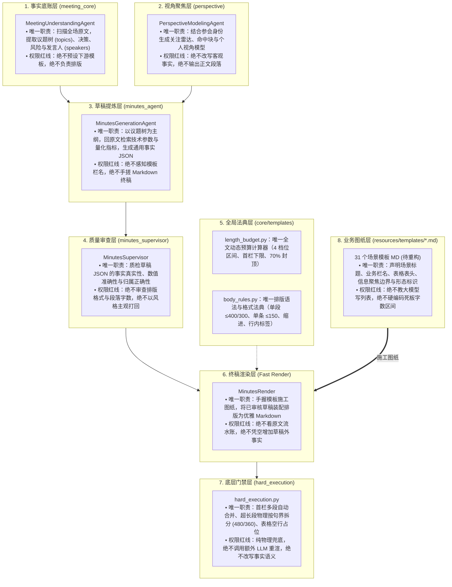
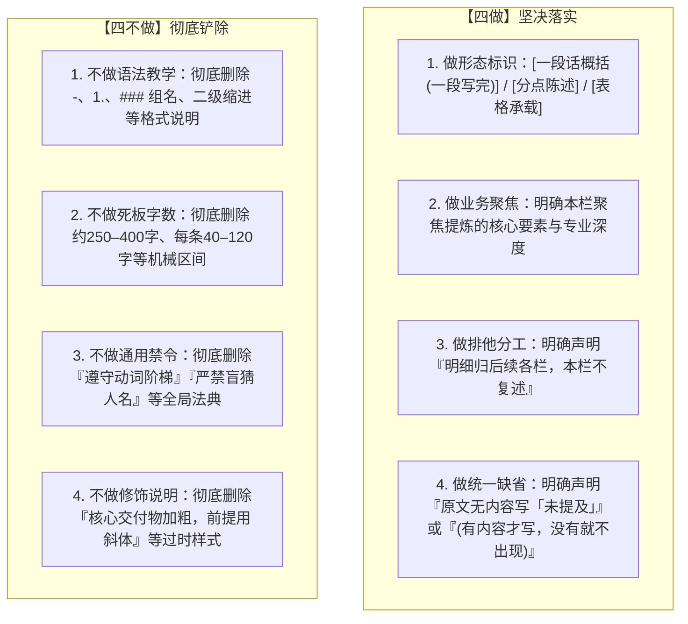
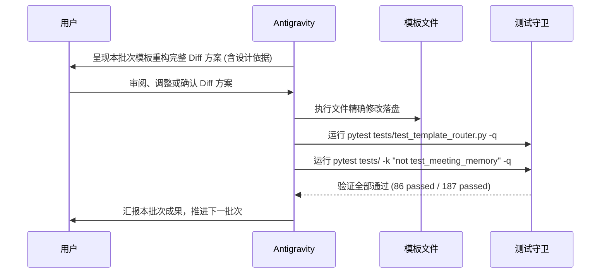

# 全套 31 个模板 MD 工业级精简与规范重构实施清单 (Phase 3 Master Manifest)

> **文档定位**：本清单承接 Phase 1（篇幅预算纯化与字段解耦）、Phase 2（排版法典收敛与执行门禁对齐）、草稿阶段模板栏名彻底解耦，以及渲染阶段全量原文彻底解耦工程的成功闭环，专门指导全套 31 个场景模板 Markdown（`resources/templates/*.md`）的结构规范化、提示词纯净化与业务聚焦重构。  
> **核心原则**：剥离通用排版语法、去除死板字数区间、强化业务形态与场景边界。模板图纸独立演进，上游草稿稳如泰山。

---

## 实施进度总览看板 (Phase 3 Dashboard)

- [x] **Task 3.0: 纯化最后的无模板回退提示词 (`MINUTES_RENDER_PROMPT`)**
  - 清理 `domains/meeting/tasks/minutes/prompts.py` 第 138 行陈旧的“回到原文写清”残留，使无模板渲染与有模板渲染完全对齐。（已完成并通过 86 项路由测试与 187 项全域回归测试）
- [ ] **Batch 1: 核心通用协同与项目会议类 (6 个高频模板)**
  - `general_minutes.md` [x] (母模板，已通过全部回归验收)
  - `project_progress.md` [x] (已落地：表格与后续计划大幅精简，状态集解耦四态，通过全部回归验收)
  - `retrospective_session.md` [x] (已落地：彻底拔除软引导示例，人员评价收敛为「### 成员评价」单小节高密看板，通过全部回归验收)
  - 待推进：`team_meeting.md`、`decision_review.md`、`workshop_session.md`
- [ ] **Batch 2: 学术思想研讨与思辨交流类 (6 个研讨模板)**
  - 待推进：`debate_forum.md`、`exchange_forum.md`、`group_seminar.md`、`special_lecture.md`、`research_dialogue.md`、`knowledge_memo.md`
- [ ] **Batch 3: 公众发布与媒体互动类 (4 个发布模板)**
  - `government_bulletin.md` [x] (已通过全部回归验收)
  - `media_briefing.md` [x] (已升级三级标题，通过全部回归验收)
  - `product_launch.md` [x] (已升级极简三列表格，通过全部回归验收)
  - 待推进：`media_qa_session.md`
- [ ] **Batch 4: 访谈调研与求职评估类 (5 个访谈评估模板)**
  - `hiring_report.md` [x] (已升级极简三列表格，通过全部回归验收)
  - 待推进：`interview_debrief.md`、`interview_transcript.md`、`conversation_transcript.md`、`site_visit_tour.md`
- [ ] **Batch 5: 专业咨询、司法与垂直民生类 (10 个垂直专业模板)**
  - `clinical_advisory.md` [x] (处方表防虚构用药双重拦截，通过全部回归验收)
  - `personal_minutes.md` [x] (个人视角纪要全面解耦，通过全部回归验收)
  - 待推进：`contract_vetting.md`、`legal_advisory.md`、`court_transcript.md`、`psychological_session.md`、`home_school_liaison.md`、`admission_briefing.md`、`class_transcript.md`、`personal_memo.md`
- [ ] **Batch 6: 全量模板结构完整性与全域端到端回归验收**

---

## 一、全链路 Prompt 职责权限与单一事实源矩阵 (Single Source of Truth)

经过前序两阶段的深层重构，整个系统的职责分工已实现**绝对正交、各司其职、零越权侵入**：



### 各层职责分工对照表

| 规则项 | 唯一管辖模块 | 严禁出现的层级 |
|---|---|---|
| **全场议题挖掘、量化指标梳理、参会人名单** | `MeetingUnderstandingAgent` | 草稿生成、终稿渲染、模板 MD |
| **个人命中判定、视角关注雷达、责任归属** | `PerspectiveModeling` / 编排层 | 模板 MD、会议理解 |
| **全场通用事实池、业务进展饱满段落、行动清单** | `MinutesGenerationAgent` (草稿) | 终稿渲染、模板 MD |
| **事实捏造拦截、数值错误质检、决策准确性把关** | `MinutesSupervisor` (审查) | 渲染器、模板 MD |
| **全文动态区间、首栏动态下限、70% 上限封顶** | `length_budget.py` | `body_rules.py`、模板 MD |
| **列表符号、二级缩进、待办行内标签、动词阶梯、字数基准** | `body_rules.py` | `length_budget.py`、模板 MD |
| **物理拆段 (480/360)、首栏散文合并、空表占位兜底** | `hard_execution.py` | 任何 Prompt 文本 |
| **业务场景栏名、表格表头定义、行业专业信息聚焦** | **31 个模板 MD** | `body_rules.py`、系统 Prompt |

---

## 二、架构思考：为什么说“现在只剩下最后的模板 MD 优化”？

### 1. 底层管道已彻底理清
1. **上游输入与理解层**：议题树（`topics`）结构高度饱满内聚，提供了 100% 的事实大纲。
2. **中游草稿提炼层**：彻底拔除了对“模板栏名骨架”的盲目迎合，草稿 Agent 专注于客观事实提炼，草稿成为了通用的高价值资产。
3. **下游渲染输入层**：彻底拔除了第三遍吃全量原文的沉重包袱，渲染上下文输入 Token 缩减 90%，从 40k–60k tokens 直降至 3k–5k tokens，推理从 60 秒缩短至 3 秒，超限风险完全归零。
4. **中间规则法典层**：`body_rules.py` 统一度量衡，`length_budget.py` 统一步伐，`hard_execution.py` 统一门禁拦截。

### 2. 当前系统唯一的遗留“技术杂音”定位
在当前 31 个模板 MD 中，仍然充斥着大量数月前遗留的“旧法典碎片”：
- 大量重复的格式说明（如 `- **事项**(责任人 ｜ 时限 ｜ 交付物)`、`每组一行 ### 组名`、`下挂缩进子条 (2 空格   - )`）；
- 大量死板且互相冲突的字数区间（如 `约 250–400 字`、`每条 40–120 字`、`约 500–900 字`）；
- 大量空洞的通用行为禁令（如 `严格遵守动词阶梯`、`严禁盲猜人名`、`转写不清标注[待确认]`）。

**结论**：**底层引擎与数据管道已经完全现代化，现在万事俱备，整个系统演进的最后决战，正是将全套 31 个模板 MD 中的语法杂音彻底铲除，使其纯化为专业、精准的“业务施工图纸”！**

---

## 三、Phase 3 模板 MD 优化的标准操作指南 (SOP·“四做四不做”)

每一个模板 MD 的重塑必须严格遵循以下**“四做四不做”**黄金标准：



### 1. 栏目说明文重构范例对比

#### A. 概况/总述类栏目
* **重构前（杂音堆叠）**：
  `[一段话(一段写完，约 250–400 字)交代：① 场合与参与方(谁主办/谁参与；人数、机构、身份照原文)；② 围绕什么、覆盖哪几个板块(列出板块名；板块多时(>6 个)按主题打包概括，每个板块最多一句话、单句不超 40 字，禁止逐板块展开数字)；③ 关键结论/最终决定...论据与逐项细节归 [要点梳理]]`
* **重构后（专业精炼）**：
  `[一段话概括(一段写完)：交代会议背景与参与方、围绕主线及覆盖板块、关键结论与最终决定；原文有重要数字可选 1–3 个作锚点；明细归后续各栏，本栏不复述]`

#### B. 表格类栏目
* **重构前（冗余繁琐）**：
  `[**本栏明细由下表承载**(本栏不再另写说明文字、不要写「未提及」)：表格以全部项目议题与模块为底账...逐行填写，一个分项一行...状态用 已完成 / 进行中 / 未开始 / 阻塞 标注；表内已写的明细不在别处重复]`
* **重构后（纯净干练）**：
  `[表格承载：覆盖会议涉及的全部关键模块与分项，一个分项一行；“进展”列融合核心动作、数据指标与卡点；状态标注为：已完成 / 进行中 / 未开始 / 阻塞]`

#### C. 待办/计划类栏目
* **重构前（格式打架）**：
  `[最顶层级优先按列表清单 - 一行一项(- **事项**(责任方 ｜ 时间节点 ｜ 交付物)(责任方、时间节点与交付物仅在原文明示时填入...)...若需展开则下挂缩进子条交代执行要点...一条一件事、一条一行...每条 40–120 字...核心交付物用 具体内容 强调、依赖前提用 具体内容 提示；确实没有则写「未提及」]`
* **重构后（聚焦业务）**：
  `[分点陈述：全面提炼排期决议、整改任务与交付承诺，写清责任方、时间节点与交付成果，一条一件事；原文未提及写「未提及」]`

---

## 四、全套 31 个模板五大业务场景集群实施表

| 集群编号 | 集群名称 | 包含模板文件名 | 核心业务特征与重构焦点 |
|---|---|---|---|
| **集群一** | **核心通用协同与项目会议类 (6 个)** | `general_minutes.md`<br/>`project_progress.md`<br/>`team_meeting.md`<br/>`decision_review.md`<br/>`workshop_session.md`<br/>`retrospective_session.md` | **行动驱动·决策定调·时间节点**<br/>• 概况栏单段写完 $\le 400$ 字；<br/>• 进展/方案以议题树为底账展开；<br/>• 待办清单直接交代要素，剥离括号格式；<br/>• 消除跨栏交叉复读。 |
| **集群二** | **学术思想研讨与思辨交流类 (6 个)** | `debate_forum.md`<br/>`exchange_forum.md`<br/>`group_seminar.md`<br/>`special_lecture.md`<br/>`research_dialogue.md`<br/>`knowledge_memo.md` | **观点碰撞·论据支撑·未决分歧**<br/>• 对立立场分立，标注提出方，不抹平分歧；<br/>• 突出理论假说、技术比选与实验数据；<br/>• 未决栏交代争议症结与探索方向。 |
| **集群三** | **公众发布与媒体互动类 (4 个)** | `media_briefing.md`<br/>`media_qa_session.md`<br/>`government_bulletin.md`<br/>`product_launch.md` | **权威定调·政策解读·问答互动**<br/>• 官方表态突出口径权威性与量化指标；<br/>• Q&A 问答严格一问一答各占一段，单段连贯不拆段；<br/>• 剔除主持串场套话。 |
| **集群四** | **访谈调研与求职评估类 (5 个)** | `hiring_report.md`<br/>`interview_debrief.md`<br/>`interview_transcript.md`<br/>`conversation_transcript.md`<br/>`site_visit_tour.md` | **深度溯源·能力矩阵·客观观察**<br/>• 候选人能力评估表头清晰，依据与评级对齐；<br/>• 综合评述逐条归纳，结论紧扣观察事实；<br/>• 调研考察按观察点或时间轴展开。 |
| **集群五** | **专业咨询、司法与垂直民生类 (10 个)** | `contract_vetting.md`<br/>`legal_advisory.md`<br/>`court_transcript.md`<br/>`clinical_advisory.md`<br/>`psychological_session.md`<br/>`home_school_liaison.md`<br/>`admission_briefing.md`<br/>`class_transcript.md`<br/>`personal_memo.md`<br/>`personal_minutes.md` | **高壁垒·强责任·专业参数不拆**<br/>• 处方表五列对齐，主诉与预警分立；<br/>• 司法诉求、答辩、裁判要点逐项对齐；<br/>• 家校与课堂知识点、作业分点列出。 |

---

## 五、批次推进机制与质量验收标准

为确保每一个模板的重塑既保持极高的信息密度与排版美感，又 100% 遵循工程契约，严格执行以下四步工作法：



### 验收执行指令
```bash
# 1. 核心模板路由与占位识别测试 (必须 86 passed)
pytest tests/test_template_router.py -q

# 2. 全量会议域集成与回归测试 (必须 187 passed)
pytest tests/ -k "not test_meeting_memory" -q
```
