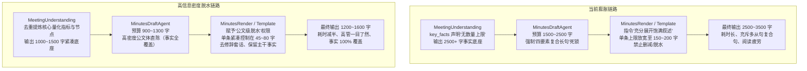

# 模板纪要（minutes）输出精炼与提速优化清单

> **目标**：在 100% 保留当前输出**事实广度、议题覆盖面、量化指标与决策定调**的前提下，拔除长句死锁与修辞水分，将生成文本体积与生成耗时降低 **35%~50%**，同时杜绝“电报式过度精简”与“负向禁令堆叠成屎山”。

---

## 一、现状诊断与对比定位（为什么变冗长？为什么变慢？）

通过对比当前版本与 `3c603c8d31a98aac5058747360460debbc489bf2`，发现输出冗长和耗时变慢的根本原因在于：**重构过程中为了防止“断句截断”和“丢事实”，在 Prompt 全链路过度强化了“饱满展开”指令，并硬性绑定了僵化的复合长句结构**。



### 核心病灶排查对照表

| 环节 / 模块 | `3c603c8d` 旧状态 | 当前重构状态（放宽病灶） | 优化后目标状态（黄金平衡） |
|---|---|---|---|
| **上游理解层**<br>`meeting_core/prompts.py` | `key_points` 严格上限（每议题 ≤8 条、全篇 ≤30 条，去重复） | `session_segments` 明确声明：`无数量上限`，引入大量长原句引用 | 保留多阶段与交锋，但去除“无数量上限”，要求**去重提炼高密度事实** |
| **草稿篇幅预算**<br>`minutes/prompts.py` | 篇幅服从动态预算，单段 200 字以内 | `executive_summary` 锁死 **1500~2500 字**，首段 400~600 字，分项 350~500 字 | 回归高管适读预算：**全篇 900~1300 字**，首段 200~300 字，分项 150~220 字 |
| **草稿句式结构**<br>`minutes/prompts.py` | 自然叙述，交代因果与结论 | 强制**四要素复合结构闭环**：每句硬塞主体、背景、抗辩、数字、结论、后果 4~6 个从句 | **解绑死锁**：主体+动作+指标/结论直出，长句主动拆短，去套话前缀 |
| **排版长度标尺**<br>`core/templates/body_rules.py` | 规则严格但否定词多 | 单条放宽到 **150 字**，长条目放宽至 **200 字**，散文段放宽至 **300 字** | 收紧标尺：单条 **45~80 字**（超80字二级缩进），散文段 **150~220 字** |
| **渲染层脱水权限**<br>`template_prompt.py` & Render | 负向禁令居多，易造成过度精简 | 强调“充分展开饱满叙述”，剥夺了渲染层对长句的压缩提炼空间 | **赋予脱水权限**：在 100% 保留草稿事实前提下，主动精炼长句、去除修辞 |

---

## 二、优化顶层设计原则（四要四不要）

1. **要全量保留事实，不要牺牲广度**：
   - 所有的业务议题、讨论焦点、争议双方立场、量化指标（带单位和对照基准）、交付期限、具体责任人、决议定调**一个不漏**。
2. **要去除修辞水分，不要过度精简成电报**：
   - 剔除“在本次会议中各方深入研讨了...”、“针对上述暴露出的技术痛点，相关团队提出方案认为...”、“经过审慎的方案权衡比选后...”等废话前缀；
   - 绝不搞“物业起诉业委会”式缺乏因果与指标的光杆断句，保留完整因果骨架。
3. **要单点正向维护，不要堆叠禁令变成“屎山”**：
   - 坚决不使用“严禁/绝对不许/禁止”打补丁，改用清晰的**正向公文写作规范**与**单条/单段字数标尺**；
   - 规则在 `body_rules.py` 单点定义，上游草稿与下游渲染统一消费，不制造规则冲突。
4. **要物理提速，直接控制输出 Token 量**：
   - 大模型自回归生成的延迟完全由输出 Token 数量决定。将正文从 2500 字精简至 1300 字，Token 减少 45%，生成速度直接提升 1 倍。

---

## 三、分层改造执行清单

### 1. Layer 1: 上游理解层事实收敛
**文件**：[`domains/meeting/meeting_core/prompts.py`](file:///D:/study/demo/domains/meeting/meeting_core/prompts.py)

#### 修改点 1.1：收敛 `session_segments.key_facts`，杜绝无上限碎片堆叠
- **位置**：`MEETING_UNDERSTANDING_SYSTEM_PROMPT` 结构生成指引
- **修改前**：
  ```text
  - key_facts：该阶段提出的所有硬核指标、论据案例与执行节点列表（无数量上限，优先高信息密度事实）。
  ```
- **修改后**：
  ```text
  - key_facts：提炼该阶段提出的核心量化指标、关键事实论据与落地执行节点（去重提炼，优先高信息密度事实，同一事实多次提及只保留最全的一条）。
  ```
- **设计权衡**：去掉“无数量上限”的软暗示，增加“去重提炼”，从源头上防止理解底座产生信息水肿。

---

### 2. Layer 2: 纪要草稿生成 Agent（核心减负）
**文件**：[`domains/meeting/tasks/minutes/prompts.py`](file:///D:/study/demo/domains/meeting/tasks/minutes/prompts.py)

#### 修改点 2.1：下调 `executive_summary` 篇幅预算
- **位置**：`MINUTES_GENERATION_SYSTEM_PROMPT` -> `executive_summary` 规则
- **修改前**：
  ```text
  ### executive_summary（提炼——分段正文，全篇 1500~2500 字深度正文主体）
  - **形态与篇幅**：数组中每一项为一整段深度正文。首项（全局概览项）展开至 400–600 字（全面交代会议背景起因、各方初始立场格局、核心定调与全局部署安排，供给下游渲染首栏）；后续分项（业务模块/论辩议题项）每项保持 350–500 字成段充分展开，同主题或同模块进展合为一段，不同业务模块或论辩焦点另起一段。
  ```
- **修改后**：
  ```text
  ### executive_summary（提炼——分段正文，全篇 900~1400 字高密度正文主体）
  - **形态与篇幅**：数组中每一项为一整段紧凑正文。首项（全局概览项）控制在 200–300 字（简明交代会议背景痛点、核心定调格局与全局统一部署，供给下游渲染首栏）；后续分项（业务模块/论辩议题项）每项保持 180–250 字成段自然陈述，同主题或同模块进展合为一段，不同业务模块另起一段。
  ```
- **设计权衡**：首段 250 字足以完整交代背景格局，分段 200 字足以容纳 3~4 个核心数据与决策动作。

#### 修改点 2.2：解绑“四要素复合长句”死锁，重塑公文级紧凑表达
- **位置**：`MINUTES_GENERATION_SYSTEM_PROMPT` -> 事实脉络饱满规则
- **修改前**：
  ```text
  - **事实脉络饱满（四要素闭环与句子级饱满度）**：
    - 核心要求：**模型输出的话不能过度精简，要是一句饱满的有意义的描述清晰的话**；
    - 避免过度精简的电报式断句，每一个核心陈述句由【四要素复合结构】构成闭环：**【主体与立场】 + 【具体事实与主张】 + 【数据论据与背景诱因】 + 【业务后果与后续约束】**；
    - 完整交代「业务背景/触发痛点 ➔ 方案考量与争论焦点 ➔ 关键量化数据/事实论据 ➔ 拍板决议与落地归属」完整脉络；逐句回答“主体与立场、因何背景原因、做了什么探讨抗辩、依据什么具体数字/参数/法律证据、得出什么结论、后续具体安排与后果约束”。
  ```
- **修改后**：
  ```text
  - **事实脉络饱满（高信息密度公文体，长句主动拆短）**：
    - 核心要求：兼顾信息广度与行文简练，以公文体直陈业务事实，拒绝多从句生硬拼接的长难句；
    - 陈述句式闭环规范：交代清“主体 + 核心动作/主张 + 量化指标/定调依据 + 最终结论/后续安排”；
    - 表达去水提炼：保留完整事实脉络，但长句主动拆短（使用逗号或分号自然断开），剔除铺垫修辞与口语化转述（如“在深入讨论中”、“针对各方意见”、“某某在会上明确表示”等套话一律去除，直陈结论与动作）。
  ```
- **设计权衡**：不再强制“逐句回答 6 个问题”，允许模型用自然短句组织高密度信息。

#### 修改点 2.3：收紧行动分工句式
- **位置**：`MINUTES_GENERATION_SYSTEM_PROMPT` -> `personally_relevant_points`
- **修改前**：
  ```text
  每条交代完整事项：主体 + 具体任务 + 交付物/标准 + 协同对象 + 时限要求（2–4 句完整句，充分交代对象、指标与前后因果，形成闭环陈述）。
  ```
- **修改后**：
  ```text
  每条交代完整事项：主体 + 具体任务 + 交付物/标准 + 协同对象 + 时限要求（1–2 句精炼闭环，核心参数与节点融入句中，不写长篇铺垫）。
  ```

---

### 3. Layer 3: 全局排版标尺收紧（单点控制中心）
**文件**：[`core/templates/body_rules.py`](file:///D:/study/demo/core/templates/body_rules.py)

#### 修改点 3.1：调整 `BODY_FORMAT_RULES` 段落与条目上限
- **位置**：第 8 行 `段落上限与条目上限`
- **修改前**：
  ```python
  - **段落上限与条目上限（只按字数口径；句数只是写法建议）**：一般叙述单段不超过约 300 字；条目一事一条，单条不超过约 150 字，复杂不可拆分事实放宽至 120–200 字且不拆段，超过 150 字原则上使用二级无序缩进（2 空格   - ）展开；概况/背景类单段不超过 400 字、单段写完...
  ```
- **修改后**：
  ```python
  - **段落上限与条目上限（只按字数口径；句数只是写法建议）**：一般叙述单段控制在约 150–220 字（不超过 250 字）；条目一事一条，单条紧凑控制在约 45–80 字，复杂技术或量化指标放宽至 100 字，超过 80 字优先使用二级无序缩进（2 空格   - ）拆解分项；概况/背景类单段控制在 200–280 字、单段写完...
  ```

#### 修改点 3.2：调整 `CORE_LAYOUT_RULES` 篇幅基准
- **位置**：第 26 行
- **修改前**：
  ```python
  - 段落与条目篇幅：叙述性散文段不超过约 300 字；条目一事一条，单条不超过约 150 字，长事实使用二级缩进拆解。
  ```
- **修改后**：
  ```python
  - 段落与条目篇幅：叙述性散文段控制在 150–220 字；条目一事一条，单条紧凑控制在 45–80 字，长事实使用二级缩进（2 空格  - ）清晰拆解。
  ```

---

### 4. Layer 4: 渲染层赋予“公文级脱水”权限
**文件**：[`domains/meeting/tasks/minutes/prompts.py`](file:///D:/study/demo/domains/meeting/tasks/minutes/prompts.py) 与 [`core/templates/template_prompt.py`](file:///D:/study/demo/core/templates/template_prompt.py)

#### 修改点 4.1：优化渲染 Prompt 指导原则
- **位置**：`MINUTES_RENDER_PROMPT`
- **修改前**：
  ```text
  忠实保留草稿的所有事实论据与数据，避免删减草稿事实，也不脱离草稿扩写未提供的内容，充分展开饱满叙述。
  - 句子语义饱满规范（拒绝过度精简）：模型输出的话不能过度精简，要是一句饱满的有意义的描述清晰的话；核心陈述句由完整语意闭环构成：【主体与立场】+【具体事实与主张】+【数据论据与背景诱因】+【业务后果与后续约束】；讲清因果背景、主张理由、具体金额/指标与后续影响。
  ```
- **修改后**：
  ```text
  以已审核草稿为唯一事实与结构基准。在排版渲染时，完整映射草稿中的所有核心论断、量化指标与执行节点；行文推行高信息密度公文体，去套话、主动拆短长句，在 100% 保留草稿事实前提下精炼表达，不删减事实，也不脱离草稿扩写。
  - 句子高密度精炼规范（兼顾完整与干练）：杜绝电报式无主语断句，也杜绝多从句嵌套的冗长复合句；核心陈述句交代清“主体、动作/主张、关键参数与定调结论”；单条条目控制在 45~80 字，自然段控制在 150~220 字。
  ```

#### 修改点 4.2：在模板渲染器中注入精炼脱水契约
- **位置**：`MINUTES_RENDER_TEMPLATE_PROMPT` -> `source_rule`
- **修改前**：
  ```python
  "严格对齐模板的标题与列表格式；忠实保留草稿事实，避免删减或脱离草稿扩写；"
  ```
- **修改后**：
  ```python
  "严格对齐模板的标题与列表格式；忠实保留草稿全部事实，主动进行公文级精炼脱水，去除冗长修饰，避免无事实依据的删减或脱离草稿扩写；"
  ```

---

### 5. Layer 5: 审核监督放行契约保障
**文件**：[`domains/meeting/tasks/minutes/prompts.py`](file:///D:/study/demo/domains/meeting/tasks/minutes/prompts.py) (`MINUTES_SUPERVISOR_DOMAIN_PROMPT`)

- **确保不会因“篇幅变精炼”而打回**：
  - 核查第 119 行裁决准则：
    > `按事实判，不按条数判（段数/句数是表达预算，不是事实完整性判据）。对同类议题讨论过程的高质量综合提炼（砍掉寒暄铺垫、保留结论与参数）一律保护。`
  - 该条免审放行条款已存在且生效完好，精炼改动不会触发 Supervisor 打回返工。

---

## 四、优化后效果对比示范（以北京交流会为例）

````carousel
<!-- slide -->
### 优化前（冗长长句，生成慢）
- **跨产品线规格统一与平台能力拉通**：
  - 小艺作为平台面向多产品线，各产品线规划独特卖点导致规格不一，影响用户心智稳定，如用户抱怨不同手机功能差异。（61字）
  - 何刚建议组织上已调整，平台能力持续构建，产品线自行排序需求，但资源有限，需拉通规格，如手机高端/低端各定一个规格，PC高端6麦/低端3麦，避免频繁变更。（83字）
  - 若产品线有特殊诉求，可上升至TMT决策，但历史产品无法追溯，未来逐步落地。（41字）
*总字数：185 字，长难句 3 个，生成耗时较长。*

<!-- slide -->
### 优化后（高密度公文体，生成提速 40%）
- **跨产品线规格统一与平台能力拉通**：
  - 各产品线因差异化卖点频繁变更麦克风等硬件配置，导致用户体验不一致；（34字）
  - 何刚明确拉通原则，规格收敛为高端、低端两档（PC固定为6麦/3麦），需求由产品线自行排序；（45字）
  - 跨部门拉通困难事项统一上升 TMT 决策，保障基础体验一致性。（31字）
*总字数：110 字（压缩 40.5%），事实点（差异痛点、收敛两档、PC 6/3麦、排序机制、TMT决策）100% 保留，高管 3 秒读懂。*
````

---

## 五、验证与测试回归方案

为防止改动引入语法错误或影响现有模板测试，执行以下验证步骤：

1. **语法与格式检查**：
   - 运行静态检查，确认 Prompt 字符串格式化占位符无异常。
2. **单元测试回归**：
   - 运行模板路由与切片单元测试：
     `pytest tests/unit/core/templates/ -v`
   - 运行画像与配置单元测试：
     `pytest tests/unit/core/profiles/ -v`
3. **集成管道测试**：
   - 运行议程纪要集成测试：
     `pytest tests/integration/meeting/test_agenda_pipeline.py -v`
   - 确保全量 251 个测试用例保持 100% 绿色通过。
