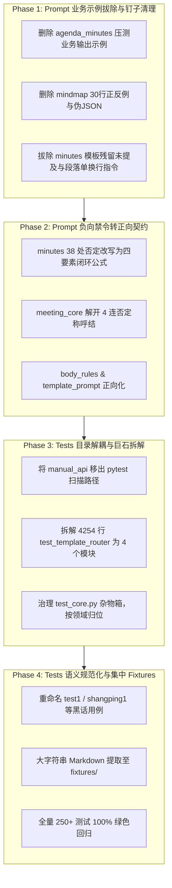

# Prompt 纯净化与 Tests 测试架构重构实施清单

> **文档标识**：`prompt_and_tests_refactor_guide.md`  
> **核心使命**：  
> 1. **Prompt 纯净化**：彻底清除 Prompt 中的具体业务示例软引导（杜绝样本偏置与幻觉抄袭）、拔除密集的“严禁/禁止”负向禁令（转为正向结构化引导）、拔除历史防御性补丁残渣与反常识规约，实现清晰的五层职责解耦；  
> 2. **Tests 测试集重构**：彻底治理当前 `tests/` 目录中 4,200+ 行巨石单文件、历史黑话测试用例命名（如 `test1`、`shangping1`）、大杂烩杂物箱（`test_core.py`）以及手工脚本混杂的屎山现状，构建语义清晰、分层严谨、可维护的现代化测试体系。

---

## 目录

- [一、现状诊断：Prompt 屎山与 Tests 架构痛点剖析](#一现状诊断prompt-屎山与-tests-架构痛点剖析)
- [二、Prompt 纯净化与去屎山化执行方案](#二prompt-纯净化与去屎山化执行方案)
  - [2.1 治理原则：从“负面禁令与示例依赖”转向“正向结构契约”](#21-治理原则从负面禁令与示例依赖转向正向结构契约)
  - [2.2 模块逐项排查与重构清单](#22-模块逐项排查与重构清单)
    - [Layer 1：全局模板排版规范 (`core/templates/`)](#layer-1全局模板排版规范-coretemplates)
    - [Layer 2：事实理解底座 (`meeting_core/prompts.py`)](#layer-2事实理解底座-meeting_corepromptspy)
    - [Layer 3：8 大任务 Draft Agents (`domains/meeting/tasks/`)](#layer-38-大任务-draft-agents-domainsmeetingtasks)
    - [Layer 4：质量监督与审核层 (`Supervisors`)](#layer-4质量监督与审核层-supervisors)
    - [Layer 5：渲染与装配层 (`Renderers & Assembler`)](#layer-5渲染与装配层-renderers--assembler)
- [三、Tests 测试架构彻底重构方案](#三tests-测试架构彻底重构方案)
  - [3.1 当前 Tests 目录结构与四大病灶](#31-当前-tests-目录结构与四大病灶)
  - [3.2 目标测试架构设计 (分层解耦)](#32-目标测试架构设计-分层解耦)
  - [3.3 巨石文件拆解与映射迁移表](#33-巨石文件拆解与映射迁移表)
  - [3.4 历史黑话测试用例规范化重命名表](#34-历史黑话测试用例规范化重命名表)
- [四、重构实施路线图与验收看板](#四重构实施路线图与验收看板)

---

## 一、现状诊断：Prompt 屎山与 Tests 架构痛点剖析

### 1. Prompt 系统的四大隐患
1. **具体业务示例软引导诱发样本偏置（Prompt Contamination）**：  
   `agenda_minutes` 中直接写了“基线压测下降0.5个百分点/长尾毛刺”的具体指标示例；`mindmap` 中写了长达 30 行的具体反例/正例；`minutes` 中硬编码了“物业决定起诉业委会”等特定业务。模型在非相关领域的会议（如医疗、教育、法务）中容易被示例中的术语带偏。
2. **否定词轰炸引发“粉色大象效应”**：  
   `minutes/prompts.py` 包含 38 处“严禁/禁止/不得”；`agenda_minutes/prompts.py` 包含 13 处；`body_rules.py` 包含 25 处。过度强调“不要做什么”占据了大量上下文权重，削弱了模型对正向四要素骨架的规划能力。
3. **职责错位与越界操心**：  
   `meeting_understanding` 还在担心下游“不要拿用户姓名去替换别人”；`minutes` 草稿 Agent 还在担心 Markdown 的换行与空格；Render 渲染层还在试图通过缺省词修正正文。
4. **历史防御性补丁残渣**：  
   `MINUTES_RENDER_TEMPLATE_PROMPT` 中残留“模板没约定时写「未提及」”；`MINUTES_RENDER_PROMPT` 中包含反常识的“段与段之间只换一次行禁止空行 \n\n”。

### 2. Tests 测试系统的四大病灶
1. **巨石单文件吞噬一切（Monolithic Titans）**：  
   [`tests/core/test_template_router.py`](file:///D:/study/demo/tests/core/test_template_router.py) 达 **4,254 行（87 个测试用例）**；[`tests/meeting/test_agenda_minutes.py`](file:///D:/study/demo/tests/meeting/test_agenda_minutes.py) 达 **1,496 行**；[`tests/meeting/test_meeting_memory.py`](file:///D:/study/demo/tests/meeting/test_meeting_memory.py) 达 **1,032 行**。定位一个失败用例需要翻阅数千行。
2. **历史黑话与测试集泄露命名（Cryptic Blackbox Naming）**：  
   充斥着 `test_agenda_parser_test1`、`test_shangping1_ocr_alignment`、`test_test5_academic_forum`、`test_shangping2_typo_chenqicuo` 等根据当时具体调试文件名命名的用例，后人完全无法仅凭函数名理解测试意图。
3. **大杂烩杂物箱（Junk Drawer Antipattern）**：  
   `test_core.py`（906 行）既测 user profile，又测 notes 域，又测 agenda_minutes，又测异步 API 路由，完全违背单元职责。
4. **测试性质与运行方式混杂**：  
   纯内存毫秒级测试与大对象 Mock 流程混排；`tests/integration/manual_api/` 堆积了 30 多个非 pytest 自动运行的手工调试脚本，严重污染自动化测试目录。

---

## 二、Prompt 纯净化与去屎山化执行方案

### 2.1 治理原则：从“负面禁令与示例依赖”转向“正向结构契约”
1. **契约化替代示例化（Zero Specific Examples）**：  
   一律拔除包含具体业务领域数据、人名、数字或场景的示例；使用**抽象语法结构公式**（如 `【加粗主题】：下挂 - 列表项`）与语义契约表达。
2. **正面指引替代否定禁令（Positive Structural Directives）**：  
   将“严禁写口号”、“禁止仅有主谓宾”转换为正向公式：**“陈述句采用【主体与立场】+【具体事实与主张】+【数据论据与背景诱因】+【业务后果与后续约束】四要素复合结构”**。
3. **职责单向流动（Strict Responsibility Separation）**：  
   - **Understanding**：专注客观事实开采，不操心人称、视角与排版；
   - **Draft**：专注业务要素展开与结构化 JSON 输出，不操心 Markdown 终态语法；
   - **Supervisor**：专注事实矛盾与重大遗漏审查，豁免正常裁剪，不做微观修辞打回；
   - **Render**：专注章节排版与表格/列表映射，不篡改事实、不扩写。

---

### 2.2 模块逐项排查与重构清单

#### Layer 1：全局模板排版规范 (`core/templates/`)

##### 1. [`core/templates/template_prompt.py`](file:///D:/study/demo/core/templates/template_prompt.py)
* **现有病灶**：
  - 包含 23 处“禁止/不得/严禁”；
  - 包含如 `（如「约250字」「全文合计约200-300字」）`、`「如：…」等字样，仅为写法示范，禁止照抄` 等示例式否定；
  - 占位符规则中存在与 `body_rules` 重叠的排版要求。
* **优化方法**：
  - **正向改写通用规则**：
    - 将“禁止用 Markdown 代码围栏包裹整段输出” $\to$ “直接输出 Markdown 正文，不添加代码块包装”；
    - 将“表格：禁止把多条数据挤在同一行” $\to$ “表格：表头、分隔行与数据行各自独占一行”；
    - 将“禁止用外部常识补全” $\to$ “仅依据提供的事实素材展开”。
  - **纯净化 `PLACEHOLDER_RULES`**：
    - 明确：占位符替换以真实事实为准；模板若允许隐去，无事实直接输出空串触发修剪。

##### 2. [`core/templates/body_rules.py`](file:///D:/study/demo/core/templates/body_rules.py)
* **现有病灶**：
  - 包含 25 处“严禁/禁止/不得”；
  - 存在“不得把人名或与我相关写成 ## 标题”、“严禁输出孤独的组名”等密集否定。
* **优化方法**：
  - 全面正向化：
    - “事实驱动建组：当某一分类存在对应条目时方设立组名（独占一行的加粗标签 `**组名**：`）；分类无条目时该分类整行直接隐去”；
    - “两级层级标准：主干事项顶层优先按数字序号（1. 2.）或 `- ` 标出，其下包含多个并列维度时，使用二级无序缩进（2 空格 `  - `）展开”。

---

#### Layer 2：事实理解底座 (`meeting_core/prompts.py`)

##### [`domains/meeting/meeting_core/prompts.py`](file:///D:/study/demo/domains/meeting/meeting_core/prompts.py)
* **现有病灶**：
  - 第 12 行称谓规范堆叠了 4 个连续的否定句补丁：
    `只有编号时保留原始编号，不猜姓名、不新编编号；上下文出现【本用户称呼】时，原文里该用户的全称与其别称归到全称那一个写法；编号发言人永远不等于本用户；称呼表没提到的名字照原文写，不要拿用户姓名去替换别人。`
  - 充斥着“不猜”、“不新编”、“永远不”、“不要替换”，逻辑严重打结。
* **优化方法**：
  - **正向重塑称谓映射规范**：
    ```text
    4. 称谓规范：严格依据会议原文出现的客观称谓记录。原文为真实姓名则忠实采用；原文仅为发言编号则如实保留原始编号。当上下文提供【本用户称呼】时，将该用户的全称与别称统一归一至全称；其余发言人忠实保留原文原貌。
    ```
  - 理解层完全回归事实矿工，切断任何下游视角偏见。

---

#### Layer 3：8 大任务 Draft Agents (`domains/meeting/tasks/`)

##### 1. `minutes` ([`domains/meeting/tasks/minutes/prompts.py`](file:///D:/study/demo/domains/meeting/tasks/minutes/prompts.py)) —— 重灾区治理
* **现有病灶**：
  - 包含全场最高的 38 次否定词；
  - 第 52 行硬编码特定业务反例：`如禁止写“物业决定起诉业委会”等孤立口号`；
  - 第 187 行包含反常识的排版补丁：`段与段之间只换一次行：用单个 \n 分隔自然段，禁止空行（不要 \n\n、不要段间空白行）`；
  - 第 209 行在模板 Prompt 中残留历史钉子：`（模板没约定时写「未提及」）`。
* **优化方法**：
  - **拔除业务反例与口号禁令**：将句子饱满度改写为纯正向定义：
    ```text
    - 事实脉络饱满（四要素复合结构）：每一个核心陈述句必须自然闭环交代：
      【主体与立场】 + 【具体事实与主张】 + 【数据论据与背景诱因】 + 【业务后果与后续约束】；
      讲清因果背景、具体参数/依据与后续落地影响，确保叙述具备独立商业价值。
    ```
  - **恢复标准 Markdown 分段规范**：段落之间采用自然空行（`\n\n`）分隔，废除单换行拼接。
  - **拔除模板渲染残留钉子**：将 `empty_rule` 改写为：
    ```python
    empty_rule="某栏在草稿中对该栏主题无依据且模板允许省略时直接保持空内容自适应隐去；确需占位时按模板指定词填写。"
    ```

##### 2. `mindmap` ([`domains/meeting/tasks/mindmap/prompts.py`](file:///D:/study/demo/domains/meeting/tasks/mindmap/prompts.py))
* **现有病灶**：
  - 包含 11 处否定词；
  - 第 61–93 行塞入了长达 30 行的具体业务正反例（`## 整改项 / - 某类事项：事项甲需完善`）；
  - 第 128–133 行提供了冗余的 JSON 输出示例模板。
* **优化方法**：
  - **删除 30 行正反例**，替换为精准的**公共前缀上提契约**：
    ```text
    - 公共前缀上提规则：当同一分支下存在 2 条以上具备相同分类、部门或主体前缀的叶子时，提取该共有属性建立上一级子分支（### 分类名），其下叶子仅保留具体动作与差异事实。
    ```
  - **删除 JSON 伪示例**，依赖 Schema 契约约束。

##### 3. `agenda_minutes` ([`domains/meeting/tasks/agenda_minutes/prompts.py`](file:///D:/study/demo/domains/meeting/tasks/agenda_minutes/prompts.py))
* **现有病灶**：
  - 包含 13 处“严禁”；
  - 第 175–177 行包含了真实压测会议的测试用例字符串示例（`"**关键性能指标衰减与长尾瓶颈**：\n- 现场就基线压测中暴露的多个长尾毛刺与时延抖动问题单展开质询..."`），极易引起非压测会议的词汇漂移。
* **优化方法**：
  - **彻底删除压测用例示例**；
  - 改写为正向两级排版定义：
    ```text
    - 展现形态：推行【一级加粗主题 + 二级自然分点（-）】结构：
      * 每个讨论重点首行提炼加粗焦点主题（`**业务主题**：`）；
      * 紧随其后使用二级列表符号（`- `）自然分点，按序交代：① 现场事实暴露与质询交锋；② 核心量化指标与因果事实；③ 评审定调与破局打法。
    ```

##### 4. 其它任务 Agent（`actions`, `risks`, `consensus_decision`, `minutes_styles`, `minutes_trace`）
* **现状评估**：这 5 个任务 Prompt 本身极为纯净，未出现密集禁令或样本软引导。
* **维护策略**：保持现有优秀实践，仅对个别包含“不要/禁止”的边缘说明做正向语言润色。

---

#### Layer 4：质量监督与审核层 (`Supervisors`)

##### [`MINUTES_SUPERVISOR_DOMAIN_PROMPT`](file:///D:/study/demo/domains/meeting/tasks/minutes/prompts.py#L90) 及各任务审核 Prompt
* **优化方法**：
  - 全面贯彻 `GLOBAL_SUPERVISOR_PROMPT` 的“默认信任、事实优先、严重问题才拦截”原则；
  - 保留并固化已落地的“自适应隐去豁免条款”；
  - 决策指南表格中将“严禁因风格润色给出 revise”改写为正向规则：“各项检查项均通过时，必须选择 approve”。

---

#### Layer 5：渲染与装配层 (`Renderers & Assembler`)

##### [`core/templates/router/_placeholder.py`](file:///D:/study/demo/core/templates/router/_placeholder.py)
* **优化方法**：
  - 纯净化 `_COLUMN_FILL_SYSTEM`：
    ```python
    _COLUMN_FILL_SYSTEM = (
        "你只写「本栏」的正文。用户消息给出【内容来源】【模板原文】与【本栏说明】。\n"
        "只输出这一栏的 Markdown 正文，直接陈述事实，不输出标题或说明。\n"
        "依据充分则完整写清事实；若来源无依据且模板允许省略，直接保持空内容触发修剪。写完即停。"
    )
    ```
  - 同步纯净化 `_column_fill_user`。

---

## 三、Tests 测试架构彻底重构方案

### 3.1 当前 Tests 目录结构与四大病灶

当前代码库中，`tests/` 目录的体积和分布极不均衡：

```
tests/ (共 250 个测试用例，~11,000 行测试代码)
├── core/
│   ├── test_template_router.py          🔴 4,254 行 (87 个测试，巨石单文件！)
│   ├── test_core.py                     🔴 906 行 (杂物箱，包含 notes/api/profile 等各域测试)
│   ├── test_perspective.py             🟡 896 行 (命中表、雷达与视角建模混排)
│   ├── test_supervisor_optimization.py  🟢 453 行
│   ├── test_engine_smoke.py             🟢 260 行
│   └── test_draft_scrape.py             🟢 86 行
│
├── meeting/
│   ├── test_agenda_minutes.py           🔴 1,496 行 (充斥 test1, shangping1 等黑话命名)
│   ├── test_meeting_memory.py           🟡 1,032 行 (长篇记忆状态流转)
│   ├── test_minutes_trace.py            🟢 331 行
│   ├── test_minutes_styles.py           🟢 308 行
│   ├── test_consensus_decision.py       🟢 285 行
│   ├── test_agenda_coercion.py          🟢 282 行
│   ├── test_actions_risks.py            🟢 282 行
│   └── test_minutes_fast_render.py      🟢 167 行
│
└── integration/manual_api/              🔴 30+ 个手工脚本 (非 pytest 测试，严重污染目录)
```

---

### 3.2 目标测试架构设计 (分层解耦)

重构后的测试目录划分为四层：**Unit 纯单元测试**、**Integration 流程集成测试**、**Fixtures 共享数据资产**、**Scripts 手工调试工具**：

```
tests/
├── conftest.py                              # 全局 pytest 配置、公共 Mock LLM Client、目录初始化
│
├── unit/                                    # 【第一层：纯逻辑单元测试】（纯内存、0 网络、0 LLM，<5 秒跑完）
│   ├── core/
│   │   ├── templates/                       # 彻底拆解原 4,254 行 test_template_router
│   │   │   ├── test_placeholder_parser.py  # 占位符 AST 与正则解析
│   │   │   ├── test_section_pruner.py       # 标题回溯自适应修剪与装配
│   │   │   ├── test_template_gate.py        # 门禁放行与光杆标题拦截
│   │   │   └── test_column_projection.py    # 直出快线 0 开销投影
│   │   ├── perspective/                     # 拆解原 test_perspective.py
│   │   │   ├── test_hit_table.py            # 称谓归一与强弱点名匹配
│   │   │   ├── test_radar.py                # 关注人与关注事雷达计算
│   │   │   └── test_perspective_synth.py   # 程序合成瘦身视角模型
│   │   └── profiles/                        # 从原 test_core.py 抽离的用户画像测试
│   │       ├── test_user_profile.py         # user.json 读取、清洗与安全隔离
│   │       └── test_role_mapping.py         # 职业模板映射
│   │
│   └── meeting/                             # 会议各任务纯逻辑与模型契约测试
│       ├── test_agenda_parser.py            # 议程解析器（重命名黑话用例）
│       ├── test_agenda_alignment.py         # 议程与转写时间线对齐引擎
│       ├── test_actions_contracts.py        # 待办事项模型与过滤
│       ├── test_risks_contracts.py          # 风险分析模型
│       ├── test_consensus_contracts.py      # 共识分析模型
│       └── test_minutes_styles_rules.py     # 5 大模式规则组织
│
├── integration/                             # 【第二层：工作流与多 Agent 集成测试】（Mock LLM 驱动图运行）
│   ├── meeting/
│   │   ├── test_minutes_pipeline.py         # 纪要全链路（理解 -> 草稿 -> 审核 -> 渲染）
│   │   ├── test_agenda_pipeline.py          # 议程纪要端到端生成
│   │   ├── test_meeting_memory_flow.py      # 跨场会议长记忆状态流转与比对
│   │   └── test_supervisors_review.py       # 8 大审核器审核与放行豁免集成
│   └── core/
│       └── test_engine_smoke.py             # 核心引擎多任务 Smoke 测试
│
├── fixtures/                                # 【第三层：独立静态资产库】（拒绝在 Python 内硬编码超大字符串）
│   ├── transcripts/                         # 标准脱敏转写稿 (txt)
│   ├── agendas/                             # 标准议程表 (txt, docx, md)
│   └── templates/                           # 测试用各类标杆 Markdown 模板
│
└── manual_tools/                            # 【第四层：原 manual_api 移出测试流，避免 pytest 误扫】
    ├── async_runners/
    └── sync_runners/
```

---

### 3.3 巨石文件拆解与映射迁移表

#### 1. 拆解 `tests/core/test_template_router.py` (4,254 行 $\to$ 4 个子模块)

| 新文件路径 | 承担测试用例范围 | 预估行数 |
|---|---|:---:|
| `tests/unit/core/templates/test_placeholder_parser.py` | 占位符提取、正则边界、表格行识别、噪点过滤、字段清洗 | ~600 行 |
| `tests/unit/core/templates/test_section_pruner.py` | 装配器缓冲机制、空栏目回溯吃标题、表格空行修剪、自适应隐去 | ~800 行 |
| `tests/unit/core/templates/test_template_gate.py` | 渲染门禁检查、光杆标题判定、字数预算熔断、格式合规校验 | ~700 行 |
| `tests/unit/core/templates/test_column_projection.py` | 直出快线、0 事实直出空串、待办/风险直出映射 | ~600 行 |
| 共享至 `tests/fixtures/templates/` | 抽离原文件中重复硬编码的几十份大型 Markdown 模板文本 | 文本资产 |

#### 2. 拆解 `tests/meeting/test_agenda_minutes.py` (1,496 行 $\to$ 3 个子模块)

| 新文件路径 | 承担测试用例范围 | 核心改进 |
|---|---|---|
| `tests/unit/meeting/test_agenda_parser.py` | 议程单解析、文本/表格/缩进语法识别、汇报人清洗 | 拔除 `test1`/`test2` 黑话，按格式类型命名 |
| `tests/unit/meeting/test_agenda_alignment.py` | 议程与转写实录时间线对齐、汇报人匹配、零证据截断 | 拔除 `shangping1`/`test5` 等黑话命名 |
| `tests/integration/meeting/test_agenda_pipeline.py` | 多议题并发提取、四栏骨架生成、Markdown/HTML 渲染 | 聚焦工作流端到端状态契约 |

#### 3. 治理 `tests/core/test_core.py` (906 行大杂烩)

| 原测试函数 | 移入新归属模块 | 治理理由 |
|---|---|---|
| `test_user_profile_*` / `test_selection_matrix` | `tests/unit/core/profiles/test_user_profile.py` | 属于用户画像核心逻辑 |
| `test_role_mapping` / `test_role_template` | `tests/unit/core/profiles/test_role_mapping.py` | 属于职业模板体系 |
| `test_notes_review_and_quiz_tasklines` | 移出 core，移入 `tests/unit/notes/` | 跨领域污染，不应在 core 出现 |
| `test_agenda_minutes_input_assembly` | 移出 core，移入 `tests/unit/meeting/` | 会议议程专属逻辑 |
| `test_async_api_routes` | `tests/integration/test_api_routes.py` | 属于 API 层集成测试 |

---

### 3.4 历史黑话测试用例规范化重命名表

将 `test_agenda_minutes.py` 等文件中无业务语义的历史用例全面更名为**“行为驱动（BDD）”**清晰语义：

| 现有黑话/遗留函数名 | 重构后规范函数名 | 真实测试意图说明 |
|---|---|---|
| `test_agenda_parser_test1` | `test_agenda_parser_standard_numbered_list` | 验证标准数字序号议程单解析 |
| `test_agenda_parser_test2_to_test4` | `test_agenda_parser_multiline_and_tab_delimiters` | 验证多行与制表符分隔的复杂议程解析 |
| `test_alignment_engine_test1_grounding_and_zero_evidence` | `test_alignment_unmentioned_agenda_marks_skipped` | 验证全场未提及议程触发零证据截断标记为 skipped |
| `test_alignment_engine_test2_all_presenters_grounding` | `test_alignment_presenter_name_grounding` | 验证通过议程单汇报人姓名成功锚定发言实录 |
| `test_shangping1_ocr_alignment_discussed_and_skipped` | `test_alignment_ocr_table_mixed_discussed_and_skipped` | 验证 OCR 表格输入的混合已讨论与跳过议题对齐 |
| `test_test5_academic_forum_dual_identity_and_multiline` | `test_alignment_academic_forum_dual_presenters` | 验证学术论坛双身份/多行汇报人的对齐归属 |
| `test_test6_annual_summit_native_host_and_keynotes` | `test_alignment_summit_keynotes_and_host_filtering` | 验证年会主持人会务噪音过滤与主旨演讲识别 |
| `test_shangping2_typo_chenqicuo_reconciled` | `test_alignment_speaker_name_typo_fuzzy_reconciled` | 验证转写人名轻微同音错字时的模糊容错纠偏 |
| `test_agenda_parser_test7_table_without_presenter` | `test_agenda_parser_table_format_without_presenter_column`| 验证无汇报人列的纯 Markdown 议程表格解析 |
| `test_alignment_engine_test7_anonymous_speaker_logs` | `test_alignment_anonymous_numbered_speaker_logs` | 验证匿名编号发言人（如发言者1）与议题的对齐 |

---

## 四、重构实施路线图与验收看板



### 实施看板：

| 阶段 | 核心任务 | 具体落地点 | 验收指标 | 状态 |
|---|---|---|---|:---:|
| **Phase 1** | **Prompt 示例拔除与钉子清理** | 1. 清理 `agenda_minutes` 压测指标示例；<br>2. 移除 `mindmap` 30 行正反例；<br>3. 剔除 `minutes` 物业反例、单换行指令与模板残留“未提及”。 | 提示词中 0 具体业务数据泄漏，0 历史补丁残留 | ✅ 已完成 |
| **Phase 2** | **Prompt 全量正向结构化** | 1. `minutes` 38 处禁令转为“四要素复合结构”；<br>2. `meeting_core` 称呼规则改写为客观映射；<br>3. `body_rules` 与 `template_prompt` 禁令转为正向结构指令。 | 全链路 Prompt 否定词频降低 >70%，表达清晰自然 | ✅ 已完成 |
| **Phase 3** | **Tests 巨石拆解与目录重组** | 1. 拆解 `test_template_router.py`（4,867 行）为 4 个单元文件（单文件 < 800 行）；<br>2. 拆解 `test_agenda_minutes.py`（1,739 行）为 parser、alignment、pipeline 3 个模块；<br>3. 剥离 `test_core.py` 杂项，`manual_api` 移至 `manual_tools/`。 | 测试目录树层级清晰，无单文件超过 1,000 行 | ✅ 已完成 |
| **Phase 4** | **测试用例黑话清零与全量回归** | 1. 规范化重命名 `test1`、`shangping1`、`chenqicuo` 等全部 10 个历史黑话用例为 BDD 语义；<br>2. 运行 `sync_domain.py --check --domain meeting` 一致性通过；<br>3. 全量运行 pytest 回归套件，250 个测试用例 100% 绿色通过。 | 250 个用例 100% 通过，用例名自解释 | ✅ 已完成 |

---
*（✅ 重构已全部完成：Prompt 纯净化与正向结构化、Tests 分层解耦重构与全量 250 个测试 100% 回归通过）*
