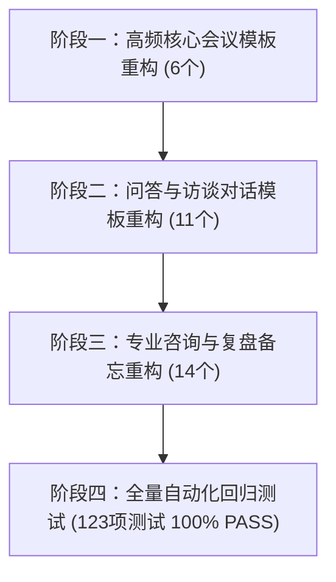

# template_v3 会议与全领域纪要 Markdown 层级与排版重构清单

> **文件说明**：本文档针对 `template_v3/` 目录下全部 31 个模板的 Markdown 呈现层级、阅读体验与交互规范进行全景梳理。明确定义六大排版支柱，重点剖析**维度 3（任务属性化）、维度 4（待办交互化）、维度 5（问答卡片化）、维度 6（金句规范化）**在各个模板中的覆盖范围与改前改后标准。
> **执行原则**：本文档为前瞻设计清单，**当前阶段仅作清单归档，不改动任何模板与工程代码**。

---

## 一、 六大排版重构支柱总览

| 序号 | 升级维度 | 语法形式（改前 $\rightarrow$ 改后） | 用户阅读与协作核心收益 | 模板覆盖范围 |
| :---: | :--- | :--- | :--- | :--- |
| **1** | **标题瘦身** | `# 团队例会` $\rightarrow$ `# [会议真实主题]` | 去除模板套皮塑料感，真实业务主题顶格，便于知识库全局检索与归档 | **全量 31 个模板** |
| **2** | **层级规范** | 全篇平铺 `#` $\rightarrow$ `#` 唯一，栏目 `##`，模块 `###` | 目录树（TOC）层次分明，大纲导航体验极佳，天然支持章节折叠 | **全量 31 个模板** |
| **3** | **任务属性化** | 单行挤满长句 $\rightarrow$ `**事项**（责任人｜时限｜状态）` | **1 秒扫读**责任人与时限，次要细节通过列表缩进自然展开 | **12 个核心执行类模板** |
| **4** | **待办交互化** | 待办项序号 `1. ` $\rightarrow$ 交互复选框 `- [ ] ` | 飞书/Notion/钉钉中可直接点击打勾，无缝打通执行闭环 | **15 个含待办/后续模板** |
| **5** | **问答卡片化** | 粗体换行 $\rightarrow$ `### Q:` + 引用块 `> A:` | 对话层次分明，问与答收拢成卡片，长篇问答与访谈绝不串行 | **11 个对话与访谈模板** |
| **6** | **金句规范化** | 括号/断行 $\rightarrow$ `> “金句”` + `> —— **发言人** ｜ 背景` | 杂志刊物级排版质感，金句脱颖而出，突出权威发言与深度思考 | **9 个含原话表态模板** |

---

## 二、 全部 31 个模板与六大维度映射矩阵

> 标记说明：
> - `●`：该模板**深度适用**该项改进；
> - `○`：该模板部分涉及或作为可选规范；
> - `-`：该模板无需该项（业务场景不含对应要素）。

| 序号 | 模板文件 (`template_v3/*.md`) | 中文分类 | 1. 标题瘦身 | 2. 层级规范 | 3. 任务属性化 | 4. 待办交互化 | 5. 问答卡片化 | 6. 金句规范化 |
| :---: | :--- | :--- | :---: | :---: | :---: | :---: | :---: | :---: |
| 1 | `team_meeting.md` | 团队例会 | ● | ● | ● | ● | - | ○ |
| 2 | `project_progress.md` | 项目进度会 | ● | ● | ● | ● | - | - |
| 3 | `general_minutes.md` | 通用纪要 | ● | ● | ● | ● | - | ● |
| 4 | `personal_minutes.md` | 个人视角纪要 | ● | ● | ● | ● | - | - |
| 5 | `retrospective_session.md` | 总结复盘会 | ● | ● | ● | ● | - | - |
| 6 | `decision_review.md` | 决策评审会 | ● | ● | - | ● | - | ● |
| 7 | `exchange_forum.md` | 对齐沟通会 | ● | ● | ● | ● | - | ● |
| 8 | `group_seminar.md` | 分组研讨会 | ● | ● | - | ● | - | ○ |
| 9 | `workshop_session.md` | 工作坊研讨 | ● | ● | - | ● | - | ○ |
| 10 | `personal_memo.md` | 个人备忘录 | ● | ● | ● | ● | - | - |
| 11 | `interview_debrief.md` | 面试复盘 | ● | ● | ● | ● | ○ | ● |
| 12 | `admission_briefing.md` | 宣讲说明会 | ● | ● | ● | ● | ● | - |
| 13 | `class_transcript.md` | 课堂教学实录 | ● | ● | ● | ● | ● | - |
| 14 | `home_school_liaison.md` | 家校沟通互通 | ● | ● | ● | ● | - | ● |
| 15 | `legal_advisory.md` | 法律咨询 | ● | ● | ● | ● | - | - |
| 16 | `clinical_advisory.md` | 就医咨询 | ● | ● | - | ○ | - | - |
| 17 | `contract_vetting.md` | 合同审核 | ● | ● | - | ○ | - | - |
| 18 | `media_qa_session.md` | 媒体问答会 | ● | ● | - | - | ● | - |
| 19 | `media_briefing.md` | 新闻发布会 | ● | ● | - | - | ● | ○ |
| 20 | `interview_transcript.md` | 深度访谈 | ● | ● | - | - | ● | ● |
| 21 | `research_dialogue.md` | 调研对谈 | ● | ● | - | - | ● | ● |
| 22 | `conversation_transcript.md` | 对话实录 | ● | ● | - | ○ | ● | ● |
| 23 | `court_transcript.md` | 庭审笔录 | ● | ● | - | - | ● | - |
| 24 | `debate_forum.md` | 辩论交锋 | ● | ● | - | - | ● | - |
| 25 | `special_lecture.md` | 专题讲座 | ● | ● | - | - | ● | ● |
| 26 | `hiring_report.md` | 招聘面试纪要 | ● | ● | - | - | ● | - |
| 27 | `government_bulletin.md` | 政务公报 | ● | ● | - | - | - | ● |
| 28 | `knowledge_memo.md` | 知识备忘 | ● | ● | - | - | - | - |
| 29 | `product_launch.md` | 产品发布 | ● | ● | - | - | - | - |
| 30 | `psychological_session.md` | 心理咨询 | ● | ● | - | - | ○ | - |
| 31 | `site_visit_tour.md` | 参观考察 | ● | ● | - | - | - | - |

---

## 三、 核心维度 3：任务属性化（Task Attribute Formatting）深度分析

### 1. 核心理念与语法标准
将过去挤在单行里的长句（如“任务名：进展；下一步；时间节点”）解耦为**两级微结构**：
- **主干行（Top Level）**：`1. **任务/事项名**（责任人 ｜ 交付时限 ｜ 状态）`
- **展开行（Indented Detail）**：
  ```markdown
  1. **任务名称**（责任人 ｜ 时限 ｜ 状态）
     - **当前进展**：交代已完成的事实、指标与现状（不写半句、带数字）。
     - **下一步计划**：交代后续推进动作与交付物。
  ```

### 2. 覆盖的 12 个模板与具体栏位

| 序号 | 模板文件 | 涉及栏目 | 改前语法引导 | 改后语法引导 |
| :---: | :--- | :--- | :--- | :--- |
| 1 | `team_meeting.md` | `[工作进展]` | `1. **任务名**：进展；下一步…；时间节点…` | `1. **任务名**（责任人 ｜ 时限 ｜ 状态）\n   - 进展：...\n   - 下一步：...` |
| 2 | `project_progress.md` | `[后续计划]` | `1. **事项**：做什么 + 责任方 + 时间节点` | `1. **事项**（责任方 ｜ 时间节点 ｜ 交付物）\n   - 执行要点与依赖前提` |
| 3 | `general_minutes.md` | `[要点梳理]` $\rightarrow$ `行动项与分工` | `1. 做什么、何时前做完、责任人`（单行） | `1. **事项**（责任人 ｜ 时限 ｜ 状态）\n   - 具体要求与口径` |
| 4 | `personal_minutes.md` | `[重点关注与业务进展]`、`[行动项与协同依赖]` | 单行成句叙述 | `1. **事项**（时限 ｜ 交付物 ｜ 验收标准）\n   - 细节说明` |
| 5 | `retrospective_session.md` | `[改进计划]` | 单行：针对什么问题，再写打算怎么做 | `1. **【改进项】事项**（责任人 ｜ 时限）\n   - **针对痛点**：...\n   - **落地动作**：...` |
| 6 | `personal_memo.md` | `[待办事项与提醒]` | 单行列出任务与截止日期 | `1. **待办事项**（截止时限 ｜ 优先级）\n   - 核心提醒与要点` |
| 7 | `admission_briefing.md` | `[待办/行动项]` | 单行按序号列出申请事项与时间 | `1. **申请事项**（截止日期 ｜ 提交要求 ｜ 负责部门）` |
| 8 | `class_transcript.md` | `[课后任务与学习建议]` | 单行序号列出课后作业与时限 | `1. **学习任务**（提交时限 ｜ 成果形式 ｜ 评分标准）` |
| 9 | `home_school_liaison.md` | `[共识与配合事项]` | 单行序号列出配合事项 | `1. **配合事项**（完成节点 ｜ 配合主体 ｜ 交付方式）` |
| 10 | `legal_advisory.md` | `[行动建议]` | 单行序号列出维权步骤与建议 | `1. **维权动作**（建议时限 ｜ 执行主体 ｜ 取证要点）` |
| 11 | `interview_debrief.md` | `[改进计划]` | 单行序号列出改进举措 | `1. **专项突破**（目标时限 ｜ 提升动作 ｜ 预期成果）` |
| 12 | `exchange_forum.md` | `[待协调事项与后续]` | 单行序号列出协调事项 | `1. **协调事项**（主导方 ｜ 协同方 ｜ 期望完成节点）` |

---

## 四、 核心维度 4：待办交互化（Interactive Checkboxes `- [ ]`）深度分析

### 1. 核心理念与语法标准
- **区分过去与未来**：
  - “客观进展、既定决策、历史成果”已发生，沿用严肃的有序列表 `1. ` `2. `；
  - **“行动待办、后续计划、改进举措、作业任务”是待执行事项，全面升级为 Markdown 复选框 `- [ ] `**。
- **协同平台原生支持**：直接打通飞书、Notion、钉钉、Obsidian、GitHub，复制即成交互任务看板，用户可直接点击打勾（变成 `- [x]`）实现闭环管理。

### 2. 覆盖的 15 个模板与具体栏位

| 序号 | 模板文件 | 交互复选框生效栏位 | 典型呈现效果 |
| :---: | :--- | :--- | :--- |
| 1 | `team_meeting.md` | `## [决定与待办]` | `- [ ] **网关连接池调优**（李四 ｜ 周三 18:00 前 ｜ 进行中）` |
| 2 | `project_progress.md` | `## [后续计划]` | `- [ ] **第三方专线打通**（运维组 ｜ 周二 14:00 前 ｜ 交付物：联调报告）` |
| 3 | `personal_minutes.md` | `### 与我相关行动项` | `- [ ] **自动化评测管线基线交付**（09-28 前 ｜ 交付物：评测报告）` |
| 4 | `general_minutes.md` | `## 行动项与分工` | `- [ ] **集群生产环境扩容与灰度**（张三 ｜ 周五前 ｜ 未开始）` |
| 5 | `retrospective_session.md` | `## [改进计划]` | `- [ ] **建立本地消息表对账稽核机制**（李四 ｜ 10-15 前）` |
| 6 | `personal_memo.md` | `## [待办事项与提醒]` | `- [ ] **提交 Q3 财务报销发票**（09-30 17:00 前 ｜ 【重要】）` |
| 7 | `admission_briefing.md` | `## [待办/行动项]` | `- [ ] **登录系统上传外语成绩证明**（10-15 前 ｜ 招生办）` |
| 8 | `class_transcript.md` | `## [课后任务与学习建议]` | `- [ ] **完成课后第三章习题并上传学习平台**（周日 24:00 前）` |
| 9 | `home_school_liaison.md` | `## [共识与配合事项]` | `- [ ] **签署并交回社会实践家长安全承诺书**（周五前 ｜ 家长配合）` |
| 10 | `legal_advisory.md` | `## [行动建议]` | `- [ ] **前往公证处办理侵权网页时间戳公证**（收到函告 3 日内）` |
| 11 | `interview_debrief.md` | `## [改进计划]` | `- [ ] **刷通分布式锁与幂等设计专题高频题**（周日前完成第一轮）` |
| 12 | `decision_review.md` | `## [遗留问题]` | `- [ ] **评估跨库联合查询对报表系统的性能冲击**（BI 团队 ｜ 下周二前）` |
| 13 | `exchange_forum.md` | `## [待协调事项与后续]` | `- [ ] **双方技术负责人签署接口协议变更备忘**（周三前）` |
| 14 | `group_seminar.md` | `## [待探讨问题与后续]` | `- [ ] **整理多模态长文本评测基准调研报告**（第二周例会汇报）` |
| 15 | `workshop_session.md` | `## [未决分歧与后续探索]` | `- [ ] **输出无感支付安全风控验证沙盒方案**（下阶段专题研讨）` |

---

## 五、 核心维度 5：问答卡片化（Q&A Dialogue Cards）深度分析

### 1. 核心理念与语法标准
彻底弃用“单行纯文本连续加粗”的旧写法，升级为**“独立小标题 + 提问方标注 + 引用块包裹回答”**的标准卡片模式：
```markdown
### Q1. 架构重构的全量上线时间与核心考核指标？
- **提问方**：人民日报·张宇
> **A. 陈立（技术总监）**：我们计划在周五前全量上线。核心指标是 P99 延迟控制在 100ms 以内，当前正针对连接池做最后阶段的极限压测调优。
```

### 2. 覆盖的 11 个对话与访谈类模板

| 序号 | 模板文件 | 涉及问答的栏目 | 提问方规范 | 回应方规范 |
| :---: | :--- | :--- | :--- | :--- |
| 1 | `media_qa_session.md` | `[核心提问与回应]` | `### Q1. 问题概括`\n`- **记者（媒体名 姓名）**：...` | `> **A. 发言人（姓名）**：完整回应要点...` |
| 2 | `special_lecture.md` | `[Q&A 环节]` | `### Q1. 听众提问主题`\n`- **提问者**：...` | `> **A. 主讲人（姓名）**：核心论证与观点...` |
| 3 | `admission_briefing.md` | `[Q&A 环节]` | `### Q1. 招生报考政策咨询`\n`- **家长/考生**：...` | `> **A. 招生组老师**：政策口径与解答...` |
| 4 | `class_transcript.md` | `[课堂互动与答疑]` | `### Q1. 难点知识疑问`\n`- **学生**：...` | `> **A. 主讲老师**：解析与思维引导...` |
| 5 | `media_briefing.md` | `[Q&A环节]` | `### Q1. 发布会现场追问`\n`- **媒体记者**：...` | `> **A. 官方发言人**：官方表态与数据...` |
| 6 | `interview_transcript.md` | `[访谈详细记录]` | `### Q1. 访谈主题`\n`- **访谈员**：...` | `> **A. 受访嘉宾**：经历叙述与洞察...` |
| 7 | `research_dialogue.md` | `[访谈概况/核心反馈]` | `### Q1. 用户使用痛点调研`\n`- **调研员**：...` | `> **A. 目标用户**：真实体验吐槽与反馈...` |
| 8 | `conversation_transcript.md` | `[交流内容]` | 轮次切分：`### 轮次 1：讨论议题` | 双方发言采用引用卡片区分 |
| 9 | `hiring_report.md` | `[面试问答纪要]` | `### Q1. 专业技能考核`\n`- **面试官**：...` | `> **A. 候选人**：解题思路与项目陈述...` |
| 10 | `court_transcript.md` | `[举证与法庭调查]` | `### 调查项：焦点事实核查`\n`- **审判长/公诉人**：...` | `> **被告/当事人陈述**：答辩与证据说明...` |
| 11 | `debate_forum.md` | `[环节交锋]` | `### 质询回合：论题交锋`\n`- **正方/反方辩手**：...` | `> **对方质辩回应**：辩驳与立论防守...` |

---

## 六、 核心维度 6：金句规范化（Golden Quotes & Attributions）深度分析

### 1. 核心理念与语法标准
采用中文严肃出版物与高端商业杂志的**“标准原话引述 + 破折号归属行”**排版语法：
```markdown
> “金句或关键原话内容（逐字保真，不篡改语气）”
> 
> —— **发言人姓名（职务/身份）** ｜ 针对什么话题/场合的定调表态
```

### 2. 覆盖的 9 个金句与关键原话模板

| 序号 | 模板文件 | 涉及原话引述的栏目 | 价值与呈现重点 |
| :---: | :--- | :--- | :--- |
| 1 | `special_lecture.md` | `## [金句总结]` | 提炼主讲人全场最具洞见的 3–8 句金句，带背景场景归属 |
| 2 | `interview_transcript.md` | `## [关键引语与金句]` | 提取受访者原话，保留情感色彩与时代见解 |
| 3 | `conversation_transcript.md` | `## [关键原话]` | 提取对话中具有转折性、决定性或鲜明立场的原句 |
| 4 | `decision_review.md` | `## [方案陈述]` | 突出记录评审现场出现的尖锐质疑、权威定调或保留意见原话 |
| 5 | `general_minutes.md` | `## [要点梳理]` | 对高层领导或关键当事人的最终拍板原话进行 `> ` 引用高亮 |
| 6 | `research_dialogue.md` | `## [关键洞察与建议]` | 保留最具代表性的“用户原声（User Voice）”，还原真实诉求 |
| 7 | `government_bulletin.md` | `## [核心政策]` | 权威讲话原文引用，体现政策庄重性与法规口径准确性 |
| 8 | `home_school_liaison.md` | `## [家长反馈]` | 忠实记录家长的关键期望、担忧或真实困惑原话 |
| 9 | `interview_debrief.md` | `## [面试官反馈]` | 摘录面试官针对优缺点的核心原话评语，便于复盘对照 |

---

## 七、 实施推进步骤与后续路线图（待后续指令执行）

根据当前系统架构与自动化回归测试要求，后续若启动改造，建议按以下四阶段平稳推进：



1. **第一阶段：高频核心会议模板（6 个）**
   - 目标：优先升级 `team_meeting`、`project_progress`、`general_minutes`、`personal_minutes`、`retrospective_session`、`decision_review`；
   - 落地维度 1、2、3、4，让最常用的日常会议纪要立即享受到“标题瘦身、层级规范、任务属性化、待办复选框打勾”的红利。
2. **第二阶段：问答与访谈对话模板（11 个）**
   - 目标：升级 `media_qa_session`、`special_lecture`、`interview_transcript`、`research_dialogue` 等；
   - 落地维度 5（问答卡片化）与维度 6（金句归属规范化），彻底告别长篇对话黑体字糊脸。
3. **第三阶段：专业咨询、复盘与备忘模板（14 个）**
   - 目标：升级医疗咨询、合同审核、政务公报、家校沟通、个人备忘等；
   - 全面落地对应维度的微结构调整。
4. **第四阶段：单测契约与全工程回归验证**
   - 验证 `tests/test_template_router.py` 中的槽位解析（`SCALAR_BASELINE_BY_DIR`）与四态规则；
   - 确保 `pytest tests/` 保持 123 项测试 100% 全部通过。

---

*清单编制完成时间：2026-09-22 ｜ 状态：归档待阅，严守不改动代码纪律。*
