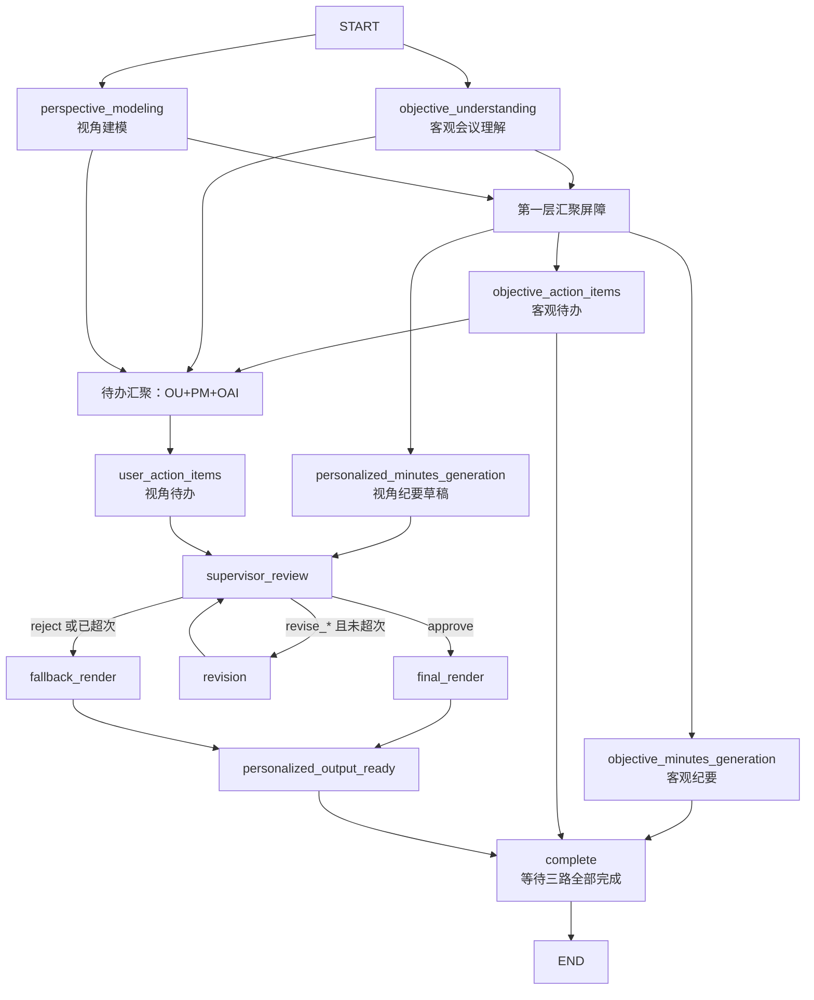

# 会议纪要多 Agent 系统 — 完整项目解释文档

> 文档版本：与代码仓库当前实现同步  
> 适用对象：新接手开发者、二次开发者、产品/业务同事（理解系统能力边界）

---

## 目录

1. [项目是什么](#1-项目是什么)
2. [核心设计思想](#2-核心设计思想)
3. [技术栈与依赖](#3-技术栈与依赖)
4. [目录结构](#4-目录结构)
5. [端到端运行流程](#5-端到端运行流程)
6. [LangGraph 编排详解](#6-langgraph-编排详解)
7. [双模式：个人视角 vs 客观视角](#7-双模式个人视角-vs-客观视角)
8. [各 Agent 职责与输入输出](#8-各-agent-职责与输入输出)
9. [数据模型（models）](#9-数据模型models)
10. [共享状态（MeetingState）](#10-共享状态meetingstate)
11. [LLM 客户端与配置](#11-llm-客户端与配置)
12. [严格校验与 Schema 修复](#12-严格校验与-schema-修复)
13. [质量审核与返工机制](#13-质量审核与返工机制)
14. [客观纪要模板机制](#14-客观纪要模板机制)
15. [命令行入口（app.py）](#15-命令行入口apppy)
16. [结果展示（presenter）](#16-结果展示presenter)
17. [示例数据说明](#17-示例数据说明)
18. [测试说明](#18-测试说明)
19. [安装与运行](#19-安装与运行)
20. [设计约束与常见误区](#20-设计约束与常见误区)
21. [扩展与二次开发指南](#21-扩展与二次开发指南)

---

## 1. 项目是什么

本项目是一个基于 **LangGraph** 编排的 **多 Agent 会议纪要生成系统**。

**输入：**

| 输入项 | 格式 | 说明 |
|--------|------|------|
| 会议文本 | `.txt` | 会议记录原文（对话、结论等） |
| 用户画像 | `.json` | 指定“从谁的视角看这场会”，或切换为客观全员视角 |
| 客观纪要模板（可选） | `.md` / 文本 | 控制客观纪要的章节结构（表格、标题等） |

**输出（一次运行同时得到）：**

| 输出项 | 含义 |
|--------|------|
| **客观会议纪要** | 面向所有参会人的中立 Markdown 纪要 |
| **客观会议待办** | 各方负责人 + 未分配事项的全量待办 |
| **视角会议纪要** | 个人模式：与当前用户强相关；客观模式：全员口径连贯纪要 |
| **视角待办** | 个人模式：仅本人明确负责/承诺的事项；客观模式：全量客观待办 |

系统强调 **“事实优先、证据驱动、不编造”**：负责人、截止时间等只有在会议原文中有依据时才可写入，禁止仅凭角色/部门/惯例推断。

---

## 2. 核心设计思想

### 2.1 三层分离

```
事实理解层  →  内容生成层  →  质量审核/渲染层
```

1. **事实理解层**  
   - `ObjectiveUnderstandingAgent`：抽出与身份无关的客观事实  
   - `PerspectiveModelingAgent`：把静态用户画像变成“本次会议中的关注视角”

2. **内容生成层**（客观链路与视角链路并行）  
   - 客观：客观纪要 + 客观待办（**不进 Supervisor**）  
   - 视角：视角纪要草稿 + 视角待办（**进 Supervisor**）

3. **质量审核/渲染层**  
   - `SupervisorAgent` 决定放行 / 定向返工 / 拒绝  
   - `FinalRenderer` 把已批准草稿整理成可读终稿  
   - 失败时走降级渲染，并打上“生成可能有误”风险提示

### 2.2 为什么要拆这么多 Agent？

| 问题 | 本架构的应对 |
|------|----------------|
| 模型容易把“建议”写成“决议” | 客观理解层强制区分决策 / 讨论 / 未决 / 风险 |
| 模型容易按角色猜负责人 | 多处 Prompt + 校验要求 owner 必须有原文证据 |
| 客观纪要被个性化改写污染 | 客观链路独立，不经过 Supervisor 返工 |
| 个性化输出质量不稳定 | 仅对视角链路做审核，最多返工 1 次，失败则降级 |
| JSON 结构偶发出错 | 重试 + SchemaRepairAgent 只修结构不改事实 |

### 2.3 命名约定

Agent **文件名、类名、图节点名、State 字段名** 按职责统一命名，避免历史字段混用。旧字段如 `meeting_understanding`、`minutes_draft`、`extracted_action_items` 已移除。

---

## 3. 技术栈与依赖

| 组件 | 用途 |
|------|------|
| Python ≥ 3.10 | 运行时 |
| **LangGraph** | 多节点状态机编排（并行边、汇聚屏障、条件路由） |
| 标准库 `urllib` | 调用 OpenAI 兼容 Chat Completions API |
| `dataclasses` | 轻量数据模型（非 Pydantic） |
| 自定义 JSON 严格校验 | `validation.py` |

**外部依赖极少**：`requirements.txt` / `pyproject.toml` 中核心业务依赖主要是 `langgraph`。LLM 调用不依赖官方 OpenAI SDK，而是自研 `LLMClient`，便于对接 DeepSeek、Kimi（Moonshot）、本地 vLLM 等。

---

## 4. 目录结构

```text
meeting_agent/
├── app.py                      # CLI 入口：读文件 → 跑系统 → 打印结果
├── ARCHITECTURE.md             # 架构速览（偏设计决策）
├── README.md                   # 安装与快速上手
├── 项目解释文档.md              # 本文档（全量解释）
├── pyproject.toml              # 包元数据与构建
├── requirements.txt            # pip 依赖
├── .env.example                # 环境变量模板
├── .gitignore
│
├── summary/                    # 默认会议文本目录
│   └── meeting.txt
├── profile/                    # 默认用户画像目录
│   ├── user_profile.json       # 个人视角示例（李明）
│   └── objective_profile.json  # 客观全员视角示例
├── template/                   # 客观纪要模板示例
│   └── project_progress.md
│
├── src/meeting_agent/          # 核心包
│   ├── __init__.py
│   ├── orchestrator.py         # LangGraph 编排 + MeetingAgentSystem
│   ├── state.py                # MeetingState 定义
│   ├── models.py               # 全部数据结构 + 客观视角判定
│   ├── validation.py           # 严格 JSON/字段契约校验
│   ├── client.py               # LLMClient（结构化输出）
│   ├── config.py               # 厂商预设与 .env 解析
│   ├── presenter.py            # 终端进度与结果排版
│   └── agents/                 # 各独立 Agent
│       ├── __init__.py
│       ├── objective_understanding_agent.py
│       ├── perspective_modeling_agent.py
│       ├── objective_minutes_generation_agent.py
│       ├── objective_action_items_agent.py
│       ├── personalized_minutes_generation_agent.py
│       ├── user_action_items_agent.py
│       ├── supervisor_agent.py
│       ├── final_renderer.py
│       └── schema_repair_agent.py   # 非图节点，仅校验失败时调用
│
└── tests/
    ├── test_objective_perspective.py
    └── test_objective_template.py
```

> 说明：README 中的 `examples/` 为文档示意路径；当前仓库默认样例位于 `summary/`、`profile/`、`template/`。

---

## 5. 端到端运行流程

```text
用户执行 python app.py
        │
        ▼
┌───────────────────┐
│ load_env(.env)    │  加载 API Key / 模型配置
└─────────┬─────────┘
          ▼
┌───────────────────┐
│ 读取会议 .txt     │
│ 读取画像 .json    │
│ 可选读取模板      │
└─────────┬─────────┘
          ▼
┌───────────────────┐
│ MeetingAgentSystem│
│   .run(...)       │
└─────────┬─────────┘
          │
          │  is_objective_perspective(user)
          │  构造 MeetingState 初始值
          ▼
┌───────────────────┐
│ LangGraph 图执行  │  ainvoke(initial_state)
└─────────┬─────────┘
          ▼
┌───────────────────┐
│ _merge_final_report│  合并客观链路 + 视角链路
└─────────┬─────────┘
          ▼
┌───────────────────┐
│ print_result()    │  终端分区展示
└───────────────────┘
```

### 5.1 程序入口调用链

1. `app.main()` 解析 CLI 参数  
2. `app.run()` 异步执行：加载配置与输入 → `MeetingAgentSystem(...).run(...)`  
3. `MeetingAgentSystem.run()`  
   - 校验 transcript 非空  
   - 判定 `objective_perspective`  
   - `graph.ainvoke(initial_state)`  
   - `_merge_final_report(state)` 组装 `FinalReport`  
4. `presenter.print_result(result)` 打印四块内容（客观纪要/客观待办/视角纪要/视角待办）

---

## 6. LangGraph 编排详解

编排代码集中在 `src/meeting_agent/orchestrator.py` 的 `MeetingAgentSystem._build_graph()`。

### 6.1 拓扑图



### 6.2 汇聚屏障（Barrier）含义

LangGraph 使用 **前置节点列表** 表示“必须全部完成后才启动下游”：

| 下游节点 | 必须等待 |
|----------|----------|
| 客观纪要 / 客观待办 / 视角纪要 | `objective_understanding` + `perspective_modeling` |
| 视角待办 | 上述两者 **+** `objective_action_items`（便于客观模式对齐全量任务） |
| Supervisor | 视角纪要 + 视角待办 |
| `complete`（结束） | 客观纪要 + 客观待办 + 视角输出链路（批准或降级任一路径） |

### 6.3 并行与串行关系

- **可并行**：第一层两个理解 Agent；第二层客观纪要 / 客观待办 / 视角纪要（在依赖满足后）  
- **有依赖的串行**：视角待办依赖客观待办完成；Supervisor 依赖两条视角草稿；返工后再次进入 Supervisor  
- **客观链路与视角审核链路独立**：客观结果不会因为 Supervisor 返工而被重算

### 6.4 图节点一览

| 节点名 | 对应方法 | 写回 State 字段 |
|--------|----------|-----------------|
| `objective_understanding` | `_objective_understanding_node` | `objective_understanding` |
| `perspective_modeling` | `_perspective_modeling_node` | `perspective_profile` |
| `objective_minutes_generation` | `_objective_minutes_generation_node` | `objective_minutes` |
| `objective_action_items` | `_objective_action_items_node` | `objective_action_items` |
| `personalized_minutes_generation` | `_personalized_minutes_generation_node` | `personalized_minutes` |
| `user_action_items` | `_user_action_items_node` | `user_action_items` |
| `supervisor_review` | `_supervisor_review_node` | `supervisor_review`、两类 feedback |
| `revision` | `_revision_node` | `revision_count` + 对应草稿更新 |
| `final_render` | `_final_render_node` | `final_report`、`quality_degraded=False` |
| `fallback_render` | `_fallback_render_node` | `final_report`、`quality_degraded=True` |
| `personalized_output_ready` | 空节点 | 汇聚批准/降级两条路径 |
| `complete` | 空节点 | 等待客观+视角全部就绪 |

---

## 7. 双模式：个人视角 vs 客观视角

判定函数：`models.is_objective_perspective(user)`。

### 7.1 判定规则（按优先级）

1. `perspective == "objective"` → **客观模式**  
2. `perspective` 为 `"personal"` / `"user"` → **个人模式**  
3. 否则：若 `name` 非空 → **个人模式**  
4. 若无姓名，且 role / context / responsibilities / interests 文本中出现 **「客观」** → **客观模式**

### 7.2 两种模式行为对比

| 维度 | 个人模式（默认） | 客观模式 |
|------|------------------|----------|
| 典型画像 | `profile/user_profile.json`（李明） | `profile/objective_profile.json` |
| `perspective_mode` | `personal` | `objective` |
| 视角纪要侧重 | 用户职责相关 + 影响该用户的全局决策/风险 | 全员公平覆盖，中立表述 |
| 视角待办 | 仅本人明确负责/承诺的任务 | 各方已分配 + 未分配全量 |
| Supervisor 审核重点 | 本人证据、不误伤他人任务 | 不绑定个人、不漏多方任务 |
| FinalRenderer | 连贯个人纪要 + 本人 action_items | 连贯全员纪要 + 全量 action_items |
| 最终 `action_items` 合并策略 | 以渲染结果为准 | 渲染为空则用客观待办；偏少则按 task+owner+deadline 去重补齐 |
| 终端标题 | 「用户视角会议纪要」「本人待办事项」 | 「客观视角纪要」「客观视角待办（最终）」 |

### 7.3 客观模式示例画像要点

```json
{
  "name": null,
  "perspective": "objective",
  "role": "客观会议记录与纪要整理",
  "context": "不绑定任何真实个人视角..."
}
```

运行时若判定为客观模式且画像未写 `perspective`，系统会自动补写 `user.perspective = "objective"`。

---

## 8. 各 Agent 职责与输入输出

每个 Agent 都是 **独立可替换类**；编排关系只存在于 `orchestrator.py`。调用 LLM 统一走 `LLMClient.structured(system, user, model, contract)`。

### 8.1 ObjectiveUnderstandingAgent（客观会议理解）

| 项 | 说明 |
|----|------|
| 文件 | `agents/objective_understanding_agent.py` |
| 职责 | 建立全系统事实底座；**不含任何用户视角** |
| 输入 | 会议原文 |
| 输出 | `ObjectiveUnderstanding` |

**提取重点：**

- 会议目的  
- 议题（讨论、结论、参与方）  
- 已确认决策 / 未决问题 / 风险  
- `assignments`：原文明示的分工与承诺（task / owner / deadline / evidence）

**硬规则：** 不按职位推断责任；无原文依据不输出。

---

### 8.2 PerspectiveModelingAgent（视角建模）

| 项 | 说明 |
|----|------|
| 文件 | `agents/perspective_modeling_agent.py` |
| 职责 | 静态画像 → 本次会议中的关注模型 |
| 输入 | 会议原文 + 用户画像 JSON |
| 输出 | `PerspectiveProfile`（含 `perspective_mode`） |

- **objective**：中立记录员角色，目标是完整还原与多方待办  
- **personal**：姓名/角色/职责视为事实，只谨慎补充缺失且有原文支持的信息  

---

### 8.3 ObjectiveMinutesGenerationAgent（客观纪要生成）

| 项 | 说明 |
|----|------|
| 文件 | `agents/objective_minutes_generation_agent.py` |
| 职责 | 面向全体的 Markdown 客观纪要 |
| 输入 | 客观理解上下文 + 可选输出模板 |
| 输出 | `ObjectiveMinutes`（headline + content） |
| 是否进 Supervisor | **否** |

- 未传模板时使用内置章节：会议概况 / 关键决策 / 分工与待办 / 风险 / 未决问题  
- 模板只控结构，不能覆盖“不补充事实、不引入用户视角”等规则  

---

### 8.4 ObjectiveActionItemsAgent（客观待办提取）

| 项 | 说明 |
|----|------|
| 文件 | `agents/objective_action_items_agent.py` |
| 职责 | 全体可执行待办（覆盖各方） |
| 输入 | 会议原文 + 客观理解 |
| 输出 | `ObjectiveActionItems` |
| 是否进 Supervisor | **否** |

分类：

- `assigned_actions`：有明示负责人（owner 非 null）  
- `unassigned_actions`：任务明确但无负责人（owner 必须 null）  

每条待办统一字段：`task, owner, deadline, priority, status, evidence, confidence`。

---

### 8.5 PersonalizedMinutesGenerationAgent（视角纪要草稿）

| 项 | 说明 |
|----|------|
| 文件 | `agents/personalized_minutes_generation_agent.py` |
| 职责 | 生成结构化纪要草稿（非最终成文） |
| 输入 | 用户画像 + 客观理解 + 视角模型（+ 返工意见） |
| 输出 | `PersonalizedMinutes` |
| 是否进 Supervisor | **是** |

字段包括：`headline`、`executive_summary`、`key_decisions`、`personally_relevant_points`、`risks_and_blockers`、`unresolved_questions`。

> 注意：在客观模式下，`personally_relevant_points` **字段名不变**，语义改为「全员执行要点与分工节点」。

---

### 8.6 UserActionItemsAgent（视角待办提取）

| 项 | 说明 |
|----|------|
| 文件 | `agents/user_action_items_agent.py` |
| 职责 | 个人：筛本人待办；客观：输出全量待办视图 |
| 输入 | 个性化上下文（含客观待办候选）+ 返工意见 |
| 输出 | `ActionItems` |
| 是否进 Supervisor | **是** |

| 字段 | 个人模式 | 客观模式 |
|------|----------|----------|
| `my_actions` | 本人负责/承诺 | 已明确负责人的待办全集 |
| `delegated_actions` | 他人任务 | 固定 `[]` |
| `unassigned_actions` | 未分配 | 未分配 |

---

### 8.7 SupervisorAgent（质量审核）

| 项 | 说明 |
|----|------|
| 文件 | `agents/supervisor_agent.py` |
| 职责 | 四维检查 + 流程决策，**不写终稿** |
| 输入 | 原文、画像、客观理解、视角模型、客观待办、两份草稿、返工次数 |
| 输出 | `SupervisorReview` |

**四维检查：**

1. `facts_check` — 事实一致性  
2. `perspective_check` — 视角是否正确（个人相关 vs 全员中立）  
3. `action_items_check` — 待办证据与归属  
4. `consistency_check` — 跨 Agent 一致性（冲突以原文为准）

**决策枚举：**

| decision | 含义 |
|----------|------|
| `approve` | 四项全 pass，feedback 必须为空 |
| `revise_minutes` | 只返工纪要（需 `minutes_feedback`） |
| `revise_actions` | 只返工待办（需 `actions_feedback`） |
| `revise_both` | 两边都返工 |
| `reject` | 无法可靠输出（至少一项 check fail） |

---

### 8.8 FinalRenderer（最终渲染）

| 项 | 说明 |
|----|------|
| 文件 | `agents/final_renderer.py` |
| 职责 | 把已批准内容整理成展示用终稿 |
| 输入 | 渲染上下文（批准或降级） |
| 输出 | `FinalReport` 的核心三字段 |

- `personalized_minutes` 必须是 **一整段连贯字符串**（不是列表）  
- 禁止新增业务事实  
- 降级场景下同样调用，但上下文带有“未通过审核”的约束说明  

---

### 8.9 SchemaRepairAgent（结构修复，非图节点）

| 项 | 说明 |
|----|------|
| 文件 | `agents/schema_repair_agent.py` |
| 触发时机 | `LLMClient.structured` 在 max_retries 次后仍校验失败 |
| 职责 | **只修 JSON 结构与字段类型，不改业务事实** |

---

## 9. 数据模型（models）

定义位置：`src/meeting_agent/models.py`。全部使用 `dataclass` + `ModelMixin.model_dump()`。

### 9.1 UserIdentity（用户画像）

```text
name, role, department, responsibilities[], interests[], context, perspective
```

### 9.2 ObjectiveUnderstanding

```text
meeting_purpose
topics[]: { title, discussion, conclusion, participants[] }
decisions[], open_questions[], risks[]
assignments[]: { task, owner, deadline, evidence }
```

### 9.3 ObjectiveMinutes

```text
headline, content   # content 为完整 Markdown
```

### 9.4 ObjectiveActionItems

```text
assigned_actions[], unassigned_actions[]
# 每项: task, owner, deadline, priority, status, evidence, confidence
```

### 9.5 PerspectiveProfile

```text
confidence, name, inferred_role
responsibilities[], goals[], concerns[], relevant_topics[], evidence[]
perspective_mode: personal | objective
```

### 9.6 PersonalizedMinutes / ActionItems

结构化草稿；待办三分桶见第 8 节。

### 9.7 SupervisorReview

```text
decision
facts_check / perspective_check / action_items_check / consistency_check
  → { status: pass|fail, findings[] }
minutes_feedback[], actions_feedback[]
```

### 9.8 FinalReport（系统最终输出）

| 字段 | 说明 |
|------|------|
| `title` | 展示标题 |
| `personalized_minutes` | 视角纪要正文（连贯字符串） |
| `action_items` | 视角侧最终待办列表 |
| `quality_warning` | 降级时的风险提示，正常为 null |
| `objective_minutes` | 客观纪要对象 |
| `objective_action_items` | 客观待办扁平列表（assigned+unassigned） |
| `objective_perspective` | 本次是否客观模式 |

合并逻辑在 `MeetingAgentSystem._merge_final_report`：把视角链路的 `final_report` 与客观链路结果拼成完整 `FinalReport`。

---

## 10. 共享状态（MeetingState）

定义位置：`src/meeting_agent/state.py`。

```python
class MeetingState(TypedDict, total=False):
    # 输入
    transcript: str
    user: dict
    objective_minutes_template: str
    objective_perspective: bool

    # 第一层
    objective_understanding: dict
    perspective_profile: dict

    # 第二层
    objective_minutes: dict
    objective_action_items: dict
    personalized_minutes: dict
    user_action_items: dict

    # 审核
    supervisor_review: dict
    minutes_revision_feedback: list[str]
    user_actions_revision_feedback: list[str]
    revision_count: int

    # 输出
    quality_degraded: bool
    final_report: dict
```

**初始 state 由 `run()` 写入：**

- `transcript` / `user` / `objective_minutes_template`  
- `objective_perspective`（布尔）  
- `revision_count = 0`  

其余字段由各节点逐步填充。

---

## 11. LLM 客户端与配置

### 11.1 配置（config.py）

支持厂商预设：

| LLM_PROVIDER | 默认 Base URL | 默认模型 | 备注 |
|--------------|---------------|----------|------|
| `deepseek` | `https://api.deepseek.com` | `deepseek-chat` | 默认厂商 |
| `kimi`（别名 moonshot） | `https://api.moonshot.cn/v1` | `moonshot-v1-32k` | temperature 默认 1 |
| `openai_compatible`（别名 openai/vllm/local） | `http://127.0.0.1:8000/v1` | `default` | 本地/网关 |

环境变量解析顺序：显式参数 > 通用 `LLM_*` > 厂商专用 Key 名 > 预设默认值。

`.env` 用标准库手工解析（`KEY=VALUE`），已存在的环境变量不会被覆盖（`setdefault`）。

### 11.2 客户端（client.py）

`LLMClient` 行为要点：

1. POST `{base_url}/chat/completions`  
2. 强制 `response_format: json_object`  
3. system 中注入「唯一合法输出模板」契约  
4. 校验失败则带错误信息重试（默认 `max_retries=2`）  
5. 仍失败则调用 `SchemaRepairAgent`  
6. 同步 HTTP 包在 `asyncio.to_thread` 中，避免阻塞事件循环  

兼容旧名：`DeepSeekClient = LLMClient`。

---

## 12. 严格校验与 Schema 修复

### 12.1 validation.py 原则

> **严格校验模型输出，不做字段丢弃、类型强转或事实补全。**

- 字段集合必须与 dataclass **完全一致**（`FinalReport` 例外：允许系统附加字段，但有白名单）  
- 待办字段枚举值受限（priority / status / confidence）  
- `assigned_actions` 的 owner 不得为 null；`unassigned_actions` 的 owner 必须为 null  
- Supervisor 决策与 check/feedback 之间有 **交叉一致性规则**（例如 approve 时不得有 fail 的 check）

校验失败抛出 `OutputValidationError`，由客户端捕获后重试或修复。

### 12.2 为什么这样设计？

多 Agent 流水线中，下游依赖上游 JSON 字段形状。若允许“差不多对”的松散解析，错误会在链路中放大。严格契约 + 结构修复，把“事实错误”和“格式错误”拆开处理。

---

## 13. 质量审核与返工机制

### 13.1 参数

```python
MeetingAgentSystem.MAX_REVISIONS = 1
```

即：Supervisor 最多触发 **一轮** 定向返工；第二轮只能 `approve` 或 `reject`（编排侧根据 `revision_count` 写入提示）。

### 13.2 路由逻辑 `_route_after_supervision`

```text
approve                    → final_render
reject 或 revision_count≥1 → fallback_render
其余 revise_*              → revision → 再 supervisor_review
```

### 13.3 返工节点 `_revision_node`

| decision | 行为 |
|----------|------|
| `revise_minutes` | 只重跑视角纪要 Agent（上下文带 minutes feedback） |
| `revise_actions` | 只重跑视角待办 Agent |
| `revise_both` | `asyncio.gather` 并行重跑两者 |
| 其他 | 抛 `RuntimeError` |

### 13.4 降级策略 `_fallback_render_node`

1. 优先仍调用 `FinalRenderer`，但上下文标明“未通过审核、不得编造”  
2. 渲染若异常，则用 `_assemble_report_from_drafts` **确定性拼装**（不依赖 LLM）  
3. `_apply_quality_disclaimer` 给标题与正文附加「（生成可能有误）」，并设置：

```text
quality_warning = "生成可能有误，请结合会议原文核对。"
```

**重要：** 降级只影响视角链路展示；客观纪要与客观待办仍保留原结果。

---

## 14. 客观纪要模板机制

### 14.1 数据流

```text
--objective-template path.md
        ↓
app._load_objective_template  （UTF-8，非空）
        ↓
MeetingState.objective_minutes_template
        ↓
ObjectiveMinutesGenerationAgent.run(context, template)
        ↓
prompt 中夹带：
--- TEMPLATE START ---
...模板正文...
--- TEMPLATE END ---
        ↓
ObjectiveMinutes.content（按模板结构填充的 Markdown）
```

### 14.2 内置默认模板结构

1. 会议概况  
2. 关键决策  
3. 分工与待办  
4. 风险  
5. 未决问题  

### 14.3 项目进度模板示例

仓库提供 `template/project_progress.md`，适合项目进度会：含项目信息、进度追踪表、风险预警表、后续计划表、待办表等。模板中的占位说明会引导模型填表，但仍受“不得编造”约束。

---

## 15. 命令行入口（app.py）

### 15.1 参数

| 参数 | 默认 | 说明 |
|------|------|------|
| `--summary` / `--summary-dir` | `summary/` | 会议 `.txt` 文件或目录 |
| `--profile` / `--profile-dir` | `profile/` | 画像 `.json` 文件或目录 |
| `--env` | `.env` | 环境变量文件 |
| `--objective-template` | 无 | 客观纪要模板文件 |

### 15.2 路径解析规则

- 相对路径相对于项目根目录解析  
- 传文件：后缀必须匹配（`.txt` / `.json`）  
- 传目录：目录内对应类型文件必须 **恰好 1 个**，否则报错并列出文件名  
- 空文件 / 空模板会抛出明确错误  

### 15.3 错误处理

捕获 `OSError, ValueError, TypeError, JSONDecodeError, RuntimeError`，以 `SystemExit("错误：...")` 退出。

---

## 16. 结果展示（presenter）

### 16.1 ProgressPrinter

图执行过程中，各节点通过 `progress_handler(event, label)` 回调：

```text
· 01 生成客观会议理解
✓ 01 生成客观会议理解
· 02 建立会议视角模型
...
```

label 格式为 `AgentName｜中文说明`，展示时只取中文部分。

### 16.2 print_result 分区

1. 客观会议纪要  
2. 客观会议待办  
3. 用户视角会议纪要 **或** 客观视角纪要  
4. 本人待办事项 **或** 客观视角待办（最终）  
5. 若有 `quality_warning`，打印 `⚠ ...`

待办展示格式示例：

```text
1. 整理报名名单（负责人：李明；截止时间：周四中午前；优先级：high）
```

---

## 17. 示例数据说明

### 17.1 会议样例 `summary/meeting.txt`

主题：**小区周末亲子跳蚤市场筹备会**。参会人含物业负责人王芳、志愿者李明、业主代表刘阿姨、安保赵师傅。内容覆盖：

- 报名与摊位规则  
- 禁止自制食品等决策  
- 明确分工与截止时间（适合测待办证据）  
- 下雨改室内等条件任务（适合测条件性待办）  

### 17.2 个人画像 `profile/user_profile.json`

用户「李明」，职责含报名整理、签到、引导等，用于验证 **只输出本人明确承诺的待办**。

### 17.3 客观画像 `profile/objective_profile.json`

`perspective: objective`，用于验证全员纪要与多方待办覆盖。

### 17.4 模板 `template/project_progress.md`

项目进度会风格的表格化客观纪要模板。

---

## 18. 测试说明

测试使用标准库 `unittest`，通过 **Mock Client（CaptureClient）** 避免真实调用 LLM。

### 18.1 `tests/test_objective_perspective.py`

覆盖：

- 客观/个人画像判定  
- 无姓名 +「客观」文案的启发式判定  
- 有姓名即使用含“客观”角色也不进入客观模式  
- 客观理解契约、Agent prompt 约束  
- 编排层扁平化客观待办、合并逻辑等（文件后半部分）

### 18.2 `tests/test_objective_template.py`

覆盖：

- Agent 是否注入自定义模板 / 默认模板  
- CLI 是否能加载模板文件  
- argparse 是否接受 `--objective-template`

运行示例：

```bash
# 在项目根目录，且 PYTHONPATH 或包安装可用
python -m unittest discover -s tests -v
```

---

## 19. 安装与运行

### 19.1 安装

```bash
# 建议 Python 3.10+
conda activate agent   # 或其它虚拟环境
python -m pip install -r requirements.txt
```

复制环境变量：

```bash
copy .env.example .env   # Windows
# cp .env.example .env   # Linux / macOS
```

### 19.2 配置示例

**DeepSeek：**

```text
LLM_PROVIDER=deepseek
DEEPSEEK_API_KEY=sk-xxx
```

**Kimi：**

```text
LLM_PROVIDER=kimi
KIMI_API_KEY=sk-xxx
```

**本地 vLLM：**

```text
LLM_PROVIDER=openai_compatible
LLM_API_KEY=local-key
LLM_BASE_URL=http://127.0.0.1:8000/v1
LLM_MODEL=qwen-local
```

### 19.3 运行命令

```bash
# 默认 summary/ + profile/（注意 profile 目录若有多个 json 需直接指定文件）
python app.py --profile profile/user_profile.json

# 客观全员视角
python app.py --profile profile/objective_profile.json

# 自定义输入 + 客观纪要模板
python app.py ^
  --summary summary/meeting.txt ^
  --profile profile/user_profile.json ^
  --objective-template template/project_progress.md
```

> PowerShell / CMD 下长命令可用 `^` 换行；Linux/macOS 用 `\`。

### 19.4 作为库调用

```python
import asyncio
from meeting_agent.models import UserIdentity
from meeting_agent.orchestrator import MeetingAgentSystem
from meeting_agent.config import load_env
from pathlib import Path

async def main():
    load_env(Path(".env"))
    system = MeetingAgentSystem()
    result = await system.run(
        transcript="会议原文...",
        user=UserIdentity(name="李明", role="志愿者", ...),
        objective_minutes_template=None,
    )
    print(result.title)
    print(result.objective_minutes.content if result.objective_minutes else "")
    print(result.personalized_minutes)
    print(result.action_items)

asyncio.run(main())
```

---

## 20. 设计约束与常见误区

### 20.1 必须遵守的产品/事实规则

1. **原文是最高事实来源**——所有 Agent 冲突时以 transcript 为准  
2. **负责人不可推断**——无明示 owner 只能进 unassigned  
3. **建议 ≠ 决策**——讨论、建议、条件假设不得写成正式决议（除非形成明确结论/承诺）  
4. **客观链路不进审核返工**——避免个性化返工改写全员纪要  
5. **视角链路最多返工一次**——超时/拒绝则降级，不无限循环  
6. **模板不能覆盖事实规则**——只改结构不改真实性约束  

### 20.2 常见误区

| 误区 | 实际情况 |
|------|----------|
| “传了画像就会按角色自动分配任务” | 不会；没有原文证据不会进 my_actions |
| “客观纪要会随 Supervisor 改” | 不会；客观纪要/待办独立产出 |
| “FinalReport 的 personalized_minutes 在客观模式下没用” | 仍有用：承载面向全体的连贯终稿正文 |
| “profile 目录放两个 json 就能选” | 不能；目录模式必须唯一，需 `--profile 具体文件` |
| “SchemaRepair 会补全遗漏的待办” | 不会；只修 JSON 结构 |

### 20.3 性能与成本特征

一次完整运行通常包含多次 LLM 调用：

- 第一层：2 次（理解 + 视角）  
- 第二层：约 4 次（客观纪要、客观待办、视角纪要、视角待办）  
- Supervisor：1～2 次（若返工再审）  
- FinalRenderer：1 次（降级也可能 1 次）  
- 额外：校验失败重试 / SchemaRepair  

整体 **时延与 token 成本明显高于单次 Prompt**，换取的是结构稳定性与事实可控性。

---

## 21. 扩展与二次开发指南

### 21.1 新增一个 Agent 的推荐步骤

1. 在 `models.py` 增加输出 dataclass  
2. 在 `validation.py` 增加严格校验分支  
3. 在 `agents/` 新建类：`SYSTEM_PROMPT` + `OUTPUT_CONTRACT` + `run()`  
4. 在 `orchestrator.py` 注册节点、边与上下文组装  
5. 在 `state.py` 增加字段  
6. 补充单元测试（Mock Client）

### 21.2 调整审核策略

- 修改 `MAX_REVISIONS` 可改变返工次数  
- 修改 `SupervisorAgent.SYSTEM_PROMPT` 可调整通过标准  
- 修改 `_route_after_supervision` 可改变失败路由（例如二次降级策略）

### 21.3 替换 LLM 后端

实现兼容 `structured(system, user, response_model, output_contract)` 的客户端，注入：

```python
MeetingAgentSystem(client=MyClient(...))
```

或扩展 `config.PROVIDER_PRESETS`。

### 21.4 Prompt 优化建议顺序（与 ARCHITECTURE.md 一致）

1. ObjectiveUnderstandingAgent  
2. PerspectiveModelingAgent  
3. ObjectiveMinutesGenerationAgent  
4. ObjectiveActionItemsAgent  
5. PersonalizedMinutesGenerationAgent  
6. UserActionItemsAgent  
7. SupervisorAgent  
8. FinalRenderer  

原则：**先稳事实底座，再优化生成与审核**。

### 21.5 相关文档

| 文档 | 内容侧重 |
|------|----------|
| `README.md` | 安装、运行、快速结构 |
| `ARCHITECTURE.md` | 设计目标、调用链、State、输出模型 |
| `项目解释文档.md`（本文） | 全量解释：机制、约束、扩展、示例 |

---

## 附录 A：一次成功运行的数据流简图

```text
transcript + user
       │
       ├─► ObjectiveUnderstanding ──┐
       │                             ├─► ObjectiveMinutes ──────────────┐
       └─► PerspectiveProfile ───────┤                                  │
                                     ├─► ObjectiveActionItems ──┐       │
                                     │                          │       │
                                     ├─► PersonalizedMinutes ───┼──► Supervisor
                                     │                          │       │
                                     └─► UserActionItems ◄──────┘       │
                                                                        │
                                              approve ──► FinalRenderer ┤
                                              revise  ──► 重跑草稿 ─────┘（最多1次）
                                              reject  ──► Fallback + 风险提示
                                                                        │
                              FinalReport ◄── 合并客观纪要/客观待办/视角结果
```

## 附录 B：待办统一字段字典

| 字段 | 类型 | 说明 |
|------|------|------|
| `task` | string | 单一可执行动作描述 |
| `owner` | string \| null | 负责人；未明确则为 null |
| `deadline` | string \| null | 截止时间原文表述 |
| `priority` | high \| medium \| low | 优先级 |
| `status` | explicit \| inferred | 是否原文明示（负责人不得 inferred 出来） |
| `evidence` | string | 支撑该条待办的原文摘录 |
| `confidence` | high \| medium \| low | 模型对该条的置信度 |

## 附录 C：关键常量

| 常量 | 位置 | 值/含义 |
|------|------|---------|
| `MAX_REVISIONS` | orchestrator | `1` |
| `QUALITY_WARNING` | orchestrator | 降级风险提示全文 |
| `QUALITY_DISCLAIMER` | orchestrator | `（生成可能有误）` |
| 默认 summary 目录 | app | `summary/` |
| 默认 profile 目录 | app | `profile/` |

---

*文档完。若代码与本文冲突，以仓库源码为准；架构级变更请同步更新 `ARCHITECTURE.md` 与本文件。*
